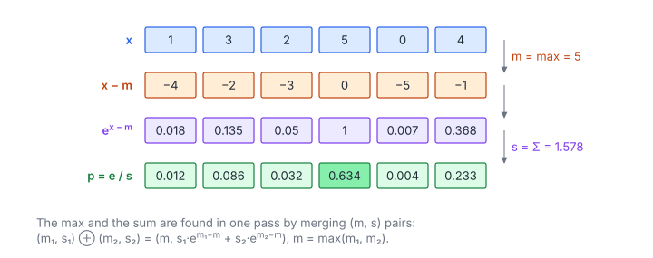

# Softmax

**Platform:** LeetGPU · **Difficulty:** medium · [Problem statement](https://leetgpu.com/challenges/softmax)

## Problem

Compute the softmax of a float32 vector of length $N$ ($1 \le N \le 500\,000$,
benchmark $N = 500\,000$), using the max-subtraction trick for numerical
stability. The tolerance is `1e-5`. Softmax turns arbitrary scores into a
probability distribution. It is the heart of attention and of every
classification head.

## Visual Overview

Read the rows from top to bottom: subtract the maximum m, exponentiate, then
divide by the sum s. The largest input always becomes e⁰ = 1, which is why the
computation cannot overflow.

## Formulation

$$
\sigma(x)_i = \frac{e^{x_i - m}}{\displaystyle\sum_{j=0}^{N-1} e^{x_j - m}}, \qquad m = \max_{0 \le j < N} x_j
$$

| Symbol | Meaning |
|---|---|
| $N$ | Vector length |
| $x_i$ | $i$-th input score (float32) |
| $m$ | Maximum input value; subtracting it leaves the result mathematically unchanged |
| $\sigma(x)_i$ | $i$-th output probability; $\sum_i \sigma(x)_i = 1$ |

**Why subtract $m$?** `expf` overflows to $+\infty$ for arguments above about
88.7. After the shift, every exponent is $\le 0$, so every term lies in
$(0, 1]$ and the denominator lies in $[1, N]$. No overflow is possible, and
at least one term equals 1.

### Online (Single-Pass) Max and Sum

The naive algorithm makes three passes: max, sum of exponentials, normalise.
The first two fuse into one pass by carrying a pair $(m, s)$, where $m$ is the
running max and $s = \sum e^{x_j - m}$ over the elements seen so far. Two
partial pairs combine with

$$
(m_1, s_1) \oplus (m_2, s_2) = \bigl(m,\ s_1 e^{m_1 - m} + s_2 e^{m_2 - m}\bigr), \qquad m = \max(m_1, m_2)
$$

| Symbol | Meaning |
|---|---|
| $(m_k, s_k)$ | Partial result over a subset $k$ of the elements: its max and its sum of $e^{x - m_k}$ |
| $\oplus$ | Merge operator; associative and commutative, with identity $(-\infty, 0)$ |
| $e^{m_k - m}$ | Rescaling factor that re-expresses a partial sum relative to the new maximum |

A single element $x$ is the pair $(x, 1)$. Because $\oplus$ is associative,
it can be evaluated as any reduction tree, exactly like the sum in
[Reduction](../004-reduction/).

## Approach

Three kernels:

1. **`blockMaxSum`.** Each of up to 512 blocks folds its grid-stride slice
   into one pair: thread-local fold, then warp shuffles, then a shared-memory
   hop. It writes $(m_b, s_b)$ to device arrays.
2. **`globalMaxSum`.** One block merges the $B$ pairs into the global
   $(M, S)$.
3. **`normalize`.** A grid-stride elementwise pass writes
   $e^{x_i - M} \cdot (1/S)$. The reciprocal is computed once per thread, so
   each element costs one multiply instead of a divide.

The identity element is represented by $(-\text{FLT\_MAX}, 0)$ rather than
$-\infty$. When both inputs are the identity, `combine` returns early. This
avoids evaluating $e^{(-\infty) - (-\infty)} = e^{\text{NaN}}$.

## Cost Analysis

$$
Q = \underbrace{4N}_{\text{pass 1}} + \underbrace{4N + 4N}_{\text{pass 3}} = 12N \ \text{bytes}, \qquad
Q_{\text{naive}} = 16N \ \text{bytes}
$$

| Symbol | Meaning |
|---|---|
| $Q$ | DRAM bytes: read $x$ (pass 1), read $x$ and write $\sigma$ (pass 3) |
| $Q_{\text{naive}}$ | three-pass version: read $x$ for max, read $x$ for sum, read and write in normalise |

With $2N$ exponentials, the kernel is still memory-bound ($\approx$ 0.2
`expf` per byte). At $N = 5\times10^5$ the whole vector (2 MB) fits in L2, so
the second read is mostly an L2 hit. Launch latency then dominates, and three
tiny kernels take roughly 10–20 µs.

## Pitfalls

- **Skipping the max shift.** For inputs around 100 this gives
  $\infty/\infty = \text{NaN}$.
- **Using `__expf` blindly.** The fast intrinsic has about 2 ulp of error and
  poor accuracy for large negative arguments; `expf` keeps well within
  `1e-5`.
- **Merge with the identity.** `combine` must handle $s = 0$ from empty
  threads (when $N <$ number of threads) without producing NaN.

## Verification

All LeetGPU cases pass on [cuemu](../../tools/cuemu/README.md), including
$N = 1$ (output exactly 1) and inputs with large magnitudes.

## Related

- [Softmax Attention](../006-softmax-attention/): the same online merge applied per query row.
- Tensara [Softmax](../../tensara/softmax/), [Log-Softmax](../../tensara/log-softmax/).
- [Tutorial 03 – Parallel reduction](../../tutorials/03-parallel-reduction.md).
