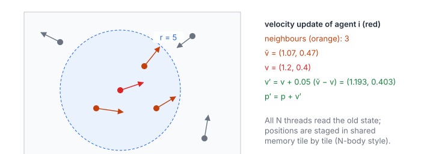

# Multi-Agent Simulation

**Platform:** LeetGPU · **Difficulty:** hard · [Problem statement](https://leetgpu.com/challenges/multi-agent-simulation)

## Problem

One step of a flocking ("boids") **alignment** rule for $N$ agents
($1 \le N \le 10^5$; benchmark $N = 10\,000$). Each agent is 4 floats
$[x, y, v_x, v_y]$. Every agent steers its velocity 5% of the way toward the
average velocity of the other agents within radius $r = 5$, then moves by its
new velocity. The result goes to `agents_next`, with tolerance `1e-5`. It is
an all-pairs ($N$-body-style) interaction, the classic showcase for
shared-memory tiling of a quadratic loop.

## Visual Overview

The red agent looks at the agents inside the dashed circle (orange); grey
agents are too far away. The formulas on the right apply the update to its
velocity with the numbers from the picture.

## Formulation

$$
\mathcal N_i = \bigl\{\, j \ne i \ :\ (x_i - x_j)^2 + (y_i - y_j)^2 < r^2 \,\bigr\}
$$

$$
\bar{\mathbf v}_i =
\begin{cases}
\dfrac{1}{\lvert\mathcal N_i\rvert}\displaystyle\sum_{j\in\mathcal N_i} \mathbf v_j, & \lvert\mathcal N_i\rvert > 0\\[2mm]
\mathbf v_i, & \lvert\mathcal N_i\rvert = 0
\end{cases}
\qquad
\mathbf v_i' = \mathbf v_i + \alpha\,(\bar{\mathbf v}_i - \mathbf v_i), \qquad
\mathbf p_i' = \mathbf p_i + \mathbf v_i'
$$

| Symbol | Meaning |
|---|---|
| $N$ | Number of agents |
| $\mathbf p_i = (x_i, y_i)$ | Position of agent $i$ |
| $\mathbf v_i = (v_{x,i}, v_{y,i})$ | Velocity of agent $i$ |
| $r$ | Neighbourhood radius, $r = 5$ (so $r^2 = 25$) |
| $\mathcal N_i$ | Set of neighbours of agent $i$ (itself excluded) |
| $\lvert\mathcal N_i\rvert$ | Number of neighbours |
| $\bar{\mathbf v}_i$ | Average neighbour velocity (own velocity if there are no neighbours) |
| $\alpha$ | Steering rate, $0.05$ |
| $\mathbf v_i',\ \mathbf p_i'$ | Updated velocity and position, written to `agents_next` |

All updates read only the **old** state, so the step is a pure function
`agents → agents_next`, with no read/write races.

## Approach

### Tiled All-Pairs Loop

- One thread per agent $i$, 256 threads per block. The thread keeps its own
  `float4` in registers.
- The other agents are processed in tiles of 256. Each block
  cooperatively loads a tile into shared memory as `float4`
  (one 16-byte load per thread), `__syncthreads()`, then every thread loops
  over the 256 staged agents. The loads are **broadcasts**: all threads read
  `tile[t]` at the same time. After a second barrier the next tile is loaded.
- The thread accumulates $\sum v_x$, $\sum v_y$ and the neighbour count in
  registers, then applies the update formulas.

Each agent's data is fetched from DRAM once per block instead of once per
pair, which is a 256× reduction in global traffic.

### Bit-Exact Neighbour Test

The membership test $d^2 < 25$ is a hard threshold. Agents placed exactly on,
or within an ulp of, the radius must be classified exactly as PyTorch does.
PyTorch computes `(diff**2).sum()` as two separately rounded squares and one
rounded add. The kernel therefore uses `__fsub_rn`, `__fmul_rn` and
`__fadd_rn`, which the compiler may not **contract into an FMA**. An FMA
computes `dx*dx + dy*dy` with a single rounding, which can flip a boundary
case and change $\lvert\mathcal N_i\rvert$ by one. That is enough to fail at
`1e-5`.

## Cost Analysis

$$
W \approx c\,N^2, \qquad Q_{\text{DRAM}} \approx 16N\left\lceil\frac{N}{256}\right\rceil + 32N
$$

| Symbol | Meaning |
|---|---|
| $W$ | Operations: about $c \approx 8$ FLOPs (distance, compare, accumulate) per ordered pair |
| $Q_{\text{DRAM}}$ | Bytes: every block streams all $N$ agents (16 bytes each), plus reading and writing the own state |

At $N = 10^4$, $W \approx 8\times10^8$ operations, a few hundred microseconds
at best. For much larger $N$, the $O(N^2)$ algorithm is the problem, not the
constant factor. A **uniform grid** with cell size $r$ (sort agents by cell,
then scan only the 3 × 3 neighbouring cells) makes the step $O(N)$ for
bounded density.

## Pitfalls

- **FMA contraction** changes boundary classifications (see above).
- **Self-exclusion.** $j \ne i$ must be tested by index, not by distance 0:
  two agents can share a position.
- **Barriers in the tile loop.** Threads with $i \ge N$ must still load
  (guarded) and reach both `__syncthreads()` of every tile.

## Verification

All LeetGPU cases pass on [cuemu](../../tools/cuemu/README.md) at `1e-5`,
including configurations with agents at distance exactly $r$.

## Related

- [Nearest Neighbor](../038-nearest-neighbor/) (the same all-pairs tiling), [K-Means](../020-kmeans-clustering/).
