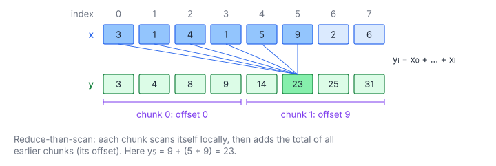

# Prefix Sum

**Platform:** LeetGPU · **Difficulty:** medium · [Problem statement](https://leetgpu.com/challenges/prefix-sum)

## Problem

Inclusive prefix sum (cumulative sum) of $N$ float32 values
($1 \le N \le 10^8$, $\lvert x_i\rvert \le 1000$; benchmark $N = 250\,000$;
tolerance `1e-2`). Scan is the parallel building block behind stream
compaction, radix sort, sparse-matrix construction and many recurrences.
Unlike a reduction it produces $N$ outputs, each depending on all earlier
inputs.

## Visual Overview

The lines show that y₅ = 23 depends on x₀ … x₅. In the reduce-then-scan scheme
each chunk is scanned locally and then shifted by the total of all earlier
chunks (its offset).

## Formulation

$$
y_i = \sum_{j=0}^{i} x_j, \qquad 0 \le i < N
$$

| Symbol | Meaning |
|---|---|
| $N$ | Array length |
| $x_j$ | Input values (float32) |
| $y_i$ | Inclusive prefix sums (float32 output) |

### Reduce-Then-Scan Decomposition

Split the array into chunks of $C = 2048$ elements. With chunk totals $S_b$
and exclusive chunk offsets $O_b$:

$$
S_b = \sum_{j=bC}^{bC + C - 1} x_j, \qquad O_b = \sum_{b' < b} S_{b'}, \qquad
y_i = O_{\lfloor i/C\rfloor} + \sum_{j = C\lfloor i/C\rfloor}^{i} x_j
$$

| Symbol | Meaning |
|---|---|
| $C$ | Chunk size: 256 threads × 8 items = 2048 |
| $b$ | Chunk (block) index |
| $S_b$ | Total of chunk $b$ |
| $O_b$ | Exclusive prefix of the chunk totals: everything before chunk $b$ |

Within a chunk, a thread handles 8 consecutive items. Its prefix is the
exclusive scan of the per-thread totals, computed with warp shuffles:

$$
\text{warp inclusive scan:}\quad v \leftarrow v + \mathbb{1}[\ell \ge \delta]\cdot \texttt{shfl\_up}(v, \delta), \qquad \delta = 1, 2, 4, 8, 16
$$

| Symbol | Meaning |
|---|---|
| $\ell$ | Lane index |
| $\delta$ | Shuffle distance at each of the $\log_2 32 = 5$ steps |
| $\texttt{shfl\_up}(v, \delta)$ | Value of $v$ held by lane $\ell - \delta$ |

This is the Hillis–Steele scan: $O(n\log n)$ work, but for 32 elements in
registers the 5 steps are cheaper than anything else.

## Approach

1. **`blockTotals`** (one block per chunk): sum the chunk into $S_b$ (float64).
2. **`scanTotals`** (1 block): exclusive scan of $S_0, S_1, \dots$ into $O_b$,
   256 at a time with a running carry, in float64.
3. **`scanChunks`** (one block per chunk):
   1. Coalesced load of the chunk into shared memory.
   2. Each thread scans its 8 consecutive items sequentially in registers.
   3. A block-wide scan of the per-thread totals: warp shuffle scan, then a
      scan of the 8 warp totals.
   4. Add the thread prefix and $O_b$, write the results back to shared
      memory, then do a coalesced store.

The detour through shared memory lets both global accesses be coalesced,
while each thread works on 8 *consecutive* items (a sequential scan is
work-optimal).

### Precision

Summing $10^8$ values of magnitude up to 1000 in float32 would accumulate
error across roughly 50 000 chunk offsets. Keeping $S_b$, $O_b$ and the
block-level scan in float64 makes the only float32 roundings the 8-item
sequential scan and the final store.

## Cost Analysis

$$
Q = \underbrace{4N}_{\text{pass 1}} + \underbrace{4N + 4N}_{\text{pass 3}} = 12N \ \text{bytes}, \qquad W = O(N)
$$

| Symbol | Meaning |
|---|---|
| $Q$ | DRAM traffic: read the input twice, write the output once |
| $W$ | Additions, linear in $N$ (work-efficient) |

A single-pass "decoupled look-back" scan (as in CUB) reaches $8N$ bytes by
chaining chunk prefixes through global flags. At the benchmark size (1 MB)
everything is L2-resident and launch latency dominates, so three simple
kernels are a good trade.

## Pitfalls

- **Exclusive vs. inclusive.** The problem is inclusive ($y_0 = x_0$). The
  chunk offsets are exclusive.
- **Barrier reuse.** `blockInclusiveScan` reuses its shared `warp_totals`
  array, so a trailing `__syncthreads()` is required before the next call
  overwrites it.
- **Temporary buffer.** $O_b$ lives in a `cudaMalloc` buffer sized
  $\lceil N/C\rceil$; it is freed after the final synchronize.

## Verification

All LeetGPU cases pass on [cuemu](../../tools/cuemu/README.md), including
$N = 1$ and $N$ not divisible by 2048. A stress test at $N = 10^8$ matches a
float64 reference within the tolerance.

## Related

- [Segmented Prefix Sum](../070-segmented-prefix-sum/), [Stream Compaction](../072-stream-compaction/),
  [Radix Sort](../036-radix-sort/), [Linear Recurrence](../082-linear-recurrence/).
- Tensara [Cumulative Sum](../../tensara/cumsum/), [Cumulative Product](../../tensara/cumprod/).
