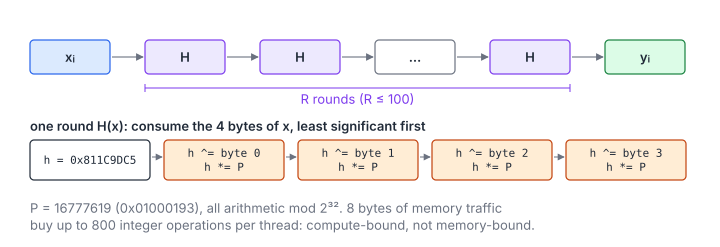

# Rainbow Table

**Platform:** LeetGPU · **Difficulty:** easy · [Problem statement](https://leetgpu.com/challenges/rainbow-table)

## Problem

Apply a 32-bit **FNV-1a** hash $R$ times to each of $N$ integers
($1 \le N \le 10^7$, $1 \le R \le 100$, inputs in $[0, 2^{31})$; benchmark
$N = 5\times10^6$). The output is uint32 and must match exactly. This is the
building block of a rainbow-table chain, and the first **compute-bound**
problem in the list: each 8 bytes of traffic buys up to 800 integer
operations.

## Visual Overview

The top row is one thread's chain of R hash rounds. The bottom row opens a
single round: the four bytes of the word are consumed one by one with an XOR
and a multiplication by the FNV prime.

## Formulation

FNV-1a over the 4 little-endian bytes of a 32-bit word $x$:

$$
h_0 = \texttt{0x811C9DC5}, \qquad
h_{b+1} = \bigl(h_b \oplus \operatorname{byte}_b(x)\bigr)\cdot P \bmod 2^{32}, \quad b = 0,1,2,3, \qquad
H(x) = h_4
$$

$$
\operatorname{byte}_b(x) = \left\lfloor \frac{x}{2^{8b}} \right\rfloor \bmod 256, \qquad P = 16777619 = \texttt{0x01000193}
$$

The output is the $R$-fold composition:

$$
y_i = \underbrace{H(H(\cdots H}_{R}(x_i)\cdots))
$$

| Symbol | Meaning |
|---|---|
| $x$, $x_i$ | Input word (the int32 input reinterpreted as uint32) |
| $h_b$ | Hash state after consuming $b$ bytes |
| $\operatorname{byte}_b(x)$ | The $b$-th least-significant byte of $x$ |
| $\oplus$ | Bitwise XOR |
| $P$ | FNV 32-bit prime |
| $\bmod 2^{32}$ | wrap-around of unsigned 32-bit arithmetic |
| $H$ | One full hash of a 32-bit word |
| $R$ | Number of rounds |
| $y_i$ | Output (uint32) |

## Approach

- One thread per element. Load $x_i$ once, run the $R$ rounds entirely in
  registers, store once.
- `fnv1a` unrolls its 4-byte loop: 4 × (shift, and, xor, multiply). With
  **unsigned** arithmetic, overflow wraps modulo $2^{32}$ by definition,
  which exactly reproduces the reference's `& 0xFFFFFFFF`.
- Rounds are inherently sequential (each depends on the previous hash), but
  elements are independent. Parallelism comes entirely from $N$.

## Cost Analysis

$$
W \approx 16RN \ \text{integer ops}, \qquad Q = 8N \ \text{bytes}, \qquad I = 2R\ \text{ops/byte}
$$

| Symbol | Meaning |
|---|---|
| $W$ | ≈ 16 integer instructions per hash (4 bytes × {shift, and, xor, mul}) times $R$ rounds |
| $Q$ | Read 4 bytes and write 4 bytes per element |
| $I$ | Operations per byte of DRAM traffic |

With $R = 100$, $I = 200$ ops/byte, far above any GPU's balance point.
Throughput is bounded by the **32-bit integer multiply** rate. On most NVIDIA
architectures IMAD issues at half or full FP32 rate. Latency hiding comes
from occupancy: many independent threads, each with a long dependent chain.

## Pitfalls

- **Signed overflow** is undefined behaviour in C++. The compiler may assume
  it never happens. Always hash in `unsigned int`.
- **Byte order.** FNV-1a consumes the least-significant byte first, matching
  the reference's `(x >> (8*i)) & 0xFF` loop.

## Verification

Exact equality on all LeetGPU cases in [cuemu](../../tools/cuemu/README.md),
including $R = 1$ and $R = 100$.

## Related

- [Monte Carlo Integration](../035-monte-carlo-integration/) (another compute-heavy elementwise kernel).
