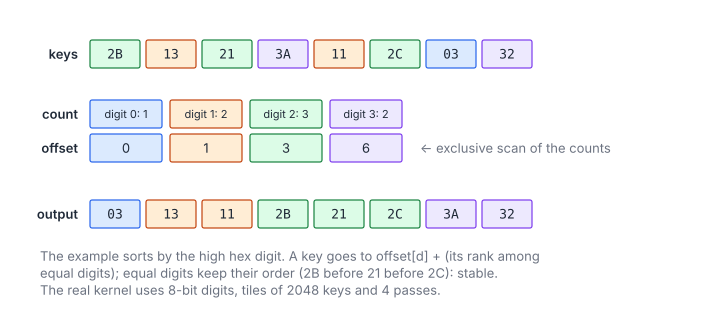

# Radix Sort

**Platform:** LeetGPU · **Difficulty:** hard · [Problem statement](https://leetgpu.com/challenges/radix-sort)

## Problem

Sort $N$ unsigned 32-bit integers ascending with a **radix sort**
($1 \le N \le 10^8$; benchmark $N = 5\times10^7$). The result goes to
`output`. Radix sort is the fastest general GPU sort for fixed-width keys,
and it combines three primitives from earlier problems: **histograms**,
**scans**, and a **stable scatter**.

## Visual Overview

The keys are coloured by the digit of this pass. The counts per digit are
scanned into starting offsets, and each key is written to its digit's offset
plus its rank among equal digits, which keeps the pass stable.

## Formulation

Write each key in base $R = 2^8$:

$$
u = \sum_{p=0}^{3} d_p(u)\, R^{p}, \qquad d_p(u) = \left\lfloor \frac{u}{R^p} \right\rfloor \bmod R
$$

| Symbol | Meaning |
|---|---|
| $u$ | A 32-bit key |
| $R$ | Radix, $2^8 = 256$ |
| $p$ | Digit position (pass number), 0 = least significant |
| $d_p(u)$ | Digit $p$ of $u$ (bits $8p \dots 8p+7$) |

**LSD radix sort** runs one *stable* counting sort per digit, from $p = 0$ to
3. After pass $p$ the keys are sorted by their low $8(p+1)$ bits.
Stability, meaning that equal digits keep their previous relative order, is
what makes this induction work.

### One Pass: Where Does Each Key Go?

Split the input into tiles of $T = 2048$ keys. Let $c_{d,t}$ count keys with
digit $d$ in tile $t$. The destination of a key $u$ at position $q$ inside
tile $t$ is

$$
\operatorname{pos}(u) = \underbrace{\sum_{d' < d}\sum_{t'} c_{d',t'} \;+\; \sum_{t' < t} c_{d,t'}}_{\operatorname{off}(d,\,t)\ =\ \text{exclusive scan of } c \text{ in digit-major order}} \;+\; \underbrace{\#\{\, q' < q : d_p(u_{q'}) = d \,\}}_{\text{rank within the tile}}, \qquad d = d_p(u)
$$

| Symbol | Meaning |
|---|---|
| $T$ | Tile size: 256 threads × 8 chunks = 2048 keys |
| $t$ | Tile index |
| $c_{d,t}$ | Histogram: keys in tile $t$ with digit $d$ |
| $\operatorname{off}(d, t)$ | Global start of the (digit, tile) bucket |
| $q$ | The key's position inside its tile |
| Rank | Number of earlier keys in the same tile with the same digit (this is what makes the pass stable) |

Storing $c$ **digit-major**, i.e. index $d \cdot \text{tiles} + t$, makes
$\operatorname{off}$ a *single* flat exclusive scan: all tiles' 0-digits come
first, then all 1-digits, and so on.

## Approach

Per pass (4 passes, ping-ponging between `output` and a temporary buffer):

1. **`digitCounts`**: each block (one tile) builds a 256-bin histogram with
   shared-memory atomics and writes it digit-major.
2. **`exclusiveScan`** over the $256 \times \text{tiles}$ table:
   reduce-then-scan in 3 kernels (chunk sums → scan of sums → apply), as in
   [Prefix Sum](../016-prefix-sum/).
3. **`scatterStable`**: the block processes its tile in 8 chunks of 256 keys
   **in order**. For each chunk:
   - `peers = __match_any_sync(full, digit)`: bitmask of lanes in this warp
     holding the same digit.
   - `rank = __popc(peers & lanes_below_me)`: the stable rank inside the warp.
   - The warp leader (`__ffs(peers)-1`) records the group size in
     `s_warp[w][digit]`.
   - Thread $d$ turns the 8 per-warp counts of digit $d$ into start offsets.
     A running `s_base[d]` carries across chunks, starting from
     $\operatorname{off}(d, t)$.
   - Each key is written to `s_warp[w][digit] + rank`.

   Invalid lanes past $N$ get the pseudo-digit 256, so they form their own
   match group and never collide with real digits.

After 4 passes (an even number), the result is back in `output`.

## Cost Analysis

$$
Q \approx P\,\bigl(\underbrace{4N}_{\text{count}} + \underbrace{4N + 4N}_{\text{scatter r/w}}\bigr) + 8N = 56N \ \text{bytes}, \qquad P = 4
$$

| Symbol | Meaning |
|---|---|
| $Q$ | DRAM bytes (histogram tables and scans are ~0.5% extra) |
| $P$ | Number of passes |
| $8N$ | Initial copy input → output |

Benchmark: $N = 5\times10^7$ gives $Q \approx 2.8$ GB, i.e. ≈ 1.4 ms at 2 TB/s.
Scattered writes are only partially coalesced: keys with the same digit from
one warp land contiguously, but different digits scatter. That makes the
scatter the slowest step. Production sorts (CUB onesweep) fuse counting and
scattering with decoupled look-back, and use 11-bit digits (3 passes).

## Pitfalls

- **Unstable scatter.** `atomicAdd` on per-digit cursors assigns slots in
  arbitrary order. The sort then looks right on random data and fails on
  inputs with many equal low digits.
- **Tile ordering.** The chunks must be processed in order *within* a tile,
  and tiles are ordered through the digit-major scan. Both are needed for
  stability.
- **Temporary memory**: a second $N$-key buffer plus the
  $256\cdot\lceil N/2048\rceil$ histogram and its scan sums.

## Verification

All LeetGPU cases pass on [cuemu](../../tools/cuemu/README.md), which
implements `__match_any_sync` with real warp rendezvous. Stress tests cover
$N = 1$, all-equal keys, keys differing only in the top byte, and
$0$/$2^{32}-1$ extremes.

## Related

- [Sorting](../015-sorting/) (floats via a key map), [Top-K](../029-top-k-selection/),
  [Histogramming](../013-histogramming/), [Prefix Sum](../016-prefix-sum/).
