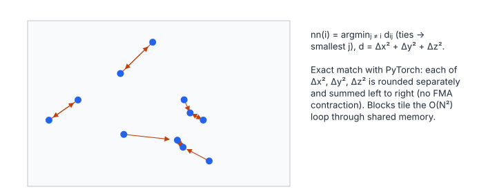

# Nearest Neighbor

**Platform:** LeetGPU · **Difficulty:** medium · [Problem statement](https://leetgpu.com/challenges/nearest-neighbor)

## Problem

For each of $N$ points in 3-D, find the index of its nearest *other* point
($1 \le N \le 10^5$, coordinates in $[-1000, 1000]$; benchmark $N = 10^4$).
The check is **exact**: every returned index must equal PyTorch's `argmin`.
That makes this a lesson in floating-point reproducibility as much as in
tiling.

## Visual Overview

Each arrow points from a point to its nearest other point. Mutual nearest
neighbours show a double arrow; the result must match PyTorch bit for bit,
including ties.

## Formulation

$$
\operatorname{nn}(i) = \arg\min_{j \ne i} d_{ij}, \qquad
d_{ij} = \operatorname{fl}\Bigl(\operatorname{fl}\bigl(\operatorname{fl}(\Delta x^2) + \operatorname{fl}(\Delta y^2)\bigr) + \operatorname{fl}(\Delta z^2)\Bigr)
$$

$$
\Delta x = \operatorname{fl}(x_i - x_j), \quad \Delta y = \operatorname{fl}(y_i - y_j), \quad \Delta z = \operatorname{fl}(z_i - z_j)
$$

| Symbol | Meaning |
|---|---|
| $N$ | Number of points |
| $(x_i, y_i, z_i)$ | Coordinates of point $i$ (stored interleaved: `points[3i..3i+2]`) |
| $d_{ij}$ | Squared Euclidean distance, evaluated with float32 rounding after each operation |
| $\operatorname{fl}(\cdot)$ | One float32 operation rounded to nearest |
| $\operatorname{nn}(i)$ | Output `indices[i]`; on ties, the smallest $j$ (argmin semantics) |

The square root is unnecessary, because $\sqrt{\cdot}$ is monotonic.

### Why the Evaluation Order Is Pinned

PyTorch computes `diff*diff` (3 separately rounded products) and then
`sum(dim=2)` (left to right). A compiler left alone would contract
$\Delta x^2 + \Delta y^2$ into an FMA, which has one rounding instead of two.
That changes $d_{ij}$ in the last bit, and whenever two candidates are within
an ulp of each other, it flips the argmin. The kernel uses `__fsub_rn`,
`__fmul_rn` and `__fadd_rn`, which are never contracted.

## Approach

- One thread per query point $i$ (registers: $x_i, y_i, z_i$, best
  distance, best index).
- Candidates stream through shared memory in tiles of 256, in
  **structure-of-arrays** form (`sx`, `sy`, `sz`). Each thread of the block
  loads one candidate, then a barrier.
- Every thread scans the 256 candidates; all threads read `sx[t]` at the
  same time, which is a broadcast. The update rule is
  `if (j != i && (d < best || best_j < 0))`: a strict `<` keeps the lowest
  index on ties, because $j$ increases monotonically.
- Threads with $i \ge N$ still help load tiles and reach the barriers.

## Cost Analysis

$$
W \approx 9N^2 \ \text{FLOPs}, \qquad Q_{\text{DRAM}} \approx 12N\left\lceil \frac{N}{256}\right\rceil + 16N \ \text{bytes}
$$

| Symbol | Meaning |
|---|---|
| $W$ | 3 subtractions, 3 multiplies, 2 additions and a compare per pair |
| $Q_{\text{DRAM}}$ | Every block streams all points (12 bytes each); plus own reads and index writes |

For $N = 10^4$: $W \approx 9\times10^8$, well under a millisecond, compute-bound.
For $N = 10^5$, $W$ grows 100×. A spatial data structure (uniform grid, or a
k-d tree built with radix sort by Morton code) would make the search
$O(N\log N)$.

## Pitfalls

- **FMA contraction** breaks exact matching (see above).
- **$N = 1$.** There is no other point, and the reference's argmin over all
  $+\infty$ returns index 0. The kernel mirrors that with `best_j < 0 ? 0`.
- **Duplicate points.** Distance 0 to another index is a valid nearest
  neighbour. Only $j = i$ is excluded.

## Verification

Exact match on all LeetGPU cases in [cuemu](../../tools/cuemu/README.md),
including duplicated points and $N = 1, 2$.

## Related

- [Multi-Agent Simulation](../014-multi-agent-sim/) (the same tiling),
  [K-Means](../020-kmeans-clustering/).
