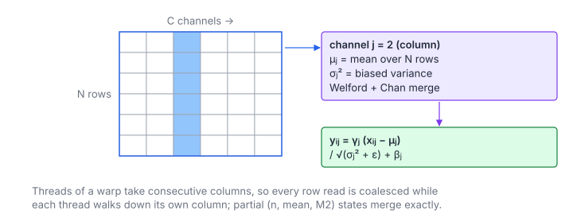

# Batch Normalization

**Platform:** LeetGPU · **Difficulty:** medium · [Problem statement](https://leetgpu.com/challenges/batch-normalization)

## Problem

BatchNorm forward (training mode) for an $N \times C$ input: normalise each
**column** (channel) by its batch mean and biased variance, then scale and
shift with learnable $\gamma, \beta$ ($N \le 10^4$, $C \le 1024$,
$\varepsilon = 10^{-5}$; benchmark $N = 5000$; tolerance `1e-5`). The
statistics are a *column* reduction over a row-major matrix, which dictates
the thread layout.

## Visual Overview

The highlighted column is one channel. Its mean and variance are computed over
all N rows and then used to normalise that column; every channel is
independent.

## Formulation

$$
\mu_j = \frac1N\sum_{i=0}^{N-1} x_{ij}, \qquad
\sigma_j^2 = \frac1N\sum_{i=0}^{N-1} (x_{ij} - \mu_j)^2, \qquad
y_{ij} = \gamma_j\,\frac{x_{ij} - \mu_j}{\sqrt{\sigma_j^2 + \varepsilon}} + \beta_j
$$

| Symbol | Meaning |
|---|---|
| $N$ | Batch size (rows) |
| $C$ | Number of channels (columns) |
| $x_{ij}$ | Input, row $i$, channel $j$ (offset $iC + j$) |
| $\mu_j$ | Batch mean of channel $j$ |
| $\sigma_j^2$ | Biased batch variance (divide by $N$, not $N-1$) |
| $\varepsilon$ | numerical-stability constant ($10^{-5}$) |
| $\gamma_j,\ \beta_j$ | Learnable scale and shift |
| $y_{ij}$ | Output |

### Welford's Online Update and Chan's Merge

Accumulating $\sum x$ and $\sum x^2$ and using $E[x^2] - E[x]^2$ suffers
catastrophic cancellation when $\lvert\mu\rvert \gg \sigma$. Welford's
algorithm keeps a running mean and sum of squared deviations:

$$
n \leftarrow n + 1, \quad \delta = x - \bar x, \quad \bar x \leftarrow \bar x + \frac{\delta}{n}, \quad M_2 \leftarrow M_2 + \delta\,(x - \bar x)
$$

Two partial states $(n_a, \bar x_a, M_{2,a})$ and $(n_b, \bar x_b, M_{2,b})$
merge as

$$
n = n_a + n_b, \quad \delta = \bar x_b - \bar x_a, \quad \bar x = \bar x_a + \delta\frac{n_b}{n}, \quad M_2 = M_{2,a} + M_{2,b} + \delta^2 \frac{n_a n_b}{n}
$$

| Symbol | Meaning |
|---|---|
| $n$ | Number of samples folded into a state |
| $\bar x$ | Running mean |
| $M_2$ | Running sum of squared deviations from the mean; $\sigma^2 = M_2 / n$ |
| $\delta$ | Difference between the new sample (or partial mean) and the current mean |

## Approach

1. **`channelStats`**: blocks of $32 \times 8$ threads; each block owns 32
   consecutive channels.
   - `threadIdx.x` is the channel. A warp reads 32 consecutive floats of one
     row, which is coalesced.
   - `threadIdx.y` $\in 0..7$ strides the rows: row group $g$ handles rows
     $g, g+8, \dots$ with a float64 Welford update.
   - The 8 partial states per channel go to shared memory and are merged by
     row group 0 with Chan's formula. It writes $\mu_j$ and
     $\text{rstd}_j = 1/\sqrt{\sigma_j^2 + \varepsilon}$.
2. **`normalize`**: a grid-stride elementwise kernel computes
   $y = \gamma_j\,((x - \mu_j)\cdot\text{rstd}_j) + \beta_j$ with
   $j = i \bmod C$.

## Cost Analysis

$$
Q = \underbrace{4NC}_{\text{stats}} + \underbrace{4NC + 4NC}_{\text{normalize}} = 12NC \ \text{bytes}, \qquad T_{\min} = \frac{12NC}{\beta_{\text{mem}}}
$$

| Symbol | Meaning |
|---|---|
| $Q$ | DRAM bytes: read $x$ twice, write $y$ once |
| $\beta_{\text{mem}}$ | DRAM bandwidth (named to avoid a clash with the BN shift $\beta$) |

For $N = 5000$, $C = 1024$: ≈ 61 MB, i.e. ≈ 30 µs. The statistics kernel
has only $\lceil C/32\rceil = 32$ blocks, which under-fills a large GPU.
Splitting the rows across several blocks per channel group (with a second
merge pass) would raise parallelism.

## Pitfalls

- **Biased vs. unbiased variance.** The reference uses `unbiased=False`,
  i.e. divide by $N$.
- **One-pass $\sum x^2$ formula** loses precision when values are large
  relative to their spread.
- **Empty row groups** when $N < 8$ must be skipped in the merge (count 0).

## Verification

All LeetGPU cases pass on [cuemu](../../tools/cuemu/README.md) at `1e-5`,
including $N = 1$ (variance 0) and $C$ not a multiple of 32.

## Related

- [RMS Normalization](../050-rms-normalization/), [Layer Normalization](../113-layer-normalization/),
  [Group Normalization](../105-group-normalization/). Tensara [Batch Norm](../../tensara/batch-norm/).
