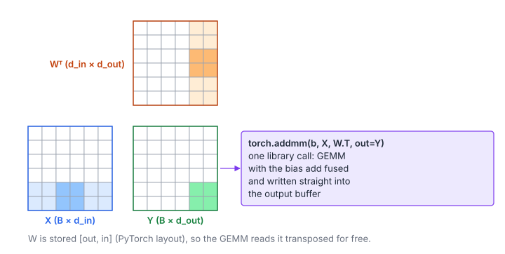

# Simple Inference

**Platform:** LeetGPU · **Difficulty:** easy · [Problem statement](https://leetgpu.com/challenges/simple-inference)

## Problem

Run the forward pass of a trained `torch.nn.Linear` on a batch: `input` is
$B \times d_{\text{in}}$, and `output` must receive $B \times d_{\text{out}}$
($B, d_{\text{in}}, d_{\text{out}} \le 1000$; benchmark $B = 1000$; tolerance
`1e-5`). This challenge only offers PyTorch starters, so the solution is
`solution.py`. The point is to express the layer as **one fused library call**
that writes straight into the provided output buffer.

## Visual Overview



X is B × dᵢₙ, Wᵀ is dᵢₙ × dₒᵤₜ and Y is B × dₒᵤₜ. A single library call
computes the product and adds the bias while writing straight into the output
buffer.

## Formulation

$$
Y = X W^{\mathsf T} + \mathbf 1\,\mathbf b^{\mathsf T}, \qquad Y_{ro} = \sum_{i=0}^{d_{\text{in}}-1} X_{ri}\, W_{oi} + b_o
$$

| Symbol | Meaning |
|---|---|
| $B$ | Batch size (rows of $X$ and $Y$) |
| $d_{\text{in}},\ d_{\text{out}}$ | Input and output feature sizes |
| $X$ | Input batch, $B \times d_{\text{in}}$ |
| $W$ | Weight (`model.weight`), $d_{\text{out}} \times d_{\text{in}}$ — PyTorch's `[out, in]` layout |
| $\mathbf b$ | Bias (`model.bias`), length $d_{\text{out}}$; may be absent |
| $\mathbf 1$ | Column of ones (broadcasts the bias to every row) |
| $Y$ | Output, $B \times d_{\text{out}}$ |

## Approach

```python
with torch.inference_mode():
    if model.bias is None:
        torch.matmul(input, model.weight.t(), out=output)
    else:
        torch.addmm(model.bias, input, model.weight.t(), out=output)
```

- `torch.addmm(b, X, Wᵀ)` computes $\mathbf b + XW^{\mathsf T}$ as a single
  cuBLAS GEMM with $\beta = 1$ on a broadcast bias, instead of a GEMM plus a
  separate add kernel.
- `W.t()` is a view with swapped strides. cuBLAS consumes the transposed
  operand directly (the "TN" layout), so nothing is copied.
- `out=output` writes into the harness's tensor, which avoids a temporary and
  a copy.
- `inference_mode()` disables autograd tracking and version counters.

## Cost Analysis

$$
W_{\text{flop}} = 2B\,d_{\text{in}}\,d_{\text{out}}, \qquad Q \approx 4\,(B d_{\text{in}} + d_{\text{in}}d_{\text{out}} + B d_{\text{out}})
$$

| Symbol | Meaning |
|---|---|
| $W_{\text{flop}}$ | FLOPs of the GEMM |
| $Q$ | Compulsory bytes (read $X$, $W$, write $Y$; the bias is negligible) |

At $1000^3$: 2 GFLOP over 12 MB, a compute-bound GEMM. cuBLAS runs it at
near-peak (TF32 tensor cores if enabled).

## Pitfalls

- **`bias=False`** models have `model.bias is None`. `addmm` would fail.
- **Calling `model(input)` then `output.copy_()`** is correct but allocates
  and copies an extra $B \times d_{\text{out}}$ tensor.

## Verification

Tested through the runner's PyTorch path on all LeetGPU cases, with and
without bias.

## Related

- [Matrix Multiplication](../002-matrix-multiplication/) (what the GEMM does inside),
  [LoRA Linear](../085-lora-linear/).
