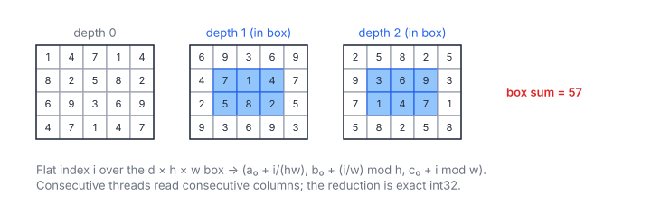

# 3D Subarray Sum

**Platform:** LeetGPU · **Difficulty:** medium · [Problem statement](https://leetgpu.com/challenges/3d-subarray-sum)

## Problem

Sum the box `input[S_DEP..E_DEP][S_ROW..E_ROW][S_COL..E_COL]` of an
$N \times M \times K$ int32 volume ($N, M, K \le 500$, values in $[1, 10]$;
benchmark $500^3$). The result is an exact int32.

## Visual Overview

The box covers depths 1 and 2 (blue cells); depth 0 lies outside it. The same
flat-index trick as in 2-D walks the box with coalesced reads.

## Formulation

$$
\text{out} = \sum_{a = a_0}^{a_1}\ \sum_{b = b_0}^{b_1}\ \sum_{c = c_0}^{c_1} x_{abc}, \qquad \text{offset}(a, b, c) = (aM + b)K + c
$$

$$
i \mapsto \Bigl(a_0 + \bigl\lfloor i / (h w)\bigr\rfloor,\ \ b_0 + \bigl\lfloor i / w\bigr\rfloor \bmod h,\ \ c_0 + (i \bmod w)\Bigr), \qquad 0 \le i < d h w
$$

| Symbol | Meaning |
|---|---|
| $N,\ M,\ K$ | Volume dimensions (depth, rows, columns) |
| $x_{abc}$ | Element at the row-major offset above |
| $a_0..a_1,\ b_0..b_1,\ c_0..c_1$ | Inclusive depth, row and column ranges |
| $d,\ h,\ w$ | Box extents $a_1-a_0+1$, $b_1-b_0+1$, $c_1-c_0+1$ |
| $i$ | Flat index over the box (column fastest) |

The largest possible sum is $10 \cdot 500^3 = 1.25\times10^9 < 2^{31}$.

## Approach

The flattened reduction from [2D Subarray Sum](../048-2d-subarray-sum/),
extended to 3 coordinates. The flat index is 64-bit, the column is fastest
(coalesced), and the warp reduction plus one atomic per warp follow as before.

## Cost Analysis

$$
Q = 4dhw \ \text{bytes}, \qquad T_{\min} = \frac{Q}{\beta}
$$

| Symbol | Meaning |
|---|---|
| $Q$ | Bytes read |
| $\beta$ | DRAM bandwidth |

The full $500^3$ box is 500 MB, i.e. ≈ 250 µs at 2 TB/s.

## Pitfalls

- **Index decomposition order** must match the memory layout (depth, row,
  column). Otherwise the reads become strided.
- **Overflow of intermediate products** such as $d h w$ in 32-bit is avoided
  by computing them in `long long`.

## Verification

Exact equality on all LeetGPU cases in [cuemu](../../tools/cuemu/README.md).

## Related

- [Subarray Sum](../047-subarray-sum/), [2D Subarray Sum](../048-2d-subarray-sum/).
