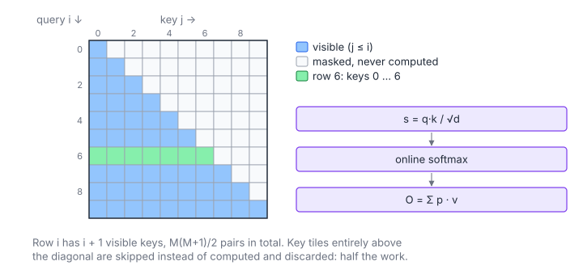

# Causal Self-Attention

**Platform:** LeetGPU · **Difficulty:** hard · [Problem statement](https://leetgpu.com/challenges/causal-self-attention)

## Problem

Causal (masked) single-head self-attention: $Q, K, V \in \mathbb R^{M\times d}$
(float32, $M \le 10^4$, $d \le 128$; tolerance `1e-4`). Query $i$ may only
attend to keys $j \le i$, as in every decoder-only language model during
training or prefill. The mask removes about half of the work, and a good
kernel skips it instead of computing and discarding it.

## Visual Overview

Only the lower triangle of the score matrix exists. Row 6 (green) mixes keys 0
… 6; tiles that lie entirely above the diagonal are skipped, which halves the
work.

## Formulation

$$
s_{ij} = \frac{\mathbf q_i\cdot\mathbf k_j}{\sqrt d}, \qquad
\tilde s_{ij} = \begin{cases} s_{ij}, & j \le i \\ -\infty, & j > i\end{cases}, \qquad
O_{i,:} = \sum_{j=0}^{i} \frac{e^{\tilde s_{ij} - m_i}}{\sum_{j' \le i} e^{\tilde s_{ij'} - m_i}}\ \mathbf v_j
$$

| Symbol | Meaning |
|---|---|
| $M$ | Sequence length (queries = keys = values) |
| $d$ | Head dimension |
| $\mathbf q_i,\ \mathbf k_j,\ \mathbf v_j$ | Rows of $Q$, $K$, $V$ |
| $s_{ij}$ | Scaled score |
| $\tilde s_{ij}$ | Masked score ($e^{-\infty} = 0$, so future keys get weight 0) |
| $m_i$ | Row maximum over the *visible* keys $j \le i$ |
| $O_{i,:}$ | Output row $i$ |

Row $i$ has $i + 1$ visible keys, so the total number of (query, key) pairs
is

$$
\sum_{i=0}^{M-1} (i + 1) = \frac{M(M+1)}{2} \approx \frac{M^2}{2}
$$

## Approach

A FlashAttention-style kernel (as in [Softmax Attention](../006-softmax-attention/))
with two causal modifications:

- **Block-level tile skipping.** A block owns 8 consecutive query rows
  $[r_0, r_0 + 7]$. It only iterates over key tiles with
  $j_0 \le \text{last\_row}$. Tiles entirely in the future of every row in
  the block are never loaded, which is about half of all tiles.
- **Per-lane mask inside the diagonal tiles.** Lane $\ell$ scores key
  $j = j_0 + \ell$ and sets `allowed = active && j <= row`. Masked lanes get
  $p = 0$ and score $-\infty$ in the tile max.

Everything else is the standard recipe: 8 warps (one query row each), K/V
tiles of 32 keys in shared memory (pitch 129 to avoid bank conflicts), one
key per lane for scoring, online softmax rescaling by $\alpha = e^{m - m'}$,
`__shfl_sync` broadcasts of $p_j$ for the $PV$ update, and 4 register
accumulators per lane ($d \le 128$).

Each row's first key ($j = 0$) is always visible, so the running
denominator is positive and never divides by zero.

## Cost Analysis

$$
W \approx 4d\cdot\frac{M(M+1)}{2} = 2dM(M+1), \qquad \text{tiles loaded per block} = \left\lceil\frac{r_0 + 8}{32}\right\rceil
$$

| Symbol | Meaning |
|---|---|
| $W$ | FLOPs for scores and $PV$ over visible pairs only |
| $r_0$ | First query row of the block |

This is half of the dense attention cost. At $M = 10^4$, $d = 128$:
$W \approx 2.6\times10^{10}$ FLOP, compute-bound on fp32 FMA and shared loads.

## Pitfalls

- **Masking by skipping the loop per warp** (instead of per block) would
  make warps diverge on `__syncthreads()`. The tile loop bound must be the
  same for the whole block (`last_row`), and the fine mask is applied per lane.
- **Using $-\infty$ literally** in `expf(-inf - m)` is fine (it gives 0), but
  `-inf - (-inf)` is NaN. The first tile always contains key 0, so the
  running max is finite from the first tile on.

## Verification

All LeetGPU cases pass on [cuemu](../../tools/cuemu/README.md) at `1e-4`,
including $M = 1$ and $M$ not a multiple of 8 or 32.

## Related

- [Softmax Attention](../006-softmax-attention/), [Sliding Window Attention](../059-sliding-window-attn/),
  [Decaying Causal Attention](../092-decaying-causal-attention/), [Attention with Sinks](../112-attention-with-sinks/).
