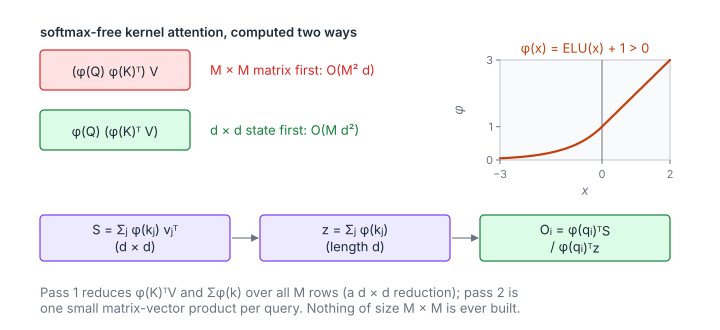

# Linear Self-Attention

**Platform:** LeetGPU · **Difficulty:** hard · [Problem statement](https://leetgpu.com/challenges/linear-self-attention)

## Problem

Linear attention (Katharopoulos et al., "Transformers are RNNs") with the
feature map $\phi(x) = \operatorname{ELU}(x) + 1$, on
$Q, K, V \in \mathbb R^{M\times d}$ ($M \le 10^4$, $d \le 128$, values in
$[-100, 100]$; benchmark $M = 10^4$; tolerance `1e-4`). Replacing
$\exp(\mathbf q\cdot\mathbf k)$ by $\phi(\mathbf q)\cdot\phi(\mathbf k)$
turns the $O(M^2 d)$ attention into $O(Md^2)$ **by associativity**.

## Visual Overview

Computing (φ(Q)φ(K)ᵀ)V builds an M × M matrix; computing φ(Q)(φ(K)ᵀV) only
needs the d × d state S and the vector z. The bottom row is the order the
kernel uses; the plot shows the feature map φ.

## Formulation

$$
O_{i,:} = \frac{\phi(\mathbf q_i)^{\mathsf T}\, S}{\phi(\mathbf q_i)^{\mathsf T}\, \mathbf z}, \qquad
S = \sum_{j=0}^{M-1} \phi(\mathbf k_j)\,\mathbf v_j^{\mathsf T} = \phi(K)^{\mathsf T} V, \qquad
\mathbf z = \sum_{j=0}^{M-1} \phi(\mathbf k_j)
$$

$$
\phi(x) = \operatorname{ELU}(x) + 1 = \begin{cases} x + 1, & x > 0 \\ e^{x}, & x \le 0 \end{cases}\quad(\text{elementwise})
$$

| Symbol | Meaning |
|---|---|
| $M$ | Sequence length |
| $d$ | Feature dimension |
| $\mathbf q_i,\ \mathbf k_j,\ \mathbf v_j$ | Rows of $Q$, $K$, $V$ (column vectors of length $d$) |
| $\phi$ | Positive feature map, applied elementwise |
| $S$ | $d\times d$ "key–value state" |
| $\mathbf z$ | Length-$d$ normaliser state |
| $O_{i,:}$ | Output row $i$ |

**Why it is linear.** Standard attention computes
$\sum_j \frac{\operatorname{sim}(\mathbf q_i, \mathbf k_j)}{\sum_{j'}\operatorname{sim}}\mathbf v_j$.
With $\operatorname{sim}(\mathbf q, \mathbf k) = \phi(\mathbf q)^{\mathsf T}\phi(\mathbf k)$,
the query factors out of the sum over $j$:
$\sum_j \phi(\mathbf q_i)^{\mathsf T}\phi(\mathbf k_j)\mathbf v_j^{\mathsf T} = \phi(\mathbf q_i)^{\mathsf T}\bigl(\sum_j \phi(\mathbf k_j)\mathbf v_j^{\mathsf T}\bigr)$.
The inner sum is computed once and shared by all queries.

## Approach

1. **`kvState`**: one thread per entry $S_{ab}$ (and $d$ more threads for
   $z_a$). Each loops over all $M$ rows, accumulating
   $\phi(K_{ra})\,V_{rb}$ in float64. For fixed $r$, neighbouring threads
   (consecutive $b$) read consecutive $V_{rb}$, which is coalesced, while
   $\phi(K_{ra})$ is the same address across a row of threads (a broadcast).
2. **`applyState`**: one block per query row $i$. It computes
   $\phi(\mathbf q_i)$ into shared memory, then thread 0 computes the
   denominator $\phi(\mathbf q_i)\cdot\mathbf z$ once. Thread $b$ computes
   $\sum_a \phi(q_{ia}) S_{ab}$ and divides.

Float64 in step 1 matters: inputs up to 100 make $\phi(k)$ up to 101, and
$S$ sums $10^4$ products of magnitude ~$10^4$.

## Cost Analysis

$$
W_{\text{linear}} = 2Md^2 + 2Md^2 + O(Md), \qquad W_{\text{softmax attn}} = 4M^2 d, \qquad \frac{W_{\text{softmax}}}{W_{\text{linear}}} = \frac{M}{d}
$$

| Symbol | Meaning |
|---|---|
| $W_{\text{linear}}$ | FLOPs: building $S$ ($2Md^2$) and applying it to all queries ($2Md^2$) |
| $W_{\text{softmax attn}}$ | FLOPs of standard attention for comparison |

At $M = 10^4$, $d = 128$, linear attention is ≈ 78× cheaper. The state-building
kernel has only $d^2 + d \approx 16$K threads, each looping $10^4$ rows. A
split-M reduction (partial states per block, then a sum) would raise
parallelism.

## Pitfalls

- **$\phi$ must be positive**, so the denominator is positive. ELU + 1 is
  positive everywhere.
- **Overflow in $e^{x}$** is impossible, because the exponential branch only
  runs for $x \le 0$.
- **Precision of $S$** with large inputs (see above).

## Verification

All LeetGPU cases pass on [cuemu](../../tools/cuemu/README.md) at `1e-4`,
including $M = 1$ and $d = 1$.

## Related

- [Softmax Attention](../006-softmax-attention/), [SSM Selective Scan](../094-ssm-selective-scan/)
  (another linear-time sequence model), [Linear Recurrence](../082-linear-recurrence/).
