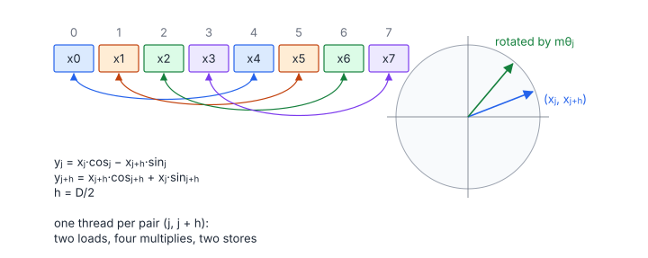

# Rotary Positional Embedding

**Platform:** LeetGPU · **Difficulty:** medium · [Problem statement](https://leetgpu.com/challenges/rotary-positional-embedding)

## Problem

Apply rotary positional embedding (RoPE) to $M$ query vectors of dimension
$D$, given precomputed $\cos$ and $\sin$ tables of the same shape
($M, D \le 10^4$, $D$ even; benchmark $M = 2^{20}$, $D = 128$; tolerance
`1e-4`). The tables use the **half-split** layout of LLaMA/GPT-NeoX. RoPE
encodes absolute position as a rotation, so the dot product
$\mathbf q_m \cdot \mathbf k_n$ depends only on the relative offset $m - n$.

## Visual Overview

The arcs pair element j with element j + D/2. Each pair is treated as a 2-D
vector and rotated by an angle that depends on the position (right), which is
exactly what the two formulas compute.

## Formulation

$$
\operatorname{RoPE}(\mathbf x) = \mathbf x \odot \mathbf c + \operatorname{rotate\_half}(\mathbf x)\odot\mathbf s, \qquad
\operatorname{rotate\_half}([\mathbf x_1;\ \mathbf x_2]) = [-\mathbf x_2;\ \mathbf x_1]
$$

For one row and $0 \le j < D/2$ (with $h = D/2$):

$$
y_j = x_j\,c_j - x_{j+h}\,s_j, \qquad y_{j+h} = x_{j+h}\,c_{j+h} + x_j\,s_{j+h}
$$

| Symbol | Meaning |
|---|---|
| $M$ | Number of tokens (rows) |
| $D$ | Head dimension (even) |
| $h$ | Half dimension $D/2$ |
| $\mathbf x$ | One row of $Q$ |
| $\mathbf x_1,\ \mathbf x_2$ | First and second halves of $\mathbf x$ |
| $\mathbf c,\ \mathbf s$ | Rows of the `cos` and `sin` tables; half-split means $c_j = c_{j+h}$ and $s_j = s_{j+h}$ |
| $\odot$ | Elementwise product |
| $\mathbf y$ | Output row |

With $c_j = \cos(m\theta_j)$ and $s_j = \sin(m\theta_j)$ for token position
$m$, each pair $(x_j, x_{j+h})$ is rotated by angle $m\theta_j$ in its own
2-D plane:

$$
\begin{pmatrix} y_j \\ y_{j+h}\end{pmatrix} = \begin{pmatrix}\cos m\theta_j & -\sin m\theta_j\\ \sin m\theta_j & \cos m\theta_j\end{pmatrix}\begin{pmatrix} x_j \\ x_{j+h}\end{pmatrix}
$$

| Symbol | Meaning |
|---|---|
| $m$ | Token position |
| $\theta_j$ | Frequency of pair $j$ (typically $10000^{-2j/D}$) |

## Approach

One thread per **pair** $(j, j+h)$ of one row: $M \cdot D/2$ threads,
grid-stride with a 64-bit index.

- Load $x_j$, $x_{j+h}$, both $c$'s and both $s$'s, then compute the two
  outputs.
- Each input element is read exactly once. A per-element mapping would read
  every $x$ twice.
- Coalescing: consecutive threads have consecutive $j$ within a row, so the
  warp reads 32 consecutive floats from the first half and 32 from the second
  half: two full segments per array.

The kernel uses both $c_j$ and $c_{j+h}$ (not only one) so that it matches
the reference even if a caller passes non-duplicated tables.

## Cost Analysis

$$
Q = 4\cdot 4MD \ \text{bytes} \quad(\text{read } Q, \cos, \sin;\ \text{write output}), \qquad W = 3MD
$$

| Symbol | Meaning |
|---|---|
| $Q$ | DRAM bytes |
| $W$ | FLOPs: 2 multiplies and 1 add per output element |

Benchmark: $M = 2^{20}$, $D = 128$ gives $Q = 2.1$ GB, i.e. ≈ 1 ms at 2 TB/s.
It is purely memory-bound. Production kernels compute $\cos/\sin$ on the fly
from $m\theta_j$ (halving the traffic) and fuse RoPE into the QKV projection
epilogue or into the attention kernel.

## Pitfalls

- **Interleaved vs. half-split.** GPT-J style RoPE rotates adjacent pairs
  $(2j, 2j+1)$. This problem uses halves $(j, j+h)$.
- **Sign convention.** `rotate_half` negates the *second* half and moves it
  to the front.
- **Grid size.** $MD/2$ can exceed $2^{31}$ at the maximum size, which is
  why the index is `long long` and the grid is capped with a grid-stride loop.

## Verification

All LeetGPU cases pass on [cuemu](../../tools/cuemu/README.md) at `1e-4`,
including $D = 2$.

## Related

- [Multi-Head Latent Attention](../114-multi-head-latent-attention/) (decoupled RoPE),
  [LLaMA Transformer Block](../093-llama-transformer-block/).
