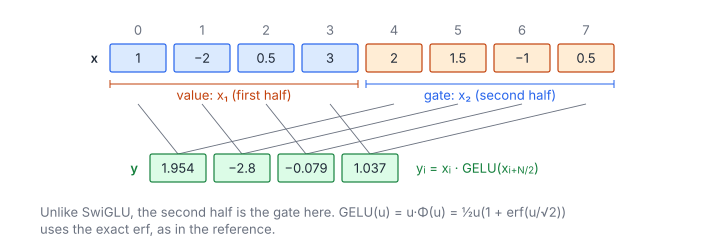

# Gaussian Error Gated Linear Unit

**Platform:** LeetGPU · **Difficulty:** easy · [Problem statement](https://leetgpu.com/challenges/gaussian-error-gated-linear-unit)

## Problem

GEGLU on a 1-D vector: split the length-$N$ input into halves $\mathbf x_1$
and $\mathbf x_2$ and output $\mathbf x_1 \odot \operatorname{GELU}(\mathbf x_2)$
($N \le 10^6$, even; values in $[-100, 100]$; tolerance `1e-4`). GEGLU is the
gated MLP activation of T5 v1.1 and several diffusion transformers. Note
that here the **second** half is activated, unlike [SwiGLU](../054-swiglu/).

## Visual Overview

Here the second half (orange) is the gate that goes through GELU, and the
first half (blue) is the value. Output i combines element i of both halves.

## Formulation

$$
y_i = x_i \cdot \operatorname{GELU}(x_{i + N/2}), \qquad
\operatorname{GELU}(u) = u\,\Phi(u) = \frac{u}{2}\left(1 + \operatorname{erf}\!\left(\frac{u}{\sqrt2}\right)\right)
$$

| Symbol | Meaning |
|---|---|
| $N$ | Input length (even); output length $N/2$ |
| $x_i$ | First half (the value that is gated), $0 \le i < N/2$ |
| $x_{i+N/2}$ | Second half (the gate, passed through GELU) |
| $\Phi$ | Standard normal CDF |
| $\operatorname{erf}$ | Error function, $\operatorname{erf}(z) = \frac{2}{\sqrt\pi}\int_0^z e^{-t^2}dt$ |
| $y_i$ | Output |

This is the **exact** GELU. The popular tanh approximation
$\tfrac u2\bigl(1 + \tanh(\sqrt{2/\pi}(u + 0.044715u^3))\bigr)$ differs by up
to ~$10^{-3}$, which is more than the tolerance.

## Approach

One thread per output: load both halves (two coalesced streams), then
`x1 * (0.5f * x2 * (1.0f + erff(x2 * 0.70710678f)))`. CUDA's `erff` has at
most 2 ulp of error. Multiplying by $1/\sqrt2$ instead of dividing by
$\sqrt2$ saves a division, and the difference is well below the tolerance.

## Cost Analysis

$$
Q = 6N\ \text{bytes}, \qquad W \approx \tfrac N2\,(c_{\operatorname{erf}} + 5)
$$

| Symbol | Meaning |
|---|---|
| $Q$ | Bytes: read $N$ floats, write $N/2$ |
| $W$ | Per output one `erff` (a rational/polynomial approximation, ≈ 20 instructions) plus a few multiply/adds |

At $N = 10^6$ (6 MB) the kernel is a few microseconds and memory-bound on
most GPUs.

## Pitfalls

- **Which half is activated.** GEGLU here applies GELU to the *second* half.
  Swapping the halves gives a wrong answer that is hard to spot on random data.
- **Tanh approximation** (see above).

## Verification

All LeetGPU cases pass on [cuemu](../../tools/cuemu/README.md) at `1e-4`,
including $\pm100$.

## Related

- [SwiGLU](../054-swiglu/), Tensara [GELU](../../tensara/gelu/).
