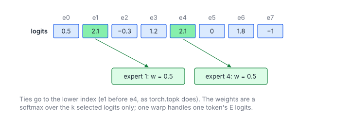

# MoE Top-K Gating

**Platform:** LeetGPU · **Difficulty:** medium · [Problem statement](https://leetgpu.com/challenges/moe-top-k-gating)

## Problem

The router of a Mixture-of-Experts layer: for each of $M$ tokens, select the
$k$ largest of its $E$ expert logits (descending, ties to the lower index as
`torch.topk` does), and softmax those $k$ values into mixing weights
($M \le 10^4$, $E \le 256$, $k \le E$; benchmark $M = 1024$, $k = 2$;
tolerance `1e-5`). The outputs are `topk_indices` and `topk_weights`, both
$M \times k$.

## Visual Overview

For one token the two largest logits (green) select the experts. Experts 1 and
4 tie at 2.1, so the lower index wins; the softmax is taken over the selected
logits only.

## Formulation

$$
(j_0, \dots, j_{k-1}) = \operatorname{TopK}(\mathbf z, k), \qquad z_{j_0} \ge z_{j_1} \ge \dots \ge z_{j_{k-1}}
$$

$$
w_t = \frac{e^{z_{j_t} - z_{j_0}}}{\sum_{u=0}^{k-1} e^{z_{j_u} - z_{j_0}}}, \qquad 0 \le t < k
$$

| Symbol | Meaning |
|---|---|
| $M$ | Number of tokens |
| $E$ | Number of experts |
| $k$ | Experts selected per token |
| $\mathbf z$ | One row of logits (length $E$) |
| $j_t$ | Index of the $t$-th selected expert; among equal logits the lower index comes first |
| $w_t$ | Mixing weight of expert $j_t$; $\sum_t w_t = 1$ |
| $z_{j_0}$ | The largest logit, used as the softmax shift |

The token's output in the MoE layer is then
$\sum_t w_t\,\operatorname{Expert}_{j_t}(\mathbf x)$. Only $k$ of the $E$
experts run, which is why MoE is cheap per token.

## Approach

**One warp per token.** $E \le 256$ means at most 8 logits per lane, all kept
in registers:

1. Lane $\ell$ loads $z_{\ell}, z_{\ell+32}, \dots$ into `vals[8]`
   (coalesced), padding with $-\infty$ past $E$.
2. **$k$ rounds of warp arg-max.** Each lane finds its best unused candidate
   (a `used` bitmask marks the ones already chosen). A 5-step
   `__shfl_xor_sync` butterfly then reduces the `(value, index)` pairs with
   the rule "larger value wins, and on equal values the smaller index wins".
   After the butterfly every lane holds the winner. The lane that owns it
   (`index % 32 == lane`) sets the corresponding `used` bit.
3. The first winner's value is the max, which becomes the shift. Each round
   writes $e^{z_{j_t} - z_{j_0}}$ and $j_t$ from lane 0 and accumulates the
   sum. At the end the $k$ weights are rescaled by $1/\text{sum}$.

This needs no sorting and no shared memory, and all $k$ rounds happen in
registers. For $k = 2$ it is two warp reductions per token.

## Cost Analysis

$$
W \approx M\,k\,(8 + 5\cdot 3), \qquad Q = 4ME + 8Mk\ \text{bytes}
$$

| Symbol | Meaning |
|---|---|
| $W$ | Operations: per round, scan 8 registers plus 5 butterfly steps (2 shuffles and a compare each) |
| $Q$ | Bytes: read the logits, write weights and indices |

Benchmark: $M = 1024$, $E \le 256$ gives about 1 MB, which is launch-bound.
For large $k$ (up to $E$) the $k$ rounds become $O(kE)$. A bitonic sort of
the 256 values would then be preferable, but routers use $k \le 8$.

## Pitfalls

- **Tie-breaking.** `torch.topk` returns lower indices first among equal
  values (on the CPU reference path). The butterfly compares indices on equal
  values. Duplicated logits are common in tests with small integer values.
- **Softmax over only the selected $k$**, not over all $E$.
- **Early `return` in a warp-per-row kernel** is safe only because the whole
  warp shares `row`.

## Verification

All LeetGPU cases pass on [cuemu](../../tools/cuemu/README.md), including
$k = E$ (a full sort), $E = 1$ and rows with duplicated logits.

## Related

- [Top-K Selection](../029-top-k-selection/), [Softmax](../005-softmax/),
  [SwiGLU MLP Block](../084-swiglu-mlp-block/) (what the experts compute).
