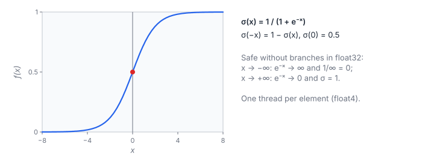

# Sigmoid Activation

**Platform:** LeetGPU · **Difficulty:** easy · [Problem statement](https://leetgpu.com/challenges/sigmoid-activation)

## Problem

Apply the logistic sigmoid to $N$ float32 values ($N \le 10^8$, finite
inputs; benchmark $N = 5\times10^7$; tolerance `1e-5`).

## Visual Overview

The curve passes through (0, 0.5) (red dot) and approaches 0 and 1 at the
ends. The plain formula already handles both extremes correctly in float32.

## Formulation

$$
\sigma(x) = \frac{1}{1 + e^{-x}}, \qquad \sigma(-x) = 1 - \sigma(x), \qquad \sigma'(x) = \sigma(x)\bigl(1 - \sigma(x)\bigr)
$$

| Symbol | Meaning |
|---|---|
| $x$ | Input value |
| $\sigma(x)$ | Output in $(0, 1)$ |
| $\sigma'$ | Derivative (used in backprop and in [Logistic Regression](../034-logistic-regression/)) |

**Extremes.** For $x \to -\infty$, $e^{-x}$ overflows to $+\infty$ and
$1/\infty = 0$, which is the correct limit. For $x \to +\infty$, $e^{-x} \to 0$
and the result is exactly 1. The direct formula is therefore safe in float32
without branches.

## Approach

The `float4` elementwise template (see [ReLU](../021-relu/)): 4 sigmoids per
thread, plus a scalar tail. Each element needs one accurate `expf` and one
IEEE division.

## Cost Analysis

$$
Q = 8N\ \text{bytes}, \qquad W \approx N\,(c_{\exp} + c_{\div} + 1)
$$

| Symbol | Meaning |
|---|---|
| $Q$ | DRAM bytes |
| $W$ | Instructions: `expf` (≈ 10–20), division (≈ 10), one add |
| $c_{\exp},\ c_{\div}$ | per-call instruction costs |

At about 25 instructions per 8 bytes, this kernel sits near the balance
point. On bandwidth-rich GPUs (HBM3) it may become compute-bound. Replacing
the division with `__frcp_rn` or `__fdividef` saves instructions with tiny
accuracy loss.

## Pitfalls

- **`__expf`** has lower accuracy for large $\lvert x\rvert$, although the
  result would still pass here.
- **Computing $e^{x}/(1+e^{x})$** overflows to NaN for $x > 88$.

## Verification

All LeetGPU cases pass on [cuemu](../../tools/cuemu/README.md) at `1e-5`.

## Related

- [SiLU](../052-silu/), [Logistic Regression](../034-logistic-regression/), Tensara [Sigmoid](../../tensara/sigmoid/),
  [Hard Sigmoid](../../tensara/hard-sigmoid/).
