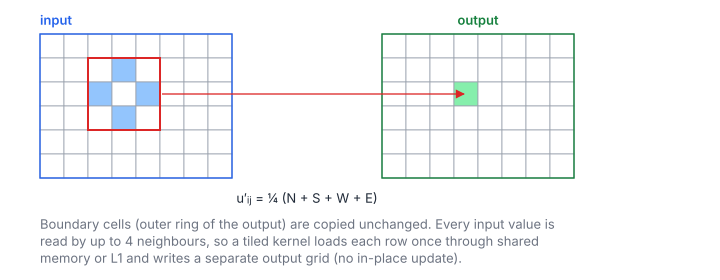

# 2D Jacobi Stencil

**Platform:** LeetGPU · **Difficulty:** medium · [Problem statement](https://leetgpu.com/challenges/2d-jacobi-stencil)

## Problem

One Jacobi sweep of the 5-point Laplace stencil on a `rows × cols` float32
grid ($\le 16\,384^2$; benchmark $8192^2$; tolerance `1e-5`). Interior cells
become the average of their 4 neighbours, and boundary cells are copied.
Jacobi iterations solve Laplace/Poisson equations (heat diffusion,
electrostatics). The stencil is the canonical **memory-bound, high-reuse**
access pattern.

## Visual Overview

The four blue cells are the neighbours of the highlighted output cell; the
centre itself is not used. The output is a separate grid, so no cell reads a
value that was already updated.

## Formulation

$$
u'_{ij} = \begin{cases}
\frac14\bigl(u_{i-1,j} + u_{i+1,j} + u_{i,j-1} + u_{i,j+1}\bigr), & 0 < i < R-1,\ 0 < j < C-1 \\
u_{ij}, & \text{otherwise (boundary)}
\end{cases}
$$

| Symbol | Meaning |
|---|---|
| $R,\ C$ | Grid rows and columns |
| $u_{ij}$ | Input value at row $i$, column $j$ (offset $iC + j$) |
| $u'_{ij}$ | Output value |

This is one step of the iteration $u^{(t+1)} = D^{-1}(b - (L + U)u^{(t)})$ for
the discrete Laplace equation $\nabla^2 u = 0$ with Dirichlet boundaries. The
input is never updated in place. That is what distinguishes Jacobi from
Gauss–Seidel.

## Approach

- 2-D grid of $32 \times 8$ blocks, one thread per cell, `threadIdx.x`
  along columns.
- Boundary threads copy. Interior threads load 4 neighbours and store
  $0.25\cdot\bigl(((u_{\uparrow} + u_{\downarrow}) + u_{\leftarrow}) + u_{\rightarrow}\bigr)$,
  the same summation order as the reference's four-term sum.
- `__restrict__` tells the compiler that `in` and `out` do not alias, so
  loads can be cached in the read-only path.

### Reuse Without Shared Memory

Each input value is read by up to 5 threads: its own, left, right, above,
below. Within a warp, the left, centre and right reads fall in the same
cache lines (L1 hits). The rows above and below were read by the
neighbouring block rows moments earlier (L2 hits). DRAM traffic therefore
stays close to 1 read + 1 write per cell, and an explicit shared-memory tile
with halo would mostly save L1/L2 transactions, not DRAM bytes.

## Cost Analysis

$$
Q_{\min} = 8RC\ \text{bytes}, \qquad W = 4RC, \qquad I = \frac{4}{8} = 0.5\ \text{FLOP/byte}
$$

| Symbol | Meaning |
|---|---|
| $Q_{\min}$ | Compulsory DRAM bytes: read and write each cell once |
| $W$ | 3 adds + 1 multiply per interior cell |
| $I$ | Arithmetic intensity |

Benchmark: 537 MB, i.e. ≈ 270 µs at 2 TB/s. Iterative solvers go beyond one
sweep with **temporal blocking**: several time steps per tile while it is in
shared memory. This raises $I$ proportionally.

## Pitfalls

- **In-place update** (`in == out`) turns Jacobi into an ill-defined
  Gauss–Seidel with races.
- **Degenerate grids.** With `rows` or `cols` < 3 everything is boundary.
  The index checks handle 1 × N grids.
- **FMA contraction** of the final `0.25 * sum` is irrelevant, since
  multiplying by a power of two is exact.

## Verification

All LeetGPU cases pass on [cuemu](../../tools/cuemu/README.md), including
1 × 1, 1 × N and 2 × 2 grids.

## Related

- [2D Convolution](../010-2d-convolution/), [Gaussian Blur](../028-gaussian-blur/).
