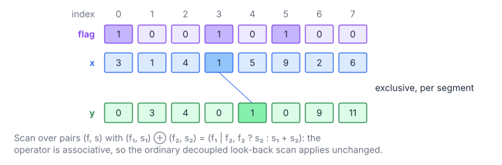

# Segmented Exclusive Prefix Sum

**Platform:** LeetGPU · **Difficulty:** medium · [Problem statement](https://leetgpu.com/challenges/segmented-exclusive-prefix-sum)

## Problem

Exclusive prefix sum that **restarts at every segment head**. `flags[i] = 1`
starts a new segment (and `flags[0] = 1` always), and output $i$ is the sum of
the earlier values *in the same segment* ($N \le 10^8$, values in
$[-100, 100]$; benchmark $N = 5\times10^7$; tolerance `1e-3`). Segmented
scans process many variable-length sequences in one launch, for example
per-row operations on sparse matrices, ragged batches of sequences, or
grouped aggregations.

## Visual Overview

Purple flags start new segments at indices 0, 3 and 5. Output 4 only sums the
earlier values of its own segment, which here is just x₃ = 1.

## Formulation

$$
y_i = \sum_{j = h(i)}^{i-1} x_j, \qquad h(i) = \max\{\, j \le i : f_j = 1 \,\}
$$

| Symbol | Meaning |
|---|---|
| $N$ | Array length |
| $x_j$ | Values (float32) |
| $f_j$ | Flag: 1 at a segment head, else 0 |
| $h(i)$ | Index of the head of the segment containing $i$ |
| $y_i$ | Output: exclusive segmented prefix; $y_i = 0$ at every head |

### Segmented Scan as an Ordinary Scan

Scan over pairs $(f, s)$ with the operator

$$
(f_1, s_1) \oplus (f_2, s_2) = \bigl(f_1 \lor f_2,\ \ f_2\ ?\ s_2 : s_1 + s_2\bigr)
$$

| Symbol | Meaning |
|---|---|
| $(f, s)$ | "contains a head" flag and the sum since the last head (or since the start of the range) |
| $\lor$ | Logical OR |
| $f_2\,?\,s_2 : s_1+s_2$ | If the right-hand range contains a head, the left-hand sum is discarded |

$\oplus$ is **associative** (with identity $(0, 0)$), so the whole
reduce-then-scan machinery of [Prefix Sum](../016-prefix-sum/) applies
unchanged. Only the combine function differs.

## Approach

With chunks of 2048 elements (256 threads × 8 consecutive items):

1. **`chunkAggregates`**: each thread folds its 8 items into a pair, a
   block-level $\oplus$-scan gives the chunk aggregate $(F_c, S_c)$.
2. **`scanAggregates`** (1 block): exclusive $\oplus$-scan of the chunk
   aggregates, with a carry across groups of 256. Its `sum` part is the value
   carried *into* each chunk, meaning the running segment sum if the chunk's
   first element is not a head.
3. **`scanChunks`**: recompute the per-thread aggregates, block-scan them, and
   derive each thread's exclusive prefix (via the previous thread's
   inclusive value in shared memory, combined with the chunk carry). Then
   walk the 8 items sequentially: reset `running` to 0 at a flag, write
   `running`, add the value.

All sums use float64, as the reference does.

### The Block Scan with a Non-Commutative Operator

The warp step is Hillis–Steele with `__shfl_up_sync` on both pair components:
`v = combine(other, v)`, with the lower lane's value on the **left**. Order
matters because $\oplus$ is associative but *not* commutative.

## Cost Analysis

$$
Q = \underbrace{8N}_{\text{pass 1: values + flags}} + \underbrace{8N + 4N}_{\text{pass 3}} = 20N\ \text{bytes}
$$

| Symbol | Meaning |
|---|---|
| $Q$ | DRAM bytes: read values and flags twice, write the output once |

Benchmark: 1 GB, i.e. ≈ 0.5 ms at 2 TB/s.

## Pitfalls

- **Operand order in `combine`** (left = earlier). Swapping it silently
  breaks segments that cross thread or warp boundaries.
- **Exclusive semantics.** The head element outputs 0, and the carry never
  crosses a head.
- **Float64 prefix.** Long segments sum many values; the reference itself
  uses double.

## Verification

All LeetGPU cases pass on [cuemu](../../tools/cuemu/README.md), including all
heads (output all zeros), a single segment (plain exclusive scan), and
segments that span chunk boundaries.

## Related

- [Prefix Sum](../016-prefix-sum/), [Stream Compaction](../072-stream-compaction/),
  [Linear Recurrence](../082-linear-recurrence/) (another non-commutative scan).
