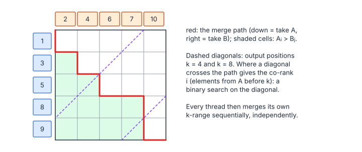

# Parallel Merge

**Platform:** LeetGPU · **Difficulty:** medium · [Problem statement](https://leetgpu.com/challenges/parallel-merge)

## Problem

Merge two sorted float32 arrays $A$ (length $M$) and $B$ (length $N$) into a
sorted $C$ of length $M + N$ ($M + N \le 5\times10^7$; benchmark
$M = N = 2.5\times10^7$). The result must be exact. Sequential merge is
inherently serial. The **merge path** technique splits it into fully
independent pieces with a binary search.

## Visual Overview

The red staircase is the merge path through the grid of A (rows) against B
(columns). A dashed diagonal is an output position k; where it crosses the
path tells how many elements come from A, found by a binary search along that
diagonal.

## Formulation

The first $k$ outputs of a stable merge consist of the first $i$ elements of
$A$ and the first $k - i$ elements of $B$ for a unique **co-rank** $i$:

$$
C[0{:}k] = \operatorname{merge}\bigl(A[0{:}i],\ B[0{:}k-i]\bigr), \qquad
i = \operatorname{corank}(k) = \min\bigl\{\, i \in [\max(0, k-N),\ \min(k, M)] : A_i > B_{k-i-1} \,\bigr\}
$$

(with $A_M = +\infty$ and $B_{-1} = -\infty$ as sentinels).

| Symbol | Meaning |
|---|---|
| $M,\ N$ | Lengths of $A$ and $B$ |
| $k$ | An output position (a "diagonal" of the merge grid) |
| $i$ | Number of elements taken from $A$ before position $k$ |
| $k - i$ | Number taken from $B$ |
| $A_i > B_{k-i-1}$ | The stopping condition: $A_i$ must come after $B$'s last taken element. Ties go to $A$ (stable, A-first) |

The predicate is monotone in $i$, so the co-rank is found by **binary search**
in $O(\log\min(M, N))$ steps.

Geometrically: draw the merge as a monotone path through an $M \times N$ grid.
Output position $k$ lies on the anti-diagonal $i + j = k$, and the binary
search finds where the path crosses it.

## Approach

- Each thread owns 8 consecutive outputs, starting at $k = 8t$.
- It binary-searches its own start co-rank $i$ (independently, with no
  communication), then sets $j = k - i$ and does a sequential merge of 8
  elements with the rule "take from $A$ if $A_i \le B_j$".
- Threads whose start is past $M + N$ exit.

Because the co-rank and the merge loop use the **same tie rule** (A first),
consecutive threads' ranges tile the output exactly: no gaps, no overlaps.

## Cost Analysis

$$
W = O\!\left(\frac{M+N}{8}\log\min(M,N)\right) + O(M+N), \qquad Q \approx 4(M + N)\cdot 2\ \text{bytes} + \text{search reads}
$$

| Symbol | Meaning |
|---|---|
| $W$ | Work: one binary search per 8 outputs, plus the linear merge |
| $Q$ | DRAM bytes: read $A$ and $B$ once, write $C$ once; binary-search probes mostly hit cache |

Benchmark: 400 MB of compulsory traffic, ≈ 0.2 ms. The merge loop's reads are
data-dependent (a thread advances through $A$ or $B$ unpredictably), so warps
only partially coalesce. A block-level merge path (co-rank per block, stage
both input windows in shared memory, then per-thread co-ranks within shared
memory) makes the DRAM reads fully coalesced.

## Pitfalls

- **Inconsistent tie handling** between the search and the merge creates
  duplicated or skipped elements whenever $A$ and $B$ share values.
- **Search bounds.** $i \in [\max(0, k-N),\ \min(k, M)]$. Outside this range
  $j$ would be negative or exceed $N$.
- **64-bit $k$.** $M + N$ fits in `int` here, but the start position is
  computed in 64-bit before the check.

## Verification

Exact match on all LeetGPU cases in [cuemu](../../tools/cuemu/README.md),
including $M = 1$ or $N = 1$, all-equal arrays, and disjoint value ranges.

## Related

- [Sorting](../015-sorting/), [Radix Sort](../036-radix-sort/), [Top-K](../029-top-k-selection/).
