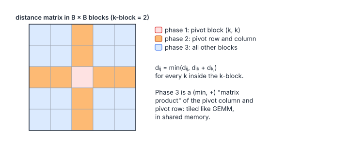

# All-Pairs Shortest Paths

**Platform:** LeetGPU · **Difficulty:** hard · [Problem statement](https://leetgpu.com/challenges/all-pairs-shortest-paths)

## Problem

All-pairs shortest paths with **Floyd–Warshall** on a dense $N\times N$
distance matrix ($N \le 4096$, $+\infty$ = no edge, zero diagonal, no negative
cycles; benchmark $N = 2048$; tolerance `1e-2`). The reference relaxes all
pairs through each intermediate vertex $k = 0, \dots, N-1$ in order.
Floyd–Warshall is $O(N^3)$ like GEMM, but in the $(\min, +)$ semiring. The
blocked version that makes it cache-friendly is the classic GPU formulation.

## Visual Overview

For pivot block k: phase 1 updates the pivot block itself (red), phase 2 its
row and column of blocks (orange), and phase 3 every remaining block (blue)
from those two.

## Formulation

$$
d^{(k+1)}_{ij} = \min\bigl(d^{(k)}_{ij},\ d^{(k)}_{ik} + d^{(k)}_{kj}\bigr), \qquad d^{(0)} = \text{dist}, \qquad \text{output} = d^{(N)}
$$

| Symbol | Meaning |
|---|---|
| $N$ | Number of vertices |
| $d^{(k)}_{ij}$ | Shortest $i \to j$ distance using only intermediate vertices $< k$ |
| dist | Input adjacency / weight matrix ($+\infty$ where there is no edge) |

Replacing $(+, \times)$ by $(\min, +)$ turns one step over all $k$ into a
"tropical" matrix product, $d_{ij} = \min_k (d_{ik} + d_{kj})$. The $k$ loop
is **sequential**, because step $k$ needs the results of step $k-1$. For fixed
$k$, all $(i, j)$ pairs are independent.

### Blocked Floyd–Warshall

Partition the matrix into $T\times T$ tiles ($T = 32$) and process $k$ in
blocks of $T$. In round $b$ (the $k$ values $bT \dots bT + T - 1$):

$$
\begin{aligned}
&\text{Phase 1 (diagonal tile):} && D_{bb} \leftarrow \operatorname{FW}(D_{bb}) \\
&\text{Phase 2 (row and column panels):} && D_{bj} \leftarrow \operatorname{FW}_{\text{row}}(D_{bb}, D_{bj}), \quad D_{ib} \leftarrow \operatorname{FW}_{\text{col}}(D_{ib}, D_{bb}) \\
&\text{Phase 3 (all other tiles):} && D_{ij} \leftarrow \min\Bigl(D_{ij},\ D_{ib} \otimes D_{bj}\Bigr)
\end{aligned}
$$

| Symbol | Meaning |
|---|---|
| $T$ | Tile size (32) |
| $b$ | Round index, $0 \le b < \lceil N/T\rceil$ |
| $D_{ij}$ | Tile at tile-row $i$, tile-column $j$ |
| FW | The $T$ sequential Floyd–Warshall steps restricted to one tile |
| $\otimes$ | $(\min, +)$ matrix product: $(X\otimes Y)_{rc} = \min_k (X_{rk} + Y_{kc})$ |

Phase 3 is exact because, once the panels are final for this round, the
remaining tiles only need $\min$ over $k$ inside the round's block, and
$\min$ is associative and commutative.

## Approach

Three kernels per round, with $32 \times 32$ thread blocks (one thread per tile
element):

1. **`phase1`** (1 block): load the diagonal tile into shared memory and run
   32 steps. Each step computes `cand`, then a barrier, then a conditional
   update, then a barrier. The first barrier ensures every thread reads step
   $k$'s values before anyone writes step $k+1$'s.
2. **`phase2`** ($\lceil N/T\rceil\times 2$ blocks): `blockIdx.y` selects the row
   panel or the column panel. Each block stages the diagonal tile and its own
   tile, then runs 32 dependent steps.
3. **`phase3`** ($\lceil N/T\rceil^2$ blocks): stage the column-panel tile
   $(i, b)$ and the row-panel tile $(b, j)$, and each thread computes
   $\min(d, \min_k(\text{col}[y][k] + \text{row}[k][x]))$ in registers. There is
   **no inner barrier**: phase 3 tiles do not depend on each other.

Out-of-range entries load as $+\infty$, which never wins a min.

## Cost Analysis

$$
W = 2N^3\ (\text{add + min}), \qquad
Q_{\text{naive}} \approx N\cdot 3\cdot 4N^2, \qquad
Q_{\text{blocked}} \approx \frac{N}{T}\cdot 3\cdot 4N^2
$$

| Symbol | Meaning |
|---|---|
| $W$ | Operations |
| $Q_{\text{naive}}$ | Bytes with one kernel per $k$ (each reads row $k$, column $k$, and reads/writes the whole matrix) |
| $Q_{\text{blocked}}$ | Bytes with blocking: each round reads and writes every tile once, plus its two panels |

At $N = 2048$: $W = 1.7\times10^{10}$ operations, and $Q_{\text{blocked}} \approx 3.2$ GB
versus ~100 GB naive. Phase 3 dominates and behaves like a GEMM with
$T = 32$. It is compute-bound on shared-memory loads plus `fminf`. Register
tiling (each thread computing 2 × 2 or 4 × 4 outputs), as in SGEMM, would
speed it up further.

## Pitfalls

- **Dependence inside phases 1 and 2.** Each $k$ step must see the previous
  step's results, hence the barrier pair. Phase 3 needs none.
- **Rounding.** The reference adds in float32 exactly as here. Path sums are
  exact integers in the tests; otherwise the `1e-2` tolerance covers
  association differences.
- **$+\infty + x = +\infty$** propagates correctly in IEEE arithmetic, so no
  special cases are needed.

## Verification

All LeetGPU cases pass on [cuemu](../../tools/cuemu/README.md) at `1e-2`,
including $N$ not a multiple of 32 and disconnected graphs ($+\infty$
results).

## Related

- [BFS Shortest Path](../046-bfs-shortest-path/), Tensara [All-Pairs Shortest Path](../../tensara/all-pairs-shortest-path/),
  [Matrix Multiplication](../002-matrix-multiplication/) (the $(+, \times)$ analogue).
