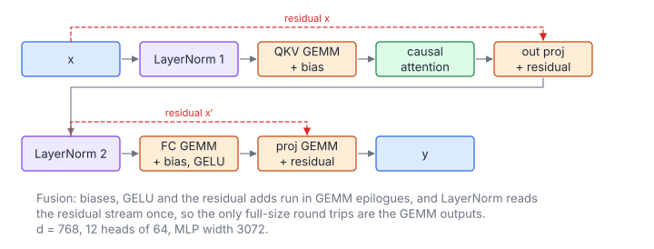

# GPT-2 Transformer Block

**Platform:** LeetGPU · **Difficulty:** hard · [Problem statement](https://leetgpu.com/challenges/gpt-2-transformer-block)

## Problem

One complete **GPT-2 (124M) decoder block** in float32. The input
$x \in \mathbb R^{S \times 768}$ and a packed weight buffer with all block
parameters (LayerNorm scales and shifts, QKV/output/MLP weights stored as
(in, out) and biases) produce the block output (tolerance `1e-3`). This
problem ties together GEMM, LayerNorm, attention and the activation
function, and shows how **kernel fusion** removes most of the elementwise
traffic.

## Visual Overview

Follow the boxes left to right, then continue on the second row. The dashed
red arcs are the residual connections that add the block's input back after
attention and after the MLP.

## Formulation

Pre-LayerNorm residual block with $d = 768$, $H = 12$ heads of $d_h = 64$, and
MLP width $4d = 3072$:

$$
\begin{aligned}
X_1 &= \operatorname{LN}_1(X), & [Q\ K\ V] &= X_1 W_{qkv} + \mathbf b_{qkv} \\
A_h &= \operatorname{softmax}\!\Bigl(\tfrac{Q_h K_h^{\mathsf T}}{\sqrt{d_h}}\Bigr) V_h, & X' &= X + \operatorname{Concat}(A_1..A_H)\,W_o + \mathbf b_o \\
X_2 &= \operatorname{LN}_2(X'), & Y &= X' + \operatorname{GELU}_{\tanh}\!\bigl(X_2W_{fc} + \mathbf b_{fc}\bigr)W_{\text{proj}} + \mathbf b_{\text{proj}}
\end{aligned}
$$

$$
\operatorname{LN}(\mathbf z) = \gamma\odot\frac{\mathbf z - \mu}{\sqrt{\sigma^2 + \varepsilon}} + \beta, \qquad
\operatorname{GELU}_{\tanh}(u) = \tfrac12 u\Bigl(1 + \tanh\bigl(\sqrt{2/\pi}\,(u + 0.044715\,u^3)\bigr)\Bigr)
$$

| Symbol | Meaning |
|---|---|
| $S$ | Sequence length (`seq_len`) |
| $d$ | Model width, 768 |
| $H,\ d_h$ | Heads (12) and head width (64) |
| $X$ | Block input, $S\times d$ |
| $\operatorname{LN}_1,\ \operatorname{LN}_2$ | LayerNorms with their own $\gamma, \beta$ (length $d$), $\varepsilon = 10^{-5}$ |
| $\mu,\ \sigma^2$ | per-row mean and biased variance of $\mathbf z$ |
| $W_{qkv},\ \mathbf b_{qkv}$ | Fused QKV projection, $d\times 3d$ and $3d$ |
| $Q_h, K_h, V_h$ | Columns $[h d_h, (h+1)d_h)$ of $Q$, $K$, $V$ |
| $A_h$ | Attention output of head $h$ ($S\times d_h$); no causal mask in this problem |
| $W_o,\ \mathbf b_o$ | Attention output projection, $d\times d$ |
| $X'$ | Hidden state after the first residual |
| $W_{fc},\ \mathbf b_{fc}$ | MLP up-projection, $d \times 4d$ |
| $W_{\text{proj}},\ \mathbf b_{\text{proj}}$ | MLP down-projection, $4d\times d$ |
| $\operatorname{GELU}_{\tanh}$ | GELU with the tanh approximation (as in the reference, `approximate="tanh"`) |
| $Y$ | Block output |

## Approach

### Kernel Sequence

| # | Kernel | Computes | Fused epilogue |
|---|---|---|---|
| 1 | `layerNormRows` | $X_1 = \operatorname{LN}_1(X)$ | – |
| 2 | GEMM $S\times d\cdot d\times 3d$ | $QKV$ | $+\,\mathbf b_{qkv}$ |
| 3 | Flash attention | $A = \operatorname{Concat}(A_h)$ | – |
| 4 | GEMM $S\times d\cdot d\times d$ | $X'$ | $+\,\mathbf b_o + X$ (residual) |
| 5 | `layerNormRows` | $X_2 = \operatorname{LN}_2(X')$ | – |
| 6 | GEMM $S\times d\cdot d\times 4d$ | MLP hidden | $+\,\mathbf b_{fc}$, then GELU |
| 7 | GEMM $S\times 4d\cdot 4d\times d$ | $Y$ | $+\,\mathbf b_{\text{proj}} + X'$ (residual) |

### A GEMM with Pluggable Epilogues

The 64 × 64 register-blocked SGEMM is a template
`gemmKernel<kTransB, Epi>`. After accumulation, each thread calls
`epi(acc, r, c)` for its 16 outputs. The functors are:

- `BiasEpi`: $v + b_c$;
- `BiasGeluEpi`: $\operatorname{GELU}_{\tanh}(v + b_c)$;
- `BiasResidualEpi`: $v + b_c + R_{rc}$.

The functor is inlined at compile time, so fusing costs nothing. Without
fusion, each of these would be a separate elementwise kernel that reads and
writes an $S\times 3d$ or $S\times 4d$ tensor.

### Attention Straight from the Packed QKV Buffer

The QKV GEMM writes rows of length $3d$: $[Q\,|\,K\,|\,V]$. Head $h$'s query
row $i$ lives at $\text{qkv} + i\cdot 3d + h d_h$, its key at an extra offset
$+d$, and its value at $+2d$. The strided flash-attention kernel (warp per
query row, online softmax, see [Multi-Head Attention](../012-multi-head-attention/))
takes these strides as parameters. That removes the reference's
`view/transpose/contiguous` shuffles. It writes directly into the
concatenated $S\times d$ layout.

### LayerNorm, Warp per Row

One warp per row of 768 values: 24 values per lane. Lanes accumulate
$\sum z$ and $\sum z^2$ (in float64) and reduce them with shuffles. The
normalisation then uses $\mu$ and $\sigma^2 = E[z^2] - \mu^2$, which is safe
in float64.

## Cost Analysis

$$
W \approx \underbrace{2S d(3d)}_{QKV} + \underbrace{4S^2 d}_{\text{attention}} + \underbrace{2Sd^2}_{W_o} + \underbrace{2\cdot 2S d(4d)}_{\text{MLP}} = 24Sd^2 + 4S^2d
$$

| Symbol | Meaning |
|---|---|
| $W$ | FLOPs of the block (LayerNorm and elementwise terms are negligible) |
| $24Sd^2$ | The familiar "$\approx 24 \times$ params-per-layer per token" rule: the block has ≈ $12d^2$ weights |
| $4S^2 d$ | Attention scores and $PV$ (quadratic in $S$) |

For $S = 1024$: $W \approx 1.45\times10^{10} + 3.2\times10^{9} \approx 18$ GFLOP.
The GEMMs dominate, so the SGEMM's efficiency sets the runtime. Fusion saves
roughly $2\cdot 4\,(3d + d + 4d + d)S$ bytes ≈ 75 MB of elementwise traffic
at $S = 1024$.

## Pitfalls

- **Weight layout.** The packed matrices are $(\text{in}, \text{out})$,
  i.e. $X W$, not $X W^{\mathsf T}$ as in `nn.Linear`. That is why the GEMMs
  use the "NN" form.
- **GELU variant.** GPT-2 uses the **tanh** approximation. The exact erf
  GELU differs by up to ~$10^{-3}$, right at the tolerance.
- **No causal mask.** The reference computes bidirectional attention here,
  unlike GPT-2 inference.
- **Temporary memory**: $S(3d + 3d + 4d)$ floats of scratch are
  allocated per call. The `xn` buffer is reused for both LayerNorms.

## Verification

All LeetGPU cases pass on [cuemu](../../tools/cuemu/README.md) at `1e-3`.
The large sequence lengths are enabled through this problem's
`cuemu_max_elements` setting.

## Related

- [LLaMA Transformer Block](../093-llama-transformer-block/), [DiT Block](../116-dit-block/),
  [Multi-Head Attention](../012-multi-head-attention/), [Layer Norm](../113-layer-normalization/).
