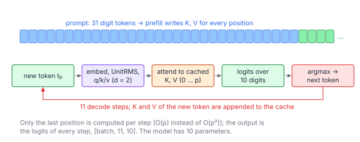

# Adder Transformer Inference

**Platform:** LeetGPU · **Difficulty:** medium · [Problem statement](https://leetgpu.com/challenges/adder-transformer-inference)

## Problem

Greedy autoregressive inference with a tiny, hand-designed transformer from
the *AdderBoard* competition. It has **10 parameters**, hidden size 2 and one
head, and it adds two 10-digit numbers. For a batch of prompts of 31 digit
tokens, run 11 decode steps and output the logits of every step,
$[\text{batch}, 11, 10]$ (tolerance `1e-2`). The model is trivial. The
lesson is how inference is organised: **KV caching** and only computing the
last position.

## Visual Overview

The prompt (blue) is processed once and its keys and values are cached. Each
decode step (row of boxes) only computes the newest position, attends to the
cache, and appends its own K and V.

## Formulation

### The Model

Model (one layer, pre-norm, $d = 2$, vocabulary $\{0..9\}$, tied embeddings):

$$
e(t) = \begin{bmatrix} w_0 - w_1 t^2 \\ -t \end{bmatrix}, \qquad
\operatorname{UnitRMS}(\mathbf x) = \frac{\mathbf x}{\sqrt{\tfrac12(x_0^2 + x_1^2) + \varepsilon}}
$$

### Queries, Keys and Values

For position $p$ with token $t_p$ and $\mathbf n_p = \operatorname{UnitRMS}(e(t_p))$:

$$
\mathbf q_p = R_{p\omega}\,\operatorname{UnitRMS}\!\begin{bmatrix} q_0 n_{p,0} \\ q_1 n_{p,0}\end{bmatrix}, \qquad
\mathbf k_p = R_{p\omega}\,\operatorname{UnitRMS}\!\begin{bmatrix} n_{p,0} \\ 0\end{bmatrix}, \qquad
v_p = v_0\, n_{p,1}, \qquad
R_\theta = \begin{bmatrix}\cos\theta & -\sin\theta\\ \sin\theta & \cos\theta\end{bmatrix}
$$

### Attention of the Last Position

Attention of the last position $L$ over positions $0..L$ (causal), added to
hidden dimension 1:

$$
a_L = \frac{\sum_{j \le L} e^{\lambda\,\mathbf q_L\cdot\mathbf k_j - m}\, v_j}{\sum_{j\le L} e^{\lambda\,\mathbf q_L\cdot\mathbf k_j - m}}, \qquad
\mathbf h = e(t_L) + \begin{bmatrix}0\\ a_L\end{bmatrix}
$$

### MLP, Final Norm and Logits

MLP ("carry" gate), final norm and tied logits:

$$
\mathbf m = \operatorname{UnitRMS}(\mathbf h), \quad
g_0 = \alpha m_0 + \gamma m_1, \quad g_1 = (\alpha - \gamma/1000)\,m_0 + \gamma m_1, \quad
h_1 \mathrel{+}= c\,\bigl(\operatorname{SiLU}(g_1) - \operatorname{SiLU}(g_0)\bigr) m_0
$$

$$
\mathbf f = \operatorname{UnitRMS}(\mathbf h)\odot\begin{bmatrix}\nu_0\\ \nu_1\end{bmatrix}, \qquad
\text{logit}_t = \mathbf f\cdot e(t), \qquad t_{L+1} = \arg\max_t \text{logit}_t
$$

| Symbol | Meaning |
|---|---|
| $t$, $t_p$ | A digit token (0–9); the token at position $p$ |
| $w_0, w_1$ | Embedding parameters (`w[0]`, `w[1]`) |
| $e(t)$ | 2-D token embedding (also the output projection, since the embeddings are tied) |
| $\varepsilon$ | $10^{-6}$ |
| $q_0, q_1, v_0$ | Query and value parameters (`w[2..4]`); the key projection has no parameters |
| $\omega$ | RoPE angular frequency $2\pi/19$ |
| $R_\theta$ | 2-D rotation (RoPE on a 2-dimensional head) |
| $\lambda$ | Attention scale, a model constant: $2^{-1/2}\cdot\frac{\ln 10}{\sqrt2\,(\cos 0.3\omega - \cos 0.7\omega)}$ |
| $m$ | Max logit for the softmax shift |
| $a_L$ | Attention output (the value vector has only dimension 0, written into hidden dim 1) |
| $\alpha, \gamma, c$ | MLP gate and carry parameters (`w[5..7]`) |
| $\nu_0, \nu_1$ | Final RMSNorm weights (`w[8]`, `w[9]`) |
| $\text{logit}_t$ | Output score of digit $t$, written for every decode step |

## Approach

### Only the Last Position Matters

The reference re-runs the whole sequence each step and keeps only the last
row of logits. With **one layer**, position $j$'s key and value depend only
on its own token and index, not on other positions. They can therefore be
computed once, when the token is appended, and cached. This is exactly the
**KV cache** of LLM inference. Each decode step is then:

1. the query of the last position ($O(1)$);
2. attention over the $\le 41$ cached keys ($O(L)$);
3. the residual, MLP, norm and 10 logits ($O(1)$).

### One Thread per Sequence

Per sequence, the whole state is ≤ 42 positions × 3 floats. One thread runs
the entire 11-step greedy loop in registers/local memory: embed the prompt
tokens → cache $(\mathbf k_j, v_j)$ → loop {query, attention, MLP, logits,
argmax, append}. The batch provides the parallelism.

### Matching the Reference Numerically

The logits feed an `argmax`, so a tiny numerical difference can flip a
generated digit and change every later step. The kernel therefore follows the
reference's operation order. The fixed constants ($\omega$, $\lambda$) are
computed on the host in double, exactly as the Python module does, and passed
in as floats.

## Cost Analysis

$$
W \approx B\left(31\,c_{\text{append}} + \sum_{s=0}^{10}\bigl(c_{\text{step}} + 6\,(31 + s)\bigr)\right)
$$

| Symbol | Meaning |
|---|---|
| $B$ | Batch size |
| $c_{\text{append}}$ | Cost of embedding a token and caching its key/value (≈ 30 FLOPs + sin/cos) |
| $c_{\text{step}}$ | Fixed per-step cost (query, MLP, norm, 10 logits ≈ 100 FLOPs + 3 exp) |
| $6(31+s)$ | Attention over the current length (dot, exp, two accumulations) |

A few thousand FLOPs per sequence: negligible. Without the KV cache
(recomputing all positions each step, as the reference does), the work would
be about 10× larger.

## Pitfalls

- **Greedy feedback.** An error in step $s$ changes the token fed into step
  $s+1$. Order-exact math avoids divergent continuations.
- **Value vector layout.** $V$ only has dimension 0, and the output
  projection moves it into hidden dimension 1. The reference is followed
  literally.
- **Positions.** RoPE uses the absolute position index $p$ (0-based), for
  both prompt and generated tokens.

## Verification

All LeetGPU cases pass on [cuemu](../../tools/cuemu/README.md) at `1e-2`
(logits of all 11 steps, which implicitly checks every generated digit).

## Related

- [RoPE Embedding](../061-rope-embedding/), [Speculative Decoding](../087-speculative-decoding-verification/),
  [INT8 KV-Cache Attention](../096-int8-kv-cache-attention/).
