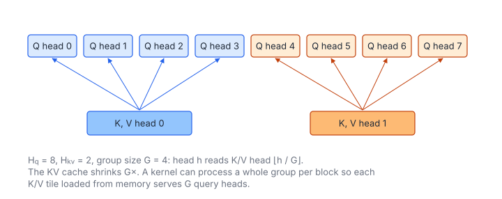

# Grouped Query Attention

**Platform:** LeetGPU · **Difficulty:** medium · [Problem statement](https://leetgpu.com/challenges/grouped-query-attention)

## Problem

Grouped-Query Attention (GQA), as used in LLaMA-2/3 70B, Mistral and Gemma.
$H_q$ query heads share $H_{kv}$ key/value heads, and each group of
$G = H_q/H_{kv}$ consecutive query heads attends to the same KV head.
$Q$ has shape $(H_q, S, D)$, $K$ and $V$ have shape $(H_{kv}, S, D)$
($H_{kv} \le H_q \le 64$, $S \le 4096$, $8 \le D \le 256$; benchmark
$H_q = 32$, $H_{kv} = 8$, $S = 1024$, $D = 128$; tolerance `1e-4`). GQA
shrinks the KV cache by $G\times$ with little quality loss.

## Visual Overview

Blue query heads 0–3 read K/V head 0 and orange heads 4–7 read K/V head 1. The
KV cache is therefore G = 4 times smaller than with one K/V head per query
head.

## Formulation

$$
O_h = \operatorname{softmax}_{\text{row}}\!\Bigl(\frac{Q_h K_{g(h)}^{\mathsf T}}{\sqrt D}\Bigr)\,V_{g(h)}, \qquad g(h) = \Bigl\lfloor \frac{h}{G} \Bigr\rfloor, \qquad G = \frac{H_q}{H_{kv}}
$$

| Symbol | Meaning |
|---|---|
| $H_q,\ H_{kv}$ | Numbers of query and key/value heads |
| $G$ | Group size (query heads per KV head) |
| $S$ | Sequence length |
| $D$ | Head dimension |
| $Q_h$ | $S\times D$ query matrix of head $h$ (offset $hSD$) |
| $K_{g},\ V_{g}$ | Key/value matrices of KV head $g$ |
| $g(h)$ | KV head used by query head $h$ (consecutive query heads share one) |
| $O_h$ | Output of head $h$ |

**Special cases:** $G = 1$ is standard multi-head attention (MHA), and
$H_{kv} = 1$ is multi-query attention (MQA).

The reference materialises the grouping with `repeat_interleave`, i.e. $G$
copies of $K$ and $V$. The kernel only maps $h \mapsto g(h)$ when computing
pointers.

## Approach

A FlashAttention-style kernel, one pass, with no $S\times S$ matrix:

- **Grid** $\lceil S/8\rceil \times H_q$. A block holds 8 consecutive query rows
  (one per warp) of head $h$, and streams KV head $g(h)$ through shared memory
  in tiles of 32 keys.
- **Per tile**: lane $\ell$ scores key $\ell$ (a full $D$-length dot product
  against the pre-scaled query in shared memory), then one warp max and one
  warp sum, the online-softmax rescale, and the $PV$ update with
  `__shfl_sync` broadcasts of $p_j$.
- **Accumulators**: lane $\ell$ owns output columns $\ell, \ell+32, \dots$, up
  to 8 registers for $D = 256$.
- **Dynamic shared memory**: $32(D+1) + 32D + 8D$ floats, ≈ 74 KB at
  $D = 256$. This exceeds the 48 KB default, so the launcher opts in with
  `cudaFuncSetAttribute(…MaxDynamicSharedMemorySize…)`. The K tile uses an
  odd pitch $D+1$ against bank conflicts.

### Why GQA Is Fast in Practice

The $G$ query heads of a group read the same $K_g$ and $V_g$. Their blocks
run close together in time (consecutive `blockIdx.y`), so after the first
block the KV tiles come from L2 instead of DRAM. KV traffic is divided by up
to $G$. For decoding ($S_q = 1$) this is the dominant saving.

## Cost Analysis

$$
W = 4H_qS^2D, \qquad Q_{\min} = 4\bigl(2H_qSD + 2H_{kv}SD\bigr)
$$

| Symbol | Meaning |
|---|---|
| $W$ | FLOPs (scores and $PV$ for every query head) |
| $Q_{\min}$ | Compulsory bytes: read $Q$ and write the output ($H_q$ heads), read $K$ and $V$ ($H_{kv}$ heads) |

Benchmark: $W \approx 17$ GFLOP, and $Q_{\min} = 42$ MB versus 67 MB for MHA with
$H_{kv} = H_q$. The kernel is compute-bound, so the gain from GQA shows up
mainly in memory capacity and at decode time.

## Pitfalls

- **Head mapping.** Consecutive query heads share a KV head
  (`repeat_interleave`), i.e. $g = \lfloor h/G\rfloor$, not $h \bmod H_{kv}$.
- **Shared memory above 48 KB** requires the opt-in attribute, or the launch fails.
- **Scale** $1/\sqrt D$.

## Verification

All LeetGPU cases pass on [cuemu](../../tools/cuemu/README.md) at `1e-4`,
including $G = 1$ (MHA), $H_{kv} = 1$ (MQA) and $D = 256$.

## Related

- [Multi-Head Attention](../012-multi-head-attention/), [Multi-Head Latent Attention](../114-multi-head-latent-attention/),
  [LLaMA Block](../093-llama-transformer-block/), [INT8 KV-Cache Attention](../096-int8-kv-cache-attention/).
