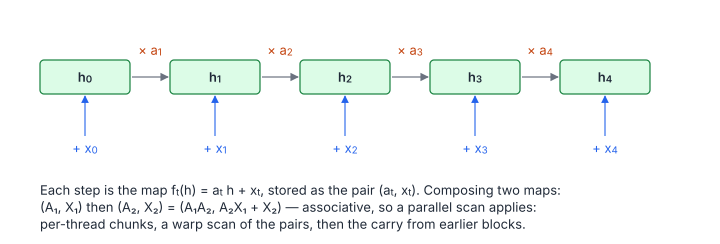

# Linear Recurrence

**Platform:** LeetGPU · **Difficulty:** medium · [Problem statement](https://leetgpu.com/challenges/linear-recurrence)

## Problem

Compute the first-order linear recurrence $h_t = a_t h_{t-1} + x_t$ with
$h_0 = x_0$, independently for $B$ sequences of length $L$ ($B \le 256$,
$L \le 65\,536$; benchmark $B = 64$, $L = 16\,384$; tolerance `1e-5`). This is
the computational core of **state-space models** (S4, Mamba, H3) and of
linear RNNs. It looks inherently sequential, but it is a **scan** over affine
maps.

## Visual Overview

Each state is the previous state times aₜ plus the new input xₜ. Writing a
step as the pair (aₜ, xₜ) makes composition associative, so the sequential
chain can be computed as a parallel scan.

## Formulation

$$
h_0 = x_0, \qquad h_t = a_t\,h_{t-1} + x_t\quad (1 \le t < L)
$$

Each step is the affine map $f_t(h) = a_t h + x_t$, written as the pair
$(a_t, x_t)$ (and $f_0 = (0, x_0)$, since position 0 has no predecessor). Then
$h_t = (f_t\circ\cdots\circ f_0)(0)$, and composition of affine maps is

$$
(A_1, X_1)\ \text{then}\ (A_2, X_2) = \bigl(A_1A_2,\ \ A_2X_1 + X_2\bigr)
$$

| Symbol | Meaning |
|---|---|
| $B,\ L$ | Batch size and sequence length |
| $a_t$ | Decay / transition coefficient at step $t$ |
| $x_t$ | Input at step $t$ |
| $h_t$ | State (output) at step $t$ |
| $f_t$ | The affine map applied at step $t$ |
| $(A, X)$ | An affine map $h \mapsto Ah + X$ (the composite of a range of steps) |

Composition is **associative** (it is matrix multiplication of
$\begin{bmatrix}A & X\\0 & 1\end{bmatrix}$), with identity $(1, 0)$. An
inclusive scan of the pairs, applied to $h = 0$, gives every $h_t$ in
$O(\log L)$ depth.

## Approach

**One block of 1024 threads per sequence** (grid = $B$):

1. **Local fold.** Thread $\tau$ owns a contiguous chunk of
   $\lceil L/1024\rceil$ steps (16 at the benchmark) and composes them into
   one map $(A_\tau, X_\tau)$ in float64.
2. **Block scan** of the 1024 maps: a warp `__shfl_up_sync` scan with
   `compose(prev, cur)` (order matters: earlier maps are on the left), then a
   scan of the 32 warp totals in warp 0.
3. **Replay.** Thread $\tau$'s incoming state is $h_{\text{in}} = X$-part of
   the exclusive prefix (all earlier chunks applied to 0). It re-walks its
   chunk sequentially, writing $h_t$.

This is the same "chunked scan" idea that makes Mamba's selective scan
parallel on GPUs.

## Cost Analysis

$$
W \approx 3BL\ (\text{fold}) + 2BL\ (\text{replay}) + O(B\cdot 1024\log 1024), \qquad Q = 12BL\ \text{bytes}
$$

| Symbol | Meaning |
|---|---|
| $W$ | FLOPs: the local fold and the replay are linear; the block scan is a small constant per block |
| $Q$ | DRAM bytes: read $a$ and $x$ once per pass (twice total, the second from L2) and write $h$ |

At the benchmark: 12.6 MB, i.e. microseconds of traffic. The runtime is
dominated by the 64-block grid (fewer blocks than SMs on large GPUs) and the
sequential 16-step chunk loops. Several blocks per sequence, with a
decoupled look-back between them, would raise parallelism for small $B$.

## Pitfalls

- **Non-commutative composition.** `compose(prev, incl)` with the earlier map
  first. The reverse order silently gives wrong results on long chains.
- **$h_0 = x_0$.** Position 0's coefficient $a_0$ must be ignored (treated as 0).
- **Precision.** Products of many $a_t$ can underflow or overflow float32 over
  long chunks; the float64 scan makes this robust.

## Verification

All LeetGPU cases pass on [cuemu](../../tools/cuemu/README.md) at `1e-5`,
including $L = 1$, $L < 1024$ (many empty chunks) and $a_t$ close to 1.

## Related

- [SSM Selective Scan](../094-ssm-selective-scan/), [GAE Reverse Scan](../110-gae-reverse-scan/),
  [Segmented Prefix Sum](../070-segmented-prefix-sum/), [Linear Attention](../056-linear-attention/).
