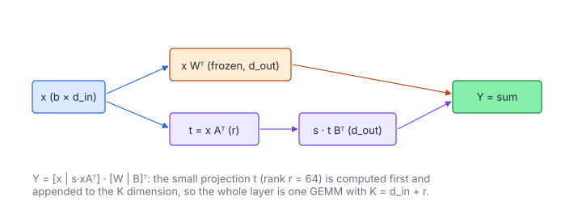

# LoRA Linear

**Platform:** LeetGPU · **Difficulty:** medium · [Problem statement](https://leetgpu.com/challenges/lora-linear)

## Problem

Forward pass of a **LoRA** linear layer: a frozen base weight $W$ plus a
trainable low-rank update $BA$ scaled by $s$
($x \in \mathbb R^{b\times d_{\text{in}}}$, $W \in \mathbb R^{d_{\text{out}}\times d_{\text{in}}}$,
$A \in \mathbb R^{r \times d_{\text{in}}}$, $B \in \mathbb R^{d_{\text{out}}\times r}$,
$r \le 256$; benchmark $b = 256$, $d_{\text{in}} = d_{\text{out}} = 4096$,
$r = 64$; tolerance `1e-4`). LoRA fine-tunes large models by training only
$A$ and $B$, which here is $2\cdot64\cdot4096 = 0.5$M parameters instead of 16.8M.

## Visual Overview

The top path is the frozen layer x Wᵀ; the bottom path projects x down to rank
r and back up, scaled by s. Both paths are added, and they can be merged into
a single GEMM.

## Formulation

$$
Y = xW^{\mathsf T} + s\,(xA^{\mathsf T})B^{\mathsf T} = \begin{bmatrix} x & s\,xA^{\mathsf T}\end{bmatrix}\begin{bmatrix} W & B\end{bmatrix}^{\mathsf T}
$$

| Symbol | Meaning |
|---|---|
| $b$ | Batch size |
| $d_{\text{in}},\ d_{\text{out}}$ | Input and output features |
| $r$ | LoRA rank |
| $x$ | Input, $b\times d_{\text{in}}$ |
| $W$ | Frozen base weight (`nn.Linear` layout, out × in) |
| $A$ | down-projection $r\times d_{\text{in}}$ |
| $B$ | up-projection $d_{\text{out}}\times r$ |
| $s$ | `lora_scale` (usually $\alpha/r$) |
| $[\,\cdot\ \cdot\,]$ | Horizontal concatenation along the inner (K) dimension |
| $Y$ | Output, $b\times d_{\text{out}}$ |

The right-hand form shows that the whole layer is **one GEMM over a
concatenated inner dimension** $d_{\text{in}} + r$, once the small matrix
$h = s\,xA^{\mathsf T}$ is known.

### Why Not Merge $W + sBA$?

For inference with a fixed adapter, precomputing $W' = W + sBA$ removes the
LoRA cost entirely. With many adapters (multi-tenant serving) or during
training, the adapter must stay separate, so the forward pass computes both
paths.

## Approach

1. **Kernel 1**: $h = s\,xA^{\mathsf T}$ ($b\times r$), an "NT" GEMM (the right
   operand is stored $r\times d_{\text{in}}$, row-major) with the scale
   applied in the epilogue.
2. **Kernel 2**: `gemmNtConcat` computes $[x\ h][W\ B]^{\mathsf T}$. Its $K$
   loop has **two segments**: first over $d_{\text{in}}$ with operands
   $(x, W)$, then over $r$ with $(h, B)$. Both accumulate into the same
   $4\times4$ registers, so the output is written **once** and there is no
   separate add kernel.

Both use the 64 × 64 register-blocked tile. For the NT layout, the $B$-side
tile is loaded with $k$ fastest, so reads of the weight rows are coalesced.

## Cost Analysis

$$
W_{\text{flop}} = 2b\,d_{\text{in}}\,d_{\text{out}} + 2b\,r\,(d_{\text{in}} + d_{\text{out}}), \qquad
\frac{W_{\text{LoRA}}}{W_{\text{base}}} = \frac{r(d_{\text{in}} + d_{\text{out}})}{d_{\text{in}}d_{\text{out}}}
$$

| Symbol | Meaning |
|---|---|
| $W_{\text{flop}}$ | FLOPs of the base and LoRA paths |
| $W_{\text{LoRA}}/W_{\text{base}}$ | Relative overhead of the adapter |

Benchmark: the base GEMM is 8.6 GFLOP, and LoRA adds $2\cdot 64/4096 = 3.1\%$.
The concatenated-K fusion also avoids writing and re-reading a
$b\times d_{\text{out}}$ partial result (8 MB).

## Pitfalls

- **Scale placement.** $s$ multiplies the LoRA path only. Applying it in
  kernel 1 (on $h$) keeps kernel 2 a plain sum.
- **Layouts.** $W$ and $B$ are $(\text{out}, \text{in})$ and $A$ is
  $(r, \text{in})$, so all right operands are "transposed" (NT).

## Verification

All LeetGPU cases pass on [cuemu](../../tools/cuemu/README.md) at `1e-4`,
including $r = 1$ and small batches.

## Related

- [Simple Inference](../041-simple-inference/), [SwiGLU MLP](../084-swiglu-mlp-block/),
  [Matrix Multiplication](../002-matrix-multiplication/).
