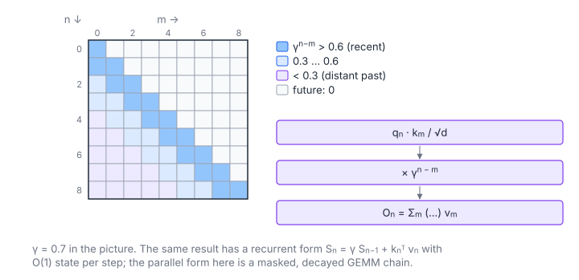

# Decaying Causal Attention

**Platform:** LeetGPU · **Difficulty:** medium · [Problem statement](https://leetgpu.com/challenges/decaying-causal-attention)

## Problem

The parallel form of **retention** (RetNet): causal attention without a
softmax, with weights that decay geometrically with distance
($Q, K, V \in \mathbb R^{S\times d}$, $S \le 8192$, $d \le 256$,
$0 < \gamma \le 1$; benchmark $S = 4096$, $d = 64$; tolerance `1e-3`).
Retention has an equivalent *recurrent* form with $O(1)$ state per step. That
is its selling point for inference.

## Visual Overview

Darker cells carry more weight: the factor γ^(n−m) decays with the distance to
the query. Future keys (upper triangle) get weight 0.

## Formulation

$$
O_n = \sum_{m=0}^{n} \gamma^{\,n-m}\; \frac{Q_n\cdot K_m}{\sqrt d}\; V_m, \qquad
\text{i.e.}\quad O = \Bigl(\tfrac{1}{\sqrt d}QK^{\mathsf T}\odot D\Bigr)V, \quad D_{nm} = \begin{cases}\gamma^{n-m}, & m \le n\\ 0, & m > n\end{cases}
$$

| Symbol | Meaning |
|---|---|
| $S$ | Sequence length |
| $d$ | Model/head dimension |
| $Q_n,\ K_m,\ V_m$ | Rows of the query, key and value matrices |
| $\gamma$ | Decay factor in $(0, 1]$ |
| $D$ | Causal decay mask (lower-triangular) |
| $O_n$ | Output row $n$ |

**Recurrent equivalent** (not used here, but it explains the model):

$$
\mathbf S_n = \gamma\,\mathbf S_{n-1} + K_n^{\mathsf T}V_n, \qquad O_n = \tfrac{1}{\sqrt d}\,Q_n\,\mathbf S_n
$$

| Symbol | Meaning |
|---|---|
| $\mathbf S_n$ | $d\times d$ recurrent state after position $n$ |

With no softmax there is no row maximum and no normaliser, and every term is
a plain weighted sum.

## Approach

The FlashAttention skeleton without the online-softmax bookkeeping:

- 8 warps = 8 query rows per block. K and V tiles of 32 keys are staged in
  **dynamic** shared memory (pitch $d+1$ for K). Up to ~74 KB at $d = 256$,
  so the launcher opts in via `cudaFuncSetAttribute`.
- Lane $\ell$ computes the full dot product for key $j = j_0 + \ell$ and
  multiplies by $\gamma^{n - j}$ (`powf`), or uses 0 if $j > n$.
- The $PV$ update broadcasts each lane's weight with `__shfl_sync`, and each
  lane accumulates its $\le 8$ output columns in registers.
- **Causal tile skipping.** Key tiles stop at the block's last row, so about
  half of all tiles are never touched.

## Cost Analysis

$$
W \approx 4d\cdot\frac{S(S+1)}{2} + \frac{S(S+1)}{2}\,c_{\text{pow}}, \qquad Q_{\min} = 16Sd\ \text{bytes}
$$

| Symbol | Meaning |
|---|---|
| $W$ | FLOPs for scores and $PV$ over the causal triangle, plus one `powf` per visible pair |
| $c_{\text{pow}}$ | Cost of `powf` (≈ 20–40 instructions) |
| $Q_{\min}$ | Read $Q, K, V$ and write $O$ once |

Benchmark: ≈ $2.1$ GFLOP + $8.4$M `powf`. A cheaper alternative computes
$\gamma^{n-j}$ as $\gamma^{n-j_0}\cdot\gamma^{-\ell}$ from two small tables,
but it overflows for small $\gamma$ and long distances. `powf` is robust.

## Pitfalls

- **Scale applies to the score only.** $\gamma^{n-m}$ multiplies after the
  scaled dot product; both go into the same weight.
- **Underflow.** For $\gamma < 1$ and large distances, $\gamma^{n-m}$
  underflows to 0, which is correct.
- **No normalisation.** Adding a softmax (by habit from other attention
  kernels) is wrong here.

## Verification

All LeetGPU cases pass on [cuemu](../../tools/cuemu/README.md) at `1e-3`,
including $\gamma = 1$ (causal linear attention) and $d = 256$.

## Related

- [Causal Attention](../053-casual-attention/), [Linear Attention](../056-linear-attention/),
  [Linear Recurrence](../082-linear-recurrence/) (the recurrent view).
