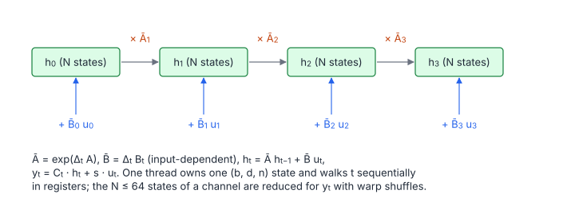

# SSM Selective Scan

**Platform:** LeetGPU · **Difficulty:** medium · [Problem statement](https://leetgpu.com/challenges/ssm-selective-scan)

## Problem

The **selective scan** of Mamba: a linear state-space recurrence whose
discretisation depends on the input through a time step $\Delta$. Inputs are
$u, \Delta \in \mathbb R^{B\times L\times D}$, $A \in \mathbb R^{D\times N}$
(negative), $B_{\text{proj}}, C \in \mathbb R^{B\times L\times N}$, and a skip
vector $\mathbf s \in \mathbb R^{D}$; the output is $y$ ($B \le 16$,
$L \le 8192$, $D \le 2048$, $N \le 64$; benchmark $B = 4$, $L = 4096$,
$D = 512$, $N = 16$; tolerance `1e-3`).

## Visual Overview

Each state hₜ is the previous state scaled by Āₜ plus the input term B̄ₜ uₜ.
Because Ā and B̄ depend on the input through Δ, the recurrence is "selective".

## Formulation

For batch $b$, channel $d$, state index $n$ and time $t$ (with $h_{-1} = 0$):

$$
\bar A_{t,n} = e^{\Delta_{t,d}A_{d,n}}, \qquad \bar B_{t,n} = \Delta_{t,d}\,B_{t,n}, \qquad
h_{t,n} = \bar A_{t,n}\, h_{t-1,n} + \bar B_{t,n}\, u_{t,d}, \qquad
y_{t,d} = \sum_{n=0}^{N-1} C_{t,n}\,h_{t,n} + s_d\,u_{t,d}
$$

| Symbol | Meaning |
|---|---|
| $B,\ L,\ D,\ N$ | Batch, sequence length, channels (`d_model`), state size (`d_state`) |
| $u_{t,d}$ | Input at time $t$, channel $d$ (the batch index $b$ is implicit) |
| $\Delta_{t,d}$ | Positive, input-dependent step size (this is what makes the scan "selective") |
| $A_{d,n}$ | continuous-time state matrix (diagonal per channel), negative |
| $\bar A_{t,n}$ | Discretised decay $\in (0,1)$ (zero-order hold) |
| $B_{t,n},\ C_{t,n}$ | Input and output projections, shared by all channels of the batch |
| $\bar B_{t,n}$ | Discretised input gain (Euler) |
| $h_{t,n}$ | Hidden state of channel $d$ (length $N$) |
| $s_d$ | Skip (the "$D$" term in Mamba's notation) |
| $y_{t,d}$ | Output |

Each $(b, d)$ pair runs $N$ independent first-order linear recurrences, the
same form as [Linear Recurrence](../082-linear-recurrence/) with time-varying
coefficients.

## Approach

### Parallelism Across Channels, Sequential in Time

With $B\cdot D = 2048$ independent $(b, d)$ pairs at the benchmark size, each
thread can own one pair and walk time sequentially. That avoids the
complexity of a parallel scan (which Mamba's CUDA kernel uses for long
sequences with few channels).

- **Registers**: the thread keeps its state vector `h[64]` and its row
  `A[d, :]` in registers. The loops over $n$ have a compile-time bound (64),
  are fully unrolled and guarded by `n < d_state`, so every index is a
  constant and nothing spills to local memory.
- **Shared broadcasts**: all 128 threads of a block have the same batch $b$
  (grid $\lceil D/128\rceil \times B$). $B_{t,:}$ and $C_{t,:}$ are identical
  for them, so the block stages them in shared memory for 32 time steps at a
  time, and reads them as broadcasts.
- **Coalesced streams**: $u_{t,d}$ and $\Delta_{t,d}$ are channels-last, so a
  warp reads 32 consecutive channels at each time step.
- Per step: $N$ exponentials, $N$ state updates, and an $N$-term dot product
  with $C$.

## Cost Analysis

$$
W \approx BLDN\,(c_{\exp} + 5), \qquad Q = 4BLD\cdot 3 + 8BLN\cdot\left\lceil\frac{D}{128}\right\rceil\ \text{bytes}
$$

| Symbol | Meaning |
|---|---|
| $W$ | Operations: one `expf` plus about 5 FLOPs per (b, t, d, n) |
| $c_{\exp}$ | Cost of `expf` |
| $Q$ | Bytes: read $u$, $\Delta$ and write $y$ once; every channel block re-reads $B$ and $C$ |

Benchmark: $BLDN = 1.3\times10^8$ state updates, dominated by `expf` (the
SFU does `ex2` at 1/4 rate), i.e. a few ms at most. Memory traffic is about
100 MB. Mamba's production kernel also fuses the discretisation and does the
scan over time in parallel chunks.

## Pitfalls

- **Register arrays with dynamic indices** would be demoted to local memory
  (slow). The fixed unrolled bound avoids that.
- **Barrier placement.** Inactive threads (channel ≥ $D$) must still help
  stage and reach the barriers; they `continue` only *after* staging.
- **Discretisation order.** The reference multiplies $\Delta\cdot B$ first,
  then by $u$. The kernel keeps `(dt * B) * u`.

## Verification

All LeetGPU cases pass on [cuemu](../../tools/cuemu/README.md) at `1e-3`,
including $N = 1$ and $N = 64$.

## Related

- [Linear Recurrence](../082-linear-recurrence/), [Causal Depthwise Conv1D](../090-causal-depthwise-conv1d/),
  [Linear Attention](../056-linear-attention/).
