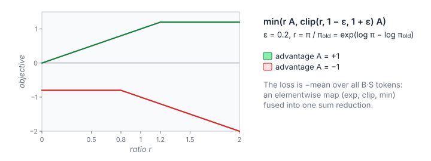

# PPO Clipped Surrogate Loss

**Platform:** LeetGPU · **Difficulty:** medium · [Problem statement](https://leetgpu.com/challenges/ppo-clipped-surrogate-loss)

## Problem

The clipped surrogate loss of **PPO** (Proximal Policy Optimisation), as
used in RLHF for LLMs. Given per-token advantages and the log-probabilities
of the sampled tokens under the current and the old policy (all $B\times S$
float32), return the scalar loss (tolerance `1e-4`).

## Visual Overview

For a positive advantage (green) the objective stops growing once r > 1 + ε;
for a negative advantage (red) it stops improving once r < 1 − ε. The loss is
minus the mean over all tokens.

## Formulation

$$
r_{b,s} = \exp\bigl(\log\pi_{b,s} - \log\pi^{\text{old}}_{b,s}\bigr), \qquad
\hat r_{b,s} = \operatorname{clip}(r_{b,s},\ 1-\varepsilon,\ 1+\varepsilon)
$$

$$
\mathcal L = -\frac{1}{BS}\sum_{b=0}^{B-1}\sum_{s=0}^{S-1}\min\bigl(r_{b,s}A_{b,s},\ \hat r_{b,s}A_{b,s}\bigr)
$$

| Symbol | Meaning |
|---|---|
| $B,\ S$ | Batch size and response length |
| $\log\pi_{b,s}$ | log-probability of token $(b, s)$ under the current policy |
| $\log\pi^{\text{old}}_{b,s}$ | Same under the policy that generated the data |
| $r_{b,s}$ | Importance ratio $\pi/\pi^{\text{old}}$ |
| $\varepsilon$ | Clip range (`clip_eps`, e.g. 0.2) |
| $\hat r$ | Ratio clipped to the trust region $[1-\varepsilon, 1+\varepsilon]$ |
| $A_{b,s}$ | Advantage estimate (see [GAE](../110-gae-reverse-scan/)) |
| $\mathcal L$ | Loss: negative mean surrogate (PPO *maximises* the surrogate) |

**Why the min.** For $A > 0$, the objective stops rewarding increases of
$r$ beyond $1+\varepsilon$. For $A < 0$, it stops rewarding decreases below
$1-\varepsilon$. The update therefore cannot move the policy far from the old
one in a single step.

## Approach

The per-token map is purely elementwise, so it is fused into the two-pass
reduction of [Reduction](../004-reduction/):

1. **`surrogateSums`**: grid-stride over $BS$ tokens. Compute `expf`, clamp,
   and `fminf` of the two products in float32, accumulate, then do a float64
   block reduction into per-block partials.
2. **`finalize`**: float64 sum of the partials, $-\text{sum}/(BS)$.

Computing the ratio from the *difference* of log-probabilities (one `expf`)
is the numerically sensible form. Dividing two probabilities would underflow
for long sequences.

## Cost Analysis

$$
Q = 12BS\ \text{bytes}, \qquad W \approx BS\,(c_{\exp} + 6)
$$

| Symbol | Meaning |
|---|---|
| $Q$ | DRAM bytes (three input arrays read once) |
| $W$ | Per token: one `expf`, clamp, two multiplies, min, add |

The kernel is memory-bound for any realistic size. In training it is fused
with the log-softmax gather that produces $\log\pi$.

## Pitfalls

- **Sign.** The loss is the **negative** mean.
- **Clamping order.** `fminf(fmaxf(r, 1-ε), 1+ε)` is the same as
  `torch.clamp` for valid $\varepsilon$.
- **Precision of the mean.** Float64 partials, as in all reductions here.

## Verification

All LeetGPU cases pass on [cuemu](../../tools/cuemu/README.md) at `1e-4`,
with positive and negative advantages and ratios on both sides of the clip range.

## Related

- [GRPO Surrogate Loss](../109-grpo-surrogate-loss/), [DPO Loss](../108-dpo-sequence-loss/),
  [GAE Reverse Scan](../110-gae-reverse-scan/), [Value Clipping](../062-value-clipping/).
