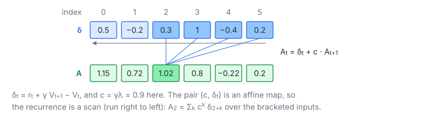

# Parallel Reverse Scan (GAE)

**Platform:** LeetGPU · **Difficulty:** medium · [Problem statement](https://leetgpu.com/challenges/parallel-reverse-scan-gae)

## Problem

**Generalised Advantage Estimation** for $B$ trajectories of length $S$:
one-step TD errors, then a *reverse* discounted accumulation from the end of
each sequence (tolerance `1e-3`). GAE feeds the advantages of
[PPO](../107-ppo-clipped-surrogate-loss/). Its right-to-left dependency is a
scan that runs backwards.

## Visual Overview

Aₜ depends on δₜ and on Aₜ₊₁, so the dependency runs right to left (arrow). A₂
collects δ₂ … δ₅ with weights 1, c, c², c³.

## Formulation

$$
\delta_t = r_t + \gamma\,V_{t+1} - V_t\quad (V_S = 0), \qquad
A_t = \delta_t + c\,A_{t+1}\quad (A_S = 0), \qquad c = \gamma\lambda
$$

Unrolled: $A_t = \sum_{k=0}^{S-1-t} c^{k}\,\delta_{t+k}$.

| Symbol | Meaning |
|---|---|
| $B,\ S$ | Batch (trajectories) and sequence length |
| $r_t$ | Reward at step $t$ |
| $V_t$ | Value estimate at step $t$; the value after the last step is 0 |
| $\gamma$ | Discount factor |
| $\lambda$ | GAE parameter, trading bias against variance |
| $c$ | Combined decay $\gamma\lambda$ |
| $\delta_t$ | temporal-difference error |
| $A_t$ | Advantage (output) |

### As a Scan of Affine Maps

Each step is the map $f_t(a) = c\,a + \delta_t$, applied from $t = S-1$ down
to 0, starting from $a = 0$. Composition is associative (see
[Linear Recurrence](../082-linear-recurrence/)). A chunk $[lo, hi)$ composes
into

$$
A_{lo} = M\cdot A_{hi} + D, \qquad M = c^{\,hi - lo}, \qquad D = \sum_{t=lo}^{hi-1} c^{\,t - lo}\,\delta_t
$$

| Symbol | Meaning |
|---|---|
| $[lo, hi)$ | A contiguous chunk of time steps |
| $M,\ D$ | Multiplier and offset of the chunk's composite map |

## Approach

**One block of 1024 threads per trajectory:**

1. **Reverse chunk ownership.** Thread $k$ owns the $k$-th chunk *counted
   from the end*: $[\,S - (k+1)p,\ S - kp\,)$ with $p = \lceil S/1024\rceil$.
   Scanning thread 0, 1, 2, … then follows the recurrence direction
   (right to left in time), and an ordinary *forward* block scan works.
2. Each thread walks its chunk backwards to fold $(M, D)$ in float64.
   $\delta_t$ is computed on the fly from $r_t, V_t, V_{t+1}$.
3. **Block scan** of the maps with the composition
   $(M_1, D_1)$ then $(M_2, D_2) = (M_1M_2,\ D_2 + M_2 D_1)$: warp shuffles,
   then the warp totals.
4. The exclusive prefix applied to $A_S = 0$ gives the advantage **entering**
   the chunk from the right. The thread replays its chunk right to left,
   writing $A_t$.

## Cost Analysis

$$
Q = 12BS\ \text{bytes}, \qquad W \approx 8BS + O(B\cdot1024\log1024)
$$

| Symbol | Meaning |
|---|---|
| $Q$ | Bytes: read rewards and values (values twice, cached) and write advantages |
| $W$ | FLOPs of the fold and replay (linear) plus the block scans |

At typical RL sizes (thousands of steps × hundreds of trajectories), the
kernel is memory-bound, and there is one block per trajectory.

## Pitfalls

- **Direction of composition.** Chunks to the *right* act first. Mixing up
  the operand order breaks long sequences only.
- **Bootstrapping.** $V_S = 0$ (no bootstrap value past the end), as in the
  reference.
- **Empty chunks** (when $S < 1024$) must be the identity map $(1, 0)$.

## Verification

All LeetGPU cases pass on [cuemu](../../tools/cuemu/README.md) at `1e-3`,
including $S = 1$ and the worked example from the statement
($c = 0.45$ gives $A = [3.308, 4.24, 4.2, 2.0]$).

## Related

- [Linear Recurrence](../082-linear-recurrence/), [PPO Clipped Loss](../107-ppo-clipped-surrogate-loss/),
  [Prefix Sum](../016-prefix-sum/).
