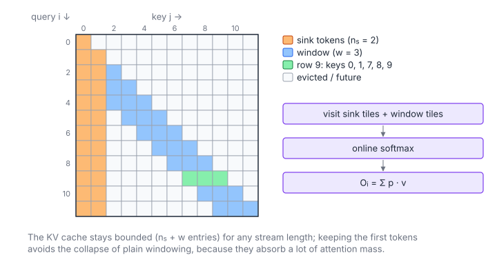

# Attention with Sinks

**Platform:** LeetGPU · **Difficulty:** medium · [Problem statement](https://leetgpu.com/challenges/attention-with-sinks)

## Problem

The attention pattern of **StreamingLLM**: causal attention where each query
sees the first `num_sinks` tokens (the "attention sinks") plus a sliding
window of the most recent `window_size` tokens
($Q, K, V \in \mathbb R^{M\times d}$, $M \le 10^4$, $d \le 128$,
sinks $\le 16$). This keeps the KV cache bounded for arbitrarily long streams
without the quality collapse that plain windowing suffers when the initial
tokens (which absorb large attention mass) are evicted.

## Visual Overview

Every query sees the two sink columns (orange) and a window of the three most
recent keys (blue). Row 9 (green) therefore attends to keys 0, 1, 7, 8 and 9.

## Formulation

$$
\mathcal A_i = \bigl\{\, j \le i \ :\ j < n_s\ \ \lor\ \ j \ge i - w + 1 \,\bigr\}, \qquad
O_i = \sum_{j\in\mathcal A_i}\frac{e^{s_{ij} - m_i}}{\sum_{j'\in\mathcal A_i} e^{s_{ij'} - m_i}}\,V_j, \qquad s_{ij} = \frac{Q_i\cdot K_j}{\sqrt d}
$$

| Symbol | Meaning |
|---|---|
| $M,\ d$ | Sequence length and head dimension |
| $n_s$ | Number of sink tokens (`num_sinks`) |
| $w$ | Window size (`window_size`), counting the current token |
| $\mathcal A_i$ | Allowed keys of query $i$: the sinks (up to $i$) plus the last $w$ positions |
| $s_{ij}$ | Scaled score |
| $m_i$ | Max over the allowed set |
| $O_i$ | Output row |

$\lvert\mathcal A_i\rvert \le n_s + w$, so the cost per query is constant, not $O(i)$.

## Approach

The flash-style kernel (8 warps = 8 query rows $[r_0, r_1]$ per block, K/V
tiles of 32, lane-per-key scoring, online softmax) visits **only two key
ranges**:

1. the sinks $[0,\ \min(n_s, r_1 + 1))$;
2. the window union $[\max(r_0 - w + 1, \text{end of range 1}),\ r_1]$, i.e.
   everything any of the 8 rows might need.

Both ranges are iterated in tiles. Inside a tile, lane $\ell$'s key $j$ is
allowed for the warp's row $i$ only if
$j \le i \land (j < n_s \lor j \ge i - w + 1)$. Otherwise it gets score
$-\infty$ and weight 0. The loop bounds are block-uniform, so all warps take
part in every barrier.

## Cost Analysis

$$
W \approx 4d\sum_i \lvert\mathcal A_i\rvert \le 4dM(n_s + w), \qquad \text{tiles per block} \approx \left\lceil\frac{n_s}{32}\right\rceil + \left\lceil\frac{w + 7}{32}\right\rceil
$$

| Symbol | Meaning |
|---|---|
| $W$ | FLOPs over allowed pairs |
| Tiles per block | Key tiles loaded per 8-row block |

Linear in $M$. With small $w$, most lanes in a tile are masked, the same
efficiency concern as [Sliding Window Attention](../059-sliding-window-attn/).

## Pitfalls

- **Overlap between sinks and window** for early rows: the second range
  starts at the end of the first, so no key is visited twice (which would
  double-count it in the softmax).
- **Causality applies to sinks too**: row 0 with $n_s = 4$ may only see key 0.
- **Window convention**: $j \ge i - w + 1$ includes the current token, i.e.
  $w$ keys in total.

## Verification

All LeetGPU cases pass on [cuemu](../../tools/cuemu/README.md), including
$n_s \ge M$ (full causal attention) and $w = 1$.

## Related

- [Sliding Window Attention](../059-sliding-window-attn/), [Causal Attention](../053-casual-attention/),
  [INT8 KV-Cache Attention](../096-int8-kv-cache-attention/).
