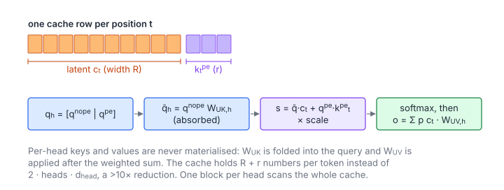

# Multi-Head Latent Attention Decode

**Platform:** LeetGPU · **Difficulty:** hard · [Problem statement](https://leetgpu.com/challenges/multi-head-latent-attention-decode)

## Problem

One **decode step** of DeepSeek-V2/V3's **Multi-Head Latent Attention**.
Instead of per-head keys and values, the KV cache stores one low-rank latent
vector $\mathbf c_t$ (width $R$, `kv_lora_rank`) and one small shared rotary
key $\mathbf k^{\text{pe}}_t$ (width $r$) per position. The per-head
up-projections $W_{UK}$ and $W_{UV}$ reconstruct keys and values implicitly.
With weight absorption, attention runs entirely in the latent space
(tolerance `1e-3`). MLA cuts KV-cache memory by more than an order of
magnitude compared with MHA.

## Visual Overview

Each cache row stores a latent vector cₜ and a small rotary key. The query is
folded into the latent space (weight absorption), so per-head keys and values
are never materialised.

## Formulation

For head $h$, with query $\mathbf q_h = [\mathbf q^{\text{nope}}_h\,|\,\mathbf q^{\text{pe}}_h]$ and cache row $t$ = $[\mathbf c_t\,|\,\mathbf k^{\text{pe}}_t]$:

$$
\tilde{\mathbf q}_h = \mathbf q^{\text{nope}}_h\,W_{UK,h}, \qquad
s_{h,t} = \frac{\tilde{\mathbf q}_h\cdot\mathbf c_t + \mathbf q^{\text{pe}}_h\cdot\mathbf k^{\text{pe}}_t}{\sqrt{d_h + r}}, \qquad
\mathbf o_h = \Bigl(\sum_{t} \operatorname{softmax}_t(s_h)_t\,\mathbf c_t\Bigr)\,W_{UV,h}
$$

| Symbol | Meaning |
|---|---|
| $H$ | Number of heads |
| $T$ | Number of cached positions (`seq_len`) |
| $R$ | Latent width (`kv_lora_rank`, 512 in DeepSeek-V3) |
| $d_h$ | Head dimension of the content part (`head_dim`) |
| $r$ | Rotary dimension (`rope_dim`, 64) |
| $\mathbf q^{\text{nope}}_h,\ \mathbf q^{\text{pe}}_h$ | Content and rotary parts of head $h$'s query |
| $\mathbf c_t$ | Latent vector of position $t$, shared by all heads (acts as both key and value) |
| $\mathbf k^{\text{pe}}_t$ | Shared rotary key of position $t$ |
| $W_{UK,h}$ | Key up-projection of head $h$, $d_h\times R$ |
| $W_{UV,h}$ | Value up-projection of head $h$, $R\times d_h$ |
| $\tilde{\mathbf q}_h$ | "absorbed" query in latent space (length $R$) |
| $s_{h,t}$ | Score |
| $\mathbf o_h$ | Output of head $h$ (length $d_h$) |

### Weight Absorption

The reconstructed key of head $h$ would be $\mathbf k_{h,t} = \mathbf c_tW_{UK,h}^{\mathsf T}$,
so $\mathbf q^{\text{nope}}_h\cdot\mathbf k_{h,t} = (\mathbf q^{\text{nope}}_hW_{UK,h})\cdot\mathbf c_t$.
Moving $W_{UK}$ onto the (single) query costs one small GEMV instead of
reconstructing $T$ keys. Likewise $\sum_t a_t(\mathbf c_tW_{UV,h}) = (\sum_t a_t\mathbf c_t)W_{UV,h}$
applies $W_{UV}$ **once** after the weighted sum.

## Approach

After absorption, the problem is **ordinary attention with one shared KV
head (MQA)**: key vector $[\mathbf c_t\,|\,\mathbf k^{\text{pe}}_t]$
(width $R + r \le 576$), value vector $\mathbf c_t$ (width $R \le 512$).

1. **`absorbQuery`**: one thread per $(h, i)$ of the concatenated query
   $[\tilde{\mathbf q}_h\,|\,\mathbf q^{\text{pe}}_h]$. For $i < R$ it is a dot
   product over $d_h$ with column $i$ of $W_{UK,h}$; otherwise it copies the
   rotary part.
2. **`latentAttention`**: flash-style, **4 heads per block** (one warp each).
   All heads share the cache, so every 32-row cache tile staged in shared
   memory serves 4 heads (MQA reuse). Rows are streamed in 128-wide column
   slices for the scores (up to 576 wide) and for the values (512 wide, 16
   register accumulators per lane). Online softmax as usual. Output: the
   latent vector $\sum_t a_{h,t}\mathbf c_t$.
3. **`upProject`**: one thread per $(h, j)$, a dot product over $R$ with
   column $j$ of $W_{UV,h}$.

## Cost Analysis

$$
\text{cache bytes per token} = 4(R + r)\ \ \text{vs.}\ \ 4\cdot 2Hd_h\ \text{(MHA)}, \qquad
W \approx 2Hd_hR + 2HT(2R + r) + 2HRd_h
$$

| Symbol | Meaning |
|---|---|
| Cache bytes | KV-cache footprint per position: MLA stores one latent row; MHA stores keys and values for every head |
| $W$ | FLOPs: absorption, scores and weighted sum over $T$ positions, up-projection |

With DeepSeek-V3's numbers ($H = 128$, $d_h = 128$, $R = 512$, $r = 64$):
576 values per token instead of 32 768, i.e. 57× smaller. Decode reads the
cache once for all heads, so the kernel is bandwidth-bound on
$4T(R + r)$ bytes.

## Pitfalls

- **Scale.** $1/\sqrt{d_h + r}$, which uses the *reconstructed* head width
  plus the rope width, not $R$.
- **Shared rotary key.** $\mathbf k^{\text{pe}}$ is the same for all heads,
  and only the query's rope part is per-head.
- **Register budget.** 16 value accumulators per lane ($R = 512$) plus the
  score loop fit within the limits because the slice loops have
  compile-time bounds.

## Verification

All LeetGPU cases pass on [cuemu](../../tools/cuemu/README.md) at `1e-3`,
with a stress test at DeepSeek-like sizes ($R = 512$, $r = 64$).

## Related

- [GQA](../080-grouped-query-attention/), [INT8 KV-Cache Attention](../096-int8-kv-cache-attention/),
  [RoPE](../061-rope-embedding/).
