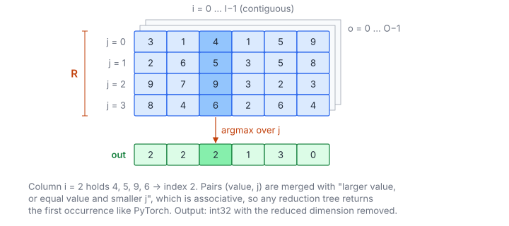

# Argmax Over Dimension

**Platform:** Tensara · **Difficulty:** easy · [Problem statement](https://tensara.org/problems/argmax)

## Problem

Index of the maximum along dimension `dim` of an $n$-D float32 tensor
(row-major, first occurrence on ties). The output is int32 with that
dimension removed. Test shapes range from $(16, 128, 256)$ to
$(64, 128, 128, 128)$, reducing over different axes. The same
"reduce along an arbitrary axis" machinery powers every `*-dim` problem on
Tensara.

## Visual Overview

Column i = 2 holds 4, 5, 9, 6, so its output is index 2. Merging (value,
index) pairs with a tie-break on the smaller index returns the first
occurrence in any reduction order.

## Formulation

View the tensor as three axes: everything before `dim`, the reduced axis,
and everything after it.

$$
O = \prod_{k<\text{dim}} S_k, \qquad R = S_{\text{dim}}, \qquad I = \prod_{k>\text{dim}} S_k, \qquad
x[o, j, i] = \text{input}[\,(oR + j)\,I + i\,]
$$

$$
\text{out}[oI + i] = \min\Bigl\{\ j^\star \ :\ x[o, j^\star, i] = \max_{0 \le j < R} x[o, j, i]\ \Bigr\}
$$

| Symbol | Meaning |
|---|---|
| $S_k$ | Size of dimension $k$ |
| $O$ | "outer" size: product of the dimensions before `dim` |
| $R$ | Length of the reduced dimension |
| $I$ | "inner" size: product of the dimensions after `dim` (the memory stride of the reduced axis) |
| $x[o, j, i]$ | The element at outer index $o$, reduced index $j$, inner index $i$ |
| out | $O\cdot I$ indices; the smallest index among maxima wins |

The reduction operator is on pairs $(v, j)$:

$$
(v_1, j_1) \oplus (v_2, j_2) = \begin{cases} (v_2, j_2), & v_2 > v_1\ \lor\ (v_2 = v_1 \land j_2 < j_1) \\ (v_1, j_1), & \text{otherwise}\end{cases}
$$

| Symbol | Meaning |
|---|---|
| $(v, j)$ | A candidate value and its index |
| $\oplus$ | Associative and commutative "arg-max with first-index tie-break" |

## Approach

Two kernels, chosen by $I$:

- **$I = 1$ (reducing the contiguous last axis)**: one **warp per output**.
  Lanes stride the row of $R$ contiguous floats (coalesced), fold with
  $\oplus$, then five `__shfl_down_sync` steps on both $v$ and $j$.
- **$I > 1$**: one **thread per output** $(o, i)$ loops over $j$ with stride
  $I$. Neighbouring threads have neighbouring $i$, so at every step the warp
  reads 32 consecutive floats, which is coalesced *across* threads.

The reduction logic is a small `Acc` struct (identity, make, combine,
shuffle, finish). The same two kernels, instantiated with different structs,
solve argmin, max/min/sum/mean/product along a dimension.

The `shape` array may arrive as a host or a device pointer, so it is copied
with `cudaMemcpyDefault` and unified addressing picks the direction.

## Cost Analysis

$$
Q = 4\,ORI + 4\,OI\ \text{bytes}, \qquad T_{\min} = \frac{4ORI}{\beta}
$$

| Symbol | Meaning |
|---|---|
| $Q$ | DRAM bytes: read the whole tensor once, write the indices |
| $\beta$ | DRAM bandwidth |

Largest case $(64, 128, 128, 128)$: 537 MB, i.e. ≈ 0.27 ms at 2 TB/s. With
$I = 1$ and small $R$ (e.g. 128), a warp-per-row wastes lanes. Several
rows per warp would help.

## Pitfalls

- **Ties**: `torch.argmax` returns the first maximal index. The combine rule
  compares indices on equal values.
- **Identity element** (index `INT_MAX`) for lanes with no data.
- **64-bit sizes**: $O\cdot R\cdot I$ can exceed $2^{31}$ elements, so indices
  are `long long`.

## Verification

All test cases (scaled variants of every official shape/dim) pass on
[cuemu](../../tools/cuemu/README.md) with exact index equality.

## Related

- [Argmin](../argmin/), [Max over Dimension](../max-dim/), [Sum over Dimension](../sum-dim/),
  [Mean](../mean-dim/), [Product](../product-dim/). LeetGPU [Reduction](../../leetgpu/004-reduction/).
