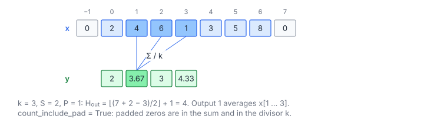

# 1D Average Pooling

**Platform:** Tensara · **Difficulty:** easy · [Problem statement](https://tensara.org/problems/avg-pool-1d)

## Problem

1-D average pooling with window $k$, stride $S$ and zero padding $P$ over a
long float32 vector ($H$ up to $6.7\times10^7$; e.g. $k = 7$, $S = 4$,
$P = 3$). It matches `F.avg_pool1d` with its default
`count_include_pad=True`: padded positions count as zeros, and the divisor is
always $k$.

## Visual Overview

Output 1 averages the three highlighted inputs. Padded zeros (grey) count in
the sum and in the divisor, as with PyTorch's default
`count_include_pad=True`.

## Formulation

$$
H_{\text{out}} = \left\lfloor\frac{H + 2P - k}{S}\right\rfloor + 1, \qquad
y_i = \frac1k\sum_{m=0}^{k-1}\tilde x_{Si + m - P}, \qquad
\tilde x_t = \begin{cases} x_t, & 0 \le t < H\\ 0, & \text{otherwise}\end{cases}
$$

| Symbol | Meaning |
|---|---|
| $H$ | Input length |
| $k$ | Window size (`kernel_size`) |
| $S$ | Stride |
| $P$ | Padding on each side |
| $H_{\text{out}}$ | Output length |
| $\tilde x$ | zero-padded input |
| $y_i$ | Output: window average with a fixed divisor $k$ |

## Approach

One thread per output $i$ (grid-stride over $H_{\text{out}}$). The window
starts at $t_0 = Si - P$. The thread sums the in-range elements, skipping
out-of-range positions (equivalent to adding zeros), and multiplies by $1/k$.

Consecutive threads start $S$ elements apart, so a warp's window loads cover
a contiguous span of about $32S + k$ elements: mostly coalesced, with
overlapping windows served by L1 when $S < k$.

## Cost Analysis

$$
Q \approx 4H + 4H_{\text{out}}\ \text{bytes}, \qquad W = kH_{\text{out}}
$$

| Symbol | Meaning |
|---|---|
| $Q$ | DRAM bytes (each input read about once thanks to caching; each output written once) |
| $W$ | Additions |

Largest case ($H = 6.7\times10^7$, $S = 3$): ≈ 360 MB, i.e. ≈ 0.18 ms.
The kernel is memory-bound.

## Pitfalls

- **Divisor**: always $k$ (`count_include_pad=True`), even for windows that
  hang over the padding.
- **Output length formula** with floor division.
- **64-bit indexing** for large $H$.

## Verification

All test cases (scaled and odd-sized variants of the official shapes) pass
on [cuemu](../../tools/cuemu/README.md).

## Related

- [Avg Pool 2D](../avg-pool-2d/), [Avg Pool 3D](../avg-pool-3d/), [Max Pool 1D](../max-pool-1d/).
