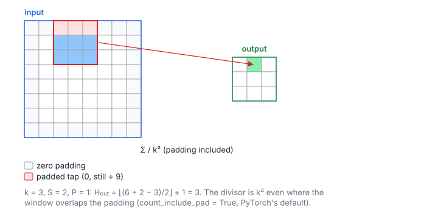

# 2D Average Pooling

**Platform:** Tensara · **Difficulty:** medium · [Problem statement](https://tensara.org/problems/avg-pool-2d)

## Problem

2-D average pooling of an $H\times W$ float32 matrix with a $k\times k$
window, stride $S$ and zero padding $P$. The reference is
`torch.nn.functional.avg_pool2d` with its defaults, which means
`count_include_pad=True`: padded positions count as zeros **and** in the
divisor. The check is `rtol = 2e-4`, `atol = 2e-5`.

## Visual Overview

The red window belongs to the highlighted output. Where it covers padding (red
cells) those zeros still count, and the divisor stays k².

## Formulation

$$
H_{\text{out}} = \left\lfloor \frac{H + 2P - k}{S} \right\rfloor + 1, \qquad
W_{\text{out}} = \left\lfloor \frac{W + 2P - k}{S} \right\rfloor + 1
$$

$$
\text{out}[i, j] = \frac{1}{k^2} \sum_{m=0}^{k-1} \sum_{n=0}^{k-1} \tilde{x}\bigl[S i + m - P,\ S j + n - P\bigr], \qquad
\tilde{x}[r, c] = \begin{cases} x[r, c], & 0 \le r < H,\ 0 \le c < W \\ 0, & \text{otherwise} \end{cases}
$$

| Symbol | Meaning |
|---|---|
| $x$ | Input matrix, $H\times W$, row-major |
| $\tilde{x}$ | $x$ extended with zeros outside its bounds (the padding) |
| $k$ | Window side (`kernel_size`) |
| $S$ | Stride between consecutive windows |
| $P$ | Zero padding on every side |
| $H_{\text{out}}, W_{\text{out}}$ | Output height and width |
| $i, j$ | Output row and column |
| $m, n$ | Offsets inside the window |
| $k^2$ | The divisor; always the full window size, even at the borders |

## Approach

1. **One thread per output** with a grid-stride loop over the
   $H_{\text{out}}W_{\text{out}}$ outputs. Consecutive threads get
   consecutive $j$, so a warp reads a band of $k$ rows whose columns overlap
   when $S < k$: neighbouring threads hit the same cache lines, and L1/L2
   supplies most of the $k^2$ loads.
2. **Padding is a bounds test**, not a copy: rows and columns outside
   $[0, H)$ and $[0, W)$ are skipped (they add 0).
3. **Divide by $k^2$** at the end, whatever the number of in-bounds
   elements.

The sizes are small ($k \le$ a few), so a shared-memory tile would only save
cache hits. For large $k$ the separable trick of [Box Blur](../box-blur/)
applies (average = row sum, then column sum).

## Cost Analysis

$$
W_{\text{ops}} = k^2 H_{\text{out}} W_{\text{out}}, \qquad
Q \approx 4\,(HW + H_{\text{out}}W_{\text{out}})\ \text{bytes}, \qquad
T_{\min} = \frac{Q}{\beta}
$$

| Symbol | Meaning |
|---|---|
| $W_{\text{ops}}$ | Additions |
| $Q$ | DRAM bytes, assuming the window overlap is served by caches |
| $\beta$ | DRAM bandwidth |
| $T_{\min}$ | Bandwidth lower bound on the run time |

The arithmetic intensity is about $k^2/8$ operations per byte (for $S = 1$),
far below the ridge point, so the kernel is bandwidth-bound.

## Pitfalls

- **`count_include_pad`**: dividing by the number of *valid* elements is
  what Box Blur wants, not this problem.
- **Output size** uses integer division of $H + 2P - k$ by $S$; compute it
  in signed `int`, not `size_t`.
- **64-bit indices** for the flattened input offset.

## Verification

All test cases (scaled-down variants of the official sizes) pass on
[cuemu](../../tools/cuemu/README.md) against the PyTorch reference.

## Related

- [Avg Pool 1D](../avg-pool-1d/), [Avg Pool 3D](../avg-pool-3d/),
  [Max Pool 2D](../max-pool-2d/), [Box Blur](../box-blur/).
