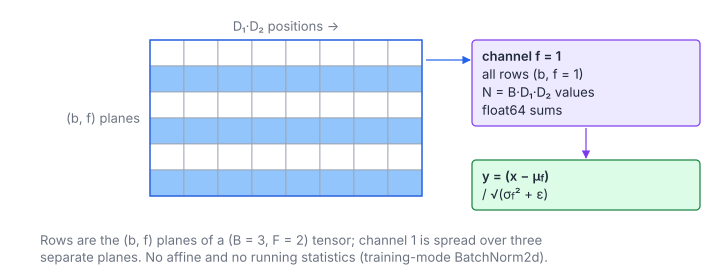

# Batch Normalization

**Platform:** Tensara · **Difficulty:** medium · [Problem statement](https://tensara.org/problems/batch-norm)

## Problem

Batch normalization of a float32 tensor of shape $(B, F, D_1, D_2)$,
without affine parameters or running statistics, $\epsilon = 10^{-5}$. The
reference is `nn.BatchNorm2d(F, affine=False, track_running_stats=False)`
in training mode. That layer computes **one mean and one variance per
channel $f$**, over the batch **and** both spatial axes. (The statement's
note about "each spatial location" does not match the reference; the
reference wins.) The check is `rtol = atol = 1e-4`.

## Visual Overview

Rows are the (sample, channel) planes. Channel 1 appears in three separate
planes (highlighted); its statistics are taken over all of them together.

## Formulation

$$
\mu_f = \frac{1}{N} \sum_{b=0}^{B-1} \sum_{p=0}^{D_1D_2-1} x_{b,f,p}, \qquad
\sigma_f^2 = \frac{1}{N} \sum_{b=0}^{B-1} \sum_{p=0}^{D_1D_2-1} \bigl(x_{b,f,p} - \mu_f\bigr)^2, \qquad
N = B\,D_1 D_2
$$

$$
y_{b,f,p} = \frac{x_{b,f,p} - \mu_f}{\sqrt{\sigma_f^2 + \epsilon}}
$$

| Symbol | Meaning |
|---|---|
| $B, F$ | Batch size, number of channels |
| $D_1, D_2$ | Spatial extents; $p$ is the flattened spatial index |
| $x_{b,f,p}$ | Input at batch $b$, channel $f$, position $p$; flat offset $(bF + f)D_1D_2 + p$ |
| $N$ | Number of elements that share one channel's statistics |
| $\mu_f$ | per-channel mean |
| $\sigma_f^2$ | per-channel **biased** variance (divide by $N$, not $N-1$) |
| $\epsilon$ | $10^{-5}$, keeps the square root away from 0 |
| $y_{b,f,p}$ | Output, same layout as $x$ |

## Approach

1. **One block per channel** ($F$ blocks, 1024 threads). The channel's data
   is $B$ contiguous chunks of $D_1D_2$ floats with stride $FD_1D_2$ between
   them. Threads walk the flat index $i \in [0, N)$, mapped to
   $b = \lfloor i / D_1D_2 \rfloor$ and $p = i \bmod D_1D_2$, so consecutive
   threads read consecutive addresses: every load is coalesced.
2. **Two-pass statistics**: first the mean, then the *centered* sum of
   squares. This avoids the cancellation of
   $\mathbb{E}[x^2] - \mathbb{E}[x]^2$. Both sums are accumulated in `double`
   and reduced with warp shuffles plus a 32-entry shared array.
3. **Normalize** in a third pass with $r_f = 1/\sqrt{\sigma_f^2+\epsilon}$
   computed once per block.

## Cost Analysis

$$
Q = 3 \cdot 4\,BFD_1D_2 \ (\text{reads}) + 4\,BFD_1D_2 \ (\text{writes}), \qquad T_{\min} = \frac{Q}{\beta}
$$

| Symbol | Meaning |
|---|---|
| $Q$ | DRAM bytes: three read passes and one write pass |
| $\beta$ | DRAM bandwidth |

At $(16, 64, 256, 256)$ the tensor is 268 MB, so $Q \approx 1.07$ GB, about
0.55 ms at 2 TB/s. With only $F = 32 \dots 256$ blocks the GPU is
under-filled for small $F$. Splitting each channel over several blocks
(partial sums, then a second tiny kernel), or Welford's single pass, would
cut both problems.

## Pitfalls

- **Statistics per channel, not per location**: following the statement's
  note literally gives a different (wrong) answer.
- **Biased variance** ($1/N$), as PyTorch uses in training mode.
- **Precision**: $N$ reaches $4\cdot 512^2 \approx 10^6$; fp32 running sums
  drift, fp64 does not.

## Verification

All test cases (scaled-down variants of the official sizes) pass on
[cuemu](../../tools/cuemu/README.md) against the PyTorch reference.

## Related

- [Layer Norm](../layer-norm/), [RMS Norm](../rms-norm/),
  LeetGPU [Batch Normalization](../../leetgpu/040-batch-normalization/).
