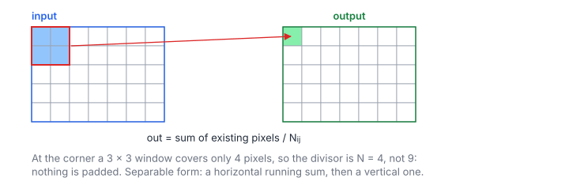

# Box Blur

**Platform:** Tensara · **Difficulty:** easy · [Problem statement](https://tensara.org/problems/box-blur)

## Problem

Box blur of a single-channel float32 image of height $h$ and width $w$ with
an odd window of side $K$ (15, 21 or 27 in the tests, on $1920\times1080$
and $2048\times2048$ images). At the borders only the pixels that exist are
averaged, so the divisor shrinks near the edges. The check is
`rtol = atol = 1e-4`.

## Visual Overview

At the corner the 3 × 3 window covers only four real pixels (red box), so it
divides by 4 instead of 9. Nothing is padded.

## Formulation

$$
r = \left\lfloor K/2 \right\rfloor, \qquad
\text{out}[i, j] = \frac{1}{N_{ij}} \sum_{u = i_0}^{i_1} \sum_{v = j_0}^{j_1} x[u, v]
$$

$$
i_0 = \max(i - r, 0),\quad i_1 = \min(i + r, h - 1),\quad
j_0 = \max(j - r, 0),\quad j_1 = \min(j + r, w - 1),\quad
N_{ij} = (i_1 - i_0 + 1)(j_1 - j_0 + 1)
$$

| Symbol | Meaning |
|---|---|
| $x$ | Input image, $h\times w$, row-major |
| $K$ | Window side (`kernel_size`, odd) |
| $r$ | Window radius |
| $i, j$ | Pixel row and column |
| $i_0, i_1, j_0, j_1$ | Window limits clipped to the image |
| $N_{ij}$ | Number of valid pixels in the clipped window |

Because the clipped window is a rectangle, the sum factors:

$$
\text{out}[i, j] = \frac{1}{N_{ij}} \sum_{u=i_0}^{i_1} R[u, j], \qquad R[u, j] = \sum_{v=j_0}^{j_1} x[u, v]
$$

| Symbol | Meaning |
|---|---|
| $R$ | Horizontal (row) sums, an intermediate $h\times w$ image |

## Approach

1. **Row pass** `rowSums`: one thread per pixel computes $R[u, j]$ over at
   most $K$ neighbours in the same row. Warp neighbours share almost all
   loads, which L1 serves.
2. **Column pass** `colSums`: one thread per pixel sums $R$ down its column
   (at most $K$ loads, coalesced across the warp since neighbouring threads
   have neighbouring $j$), then divides by $N_{ij}$.
3. The temporary $R$ is `cudaMalloc`ed per call and freed after a
   synchronize.

This is $2K$ additions per pixel instead of $K^2$ (54 vs 729 at $K = 27$).
A running-sum (sliding window) version would need $O(1)$ per pixel, but it
serializes each row, which hurts parallelism.

## Cost Analysis

$$
W_{\text{ops}} = 2K\,hw, \qquad Q \approx 4 \cdot 4\,hw\ \text{bytes}, \qquad T_{\min} = \frac{Q}{\beta}
$$

| Symbol | Meaning |
|---|---|
| $W_{\text{ops}}$ | Additions in both passes |
| $Q$ | DRAM bytes: read $x$, write $R$, read $R$, write out |
| $\beta$ | DRAM bandwidth |

For $2048^2$: $Q \approx 67$ MB, about 34 µs at 2 TB/s. Fusing both passes in
one kernel with a shared-memory tile (plus a halo of $r$ rows) would save
the round trip of $R$.

## Pitfalls

- **Divisor**: the count of valid pixels, not $K^2$ (contrast with
  [Avg Pool 2D](../avg-pool-2d/)).
- **Rounding**: the reference sums in a different order (conv2d), so
  results differ in the last bits; `1e-4` tolerances absorb this.
- **Temporary allocation** in the timed region costs a little; a real
  library would keep a workspace.

## Verification

All test cases (scaled-down variants of the official sizes) pass on
[cuemu](../../tools/cuemu/README.md) against the PyTorch reference.

## Related

- [Avg Pool 2D](../avg-pool-2d/), [Edge Detect](../edge-detect/),
  [Conv 2D](../conv-2d/), LeetGPU [2D Convolution](../../leetgpu/010-2d-convolution/).
