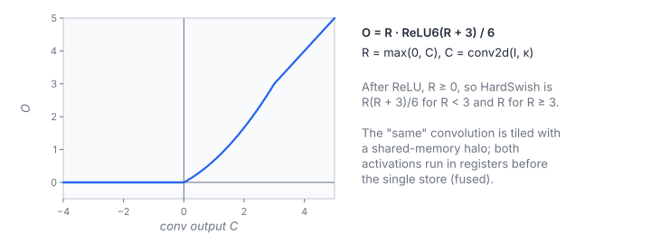

# 2D Convolution with ReLU and HardSwish

**Platform:** Tensara · **Difficulty:** medium · [Problem statement](https://tensara.org/problems/conv2d-relu-hardswish)

## Problem

A "same" 2-D convolution of an $H\times W$ image with an odd
$K_h\times K_w$ kernel (zero padding), followed by ReLU and then
HardSwish, all in one call. Sizes go up to $2048^2$ with $13\times13$
kernels. The check is `rtol = 9e-5`, `atol = 2e-4`.

## Visual Overview

The curve is the combined activation applied to a convolution output C. It is
0 for negative C, a gentle parabola up to C = 3 and the identity beyond; it
runs in registers before the single store.

## Formulation

$$
C[i, j] = \sum_{u=0}^{K_h-1}\sum_{v=0}^{K_w-1} \tilde{I}\bigl[i + u - p_h,\ j + v - p_w\bigr]\,\kappa[u, v]
$$

$$
R = \max(0, C), \qquad
\operatorname{ReLU6}(t) = \min\bigl(6, \max(0, t)\bigr), \qquad
O = R \cdot \frac{\operatorname{ReLU6}(R + 3)}{6}
$$

| Symbol | Meaning |
|---|---|
| $\tilde{I}$ | Input image with zero padding outside $H\times W$ |
| $\kappa$ | Kernel $K_h\times K_w$ |
| $p_h, p_w$ | $(K_h-1)/2$ and $(K_w-1)/2$ |
| $C$ | Convolution result |
| $R$ | After ReLU |
| $O$ | Output after HardSwish |

Because $R \ge 0$, the composition simplifies to

$$
O = \begin{cases} 0, & C \le 0 \\ C\,(C + 3)/6, & 0 < C < 3 \\ C, & C \ge 3 \end{cases}
$$

| Symbol | Meaning |
|---|---|
| $C$ | The convolution value at one pixel |

## Approach

The banded shared-memory convolution of [Conv 2D](../conv-2d/) (32 × 32
output tile, 4 rows per thread, kernel rows staged 8 at a time) is
instantiated with a `ReluHardSwish` epilogue functor. The activation is
applied to the fp32 accumulator in registers, right before the single
store. The intermediate images $C$ and $R$ never touch memory: this is the
entire point of fusion.

## Cost Analysis

$$
W = 2HWK_hK_w + 5HW, \qquad Q_{\text{fused}} \approx 8HW, \qquad Q_{\text{unfused}} \approx 8HW + 2\cdot 8HW
$$

| Symbol | Meaning |
|---|---|
| $W$ | Flops: the convolution plus about 5 per pixel for the activations |
| $Q_{\text{fused}}$ | Compulsory bytes: read the image, write the output |
| $Q_{\text{unfused}}$ | With separate ReLU and HardSwish kernels, each reading and writing an $H\times W$ image |

For small kernels ($3\times3$ at $512^2$) the convolution is only 18
flops per pixel and the unfused pipeline would be bandwidth-bound, so
fusion roughly triples the speed there.

## Pitfalls

- **Order of operations**: ReLU first, then HardSwish; HardSwish alone of
  a negative input is not 0 for $-3 < C < 0$.
- **Division by 6**: the reference divides; multiplying by $1/6$ differs by
  one ulp, which the tolerance absorbs, but dividing matches exactly.

## Verification

All test cases (scaled-down variants of the official sizes) pass on
[cuemu](../../tools/cuemu/README.md) against the PyTorch reference.

## Related

- [Conv 2D](../conv-2d/), [ReLU](../relu/), [GEMM + ReLU](../gemm-relu/).
