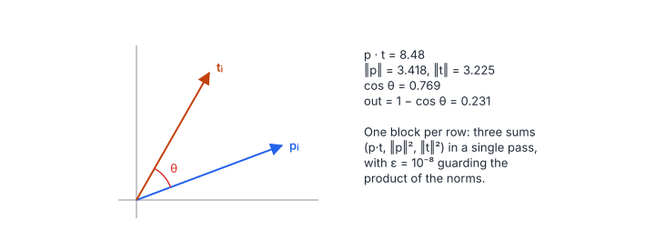

# Cosine Similarity

**Platform:** Tensara · **Difficulty:** easy · [Problem statement](https://tensara.org/problems/cosine-similarity)

## Problem

For $N$ pairs of float32 vectors of length $D$ (row $i$ of `predictions`
and row $i$ of `targets`), output the cosine *distance*
$1 - \cos(\mathbf{p}_i, \mathbf{t}_i)$. The reference is
`1 - F.cosine_similarity(p, t, dim=1)` with $\epsilon = 10^{-8}$. The check
is `rtol = atol = 1e-4`.

## Visual Overview

Each row pair is two vectors; only the angle θ between them matters. The block
reduces the dot product and both squared norms in one pass and outputs 1 − cos
θ.

## Formulation

$$
\text{out}_i = 1 - \frac{\mathbf{p}_i\cdot\mathbf{t}_i}{\sqrt{\max\bigl(\lVert\mathbf{p}_i\rVert^2\,\lVert\mathbf{t}_i\rVert^2,\ \epsilon^2\bigr)}}, \qquad
\mathbf{p}_i\cdot\mathbf{t}_i = \sum_{j=0}^{D-1} p_{ij}t_{ij}, \qquad
\lVert\mathbf{p}_i\rVert^2 = \sum_{j=0}^{D-1} p_{ij}^2
$$

| Symbol | Meaning |
|---|---|
| $N$ | Number of vector pairs (rows) |
| $D$ | Vector length (columns) |
| $\mathbf{p}_i, \mathbf{t}_i$ | Row $i$ of `predictions` and `targets` |
| $p_{ij}, t_{ij}$ | Their elements |
| $\lVert\cdot\rVert$ | Euclidean (L2) norm |
| $\epsilon$ | $10^{-8}$; guards against division by zero |
| $\text{out}_i$ | Loss of pair $i$, in $[0, 2]$ |

The statement writes the denominator as
$\max(\epsilon, \lVert\mathbf{p}\rVert)\cdot\max(\epsilon, \lVert\mathbf{t}\rVert)$;
current PyTorch clamps the *product* of squared norms as above. The two
differ only when a norm is below $10^{-8}$, which random test data never
produces.

## Approach

1. **One block per row** (256 threads). Each thread strides over the row
   and accumulates the three sums $\sum pt$, $\sum p^2$, $\sum t^2$ in one
   pass, so each input element is loaded once.
2. **Three block reductions** (warp `__shfl_xor_sync` butterfly, then a
   32-entry shared array). The helper ends with a `__syncthreads()` so the
   shared scratch can be reused by the next call.
3. Thread 0 writes $1 - \text{dot}/\sqrt{\max(pp\cdot tt, 10^{-16})}$.

## Cost Analysis

$$
Q = 8ND + 4N\ \text{bytes}, \qquad W = 6ND\ \text{flops}, \qquad T_{\min} = \frac{Q}{\beta}
$$

| Symbol | Meaning |
|---|---|
| $Q$ | DRAM bytes: both matrices once, one float per row out |
| $W$ | Three FMAs per element pair |
| $\beta$ | DRAM bandwidth |

The intensity is under 1 flop/byte: purely bandwidth-bound. If $N$ is
small (fewer rows than about 2 × the number of SMs) and $D$ large, several
blocks per row would be needed to fill the GPU.

## Pitfalls

- **Output is $1 - \cos$**, not $\cos$ and not $-\cos$.
- **One pass**: computing the norms and the dot product in separate loops
  triples the traffic.
- **`sqrt` of the product** rather than the product of two `sqrt`s avoids
  one rounding and matches PyTorch more closely.

## Verification

All test cases (scaled-down variants of the official sizes) pass on
[cuemu](../../tools/cuemu/README.md) against the PyTorch reference.

## Related

- [L2 Norm](../l2-norm/), [Triplet Margin Loss](../triplet-margin/),
  LeetGPU [Dot Product](../../leetgpu/017-dot-product/).
