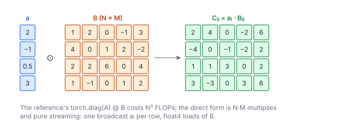

# Diagonal Matrix Multiplication

**Platform:** Tensara · **Difficulty:** easy · [Problem statement](https://tensara.org/problems/diagonal-matmul)

## Problem

Compute $C = \operatorname{diag}(\mathbf{a})\,B$, where $\mathbf{a}$ is a
length-$N$ vector and $B$ an $N\times M$ float32 matrix (up to
$8192\times4096$). The reference literally builds `torch.diag(A) @ B`, an
$N^3$-flop GEMM, but the result is just every row of $B$ scaled by one
number. The check is `rtol = 1e-4`, `atol = 3e-5`.

## Visual Overview

Each row of B is multiplied by one number from a, producing the matching row
of C. The whole problem is a streaming elementwise kernel.

## Formulation

$$
\operatorname{diag}(\mathbf{a})_{ik} = \begin{cases} a_i, & i = k \\ 0, & i \ne k \end{cases}
\quad\Longrightarrow\quad
C_{ij} = \sum_{k=0}^{N-1} \operatorname{diag}(\mathbf{a})_{ik} B_{kj} = a_i\,B_{ij}
$$

| Symbol | Meaning |
|---|---|
| $\mathbf{a}$ | Diagonal entries, length $N$ |
| $\operatorname{diag}(\mathbf{a})$ | The $N\times N$ diagonal matrix (never materialized) |
| $B$ | Input matrix $N\times M$, row-major |
| $C$ | Output matrix $N\times M$ |
| $i, j, k$ | Row, column, and summation indices |

## Approach

A 2-D grid: `blockIdx.x` covers 256 columns, `blockIdx.y` (grid-stride up
to 65535) covers rows. Each thread loads $a_i$ (the same address for the
whole block: a broadcast served from cache) and one element of $B$, and
stores one element of $C$. Loads and stores along a row are coalesced.

## Cost Analysis

$$
Q = 8NM + 4N\ \text{bytes}, \qquad W = NM\ \text{mults}, \qquad T_{\min} = \frac{8NM}{\beta}
$$

| Symbol | Meaning |
|---|---|
| $Q$ | DRAM bytes: read $B$, write $C$, read $\mathbf{a}$ |
| $W$ | Multiplications |
| $\beta$ | DRAM bandwidth |

At $8192\times4096$: $Q = 268$ MB, about 0.13 ms at 2 TB/s. The GEMM route
would do $2N^2M = 5.5\times10^{11}$ flops, several hundred times more work.
Vectorized `float4` accesses are the only micro-optimisation left.

## Pitfalls

- **Recognize the structure**: an $N\times N$ temporary would be 256 MB at
  $N = 8192$ for nothing.
- **Rows, not columns**: $\operatorname{diag}(\mathbf{a})B$ scales rows;
  $B\operatorname{diag}(\mathbf{a})$ would scale columns.

## Verification

All test cases (scaled-down variants of the official sizes) pass on
[cuemu](../../tools/cuemu/README.md) against the PyTorch reference.

## Related

- [Matrix Scalar](../matrix-scalar/), [Lower Triangular Matmul](../lower-trig-matmul/),
  [Symmetric Matmul](../symmetric-matmul/).
