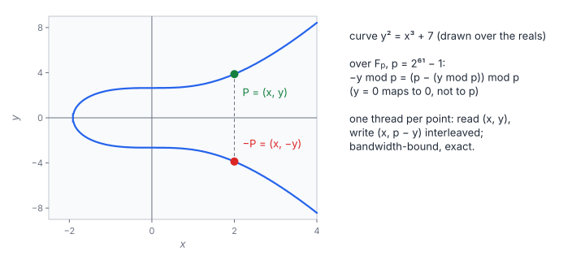

# ECC Point Negation (Batched)

**Platform:** Tensara · **Difficulty:** easy · [Problem statement](https://tensara.org/problems/ecc-point-negation)

## Problem

Negate $N$ points (256 K … 2 M) on the elliptic curve
$y^2 \equiv x^3 + 7 \pmod p$ with the Mersenne prime $p = 2^{61} - 1$.
Coordinates are `uint64` in $[0, p)$. The output interleaves
$(x_i, -y_i)$ in one array of length $2N$, and the check is exact equality.

## Visual Overview

The curve is drawn over the real numbers for intuition: negating a point
reflects it in the x-axis. Over the field Fₚ, −y becomes p − y (and 0 stays
0).

## Formulation

On a short Weierstrass curve the inverse of a point is its mirror image in
the $x$-axis:

$$
E:\ y^2 \equiv x^3 + a x + b \pmod p, \qquad -(x, y) = (x,\ -y \bmod p) = \bigl(x,\ (p - (y \bmod p)) \bmod p\bigr)
$$

| Symbol | Meaning |
|---|---|
| $E$ | The curve; here $a = 0$, $b = 7$ (the secp256k1 shape, on a smaller field) |
| $p$ | Field modulus $2^{61} - 1$ |
| $(x, y)$ | A point on $E$, coordinates in $\mathbb{F}_p = \{0, \dots, p-1\}$ |
| $-(x, y)$ | Additive inverse: $(x, y) + (x, -y) = \mathcal{O}$ |
| $\mathcal{O}$ | The point at infinity (group identity) |

Output layout:

$$
\text{out}[2i] = x_i, \qquad \text{out}[2i + 1] = \begin{cases} 0, & y_i \bmod p = 0 \\ p - (y_i \bmod p), & \text{otherwise} \end{cases}
$$

| Symbol | Meaning |
|---|---|
| $x_i, y_i$ | Coordinates of point $i$ |
| out | Interleaved result, $2N$ words |

## Approach

A grid-stride loop, one point per thread. The thread reads $x_i$ and
$y_i$ (two coalesced 8-byte loads) and writes both results as a single
16-byte `ulonglong2` store, which is naturally aligned because the output
array is 16-byte aligned. The `y == 0 ? 0 : p - y` branch compiles to a
select.

## Cost Analysis

$$
Q = 16N + 16N = 32N\ \text{bytes}, \qquad T_{\min} = \frac{32N}{\beta}
$$

| Symbol | Meaning |
|---|---|
| $Q$ | DRAM bytes: two 8-byte inputs and one 16-byte output per point |
| $\beta$ | DRAM bandwidth |

At $N = 2^{21}$: 67 MB, about 34 µs at 2 TB/s. The 64-bit modulo is a
software sequence on NVIDIA GPUs (no hardware integer divide), but with
this little work per byte it is hidden behind memory latency.

## Pitfalls

- **$y = 0$** must map to 0, not $p$ (which is outside $[0, p)$).
- **Interleaved output**: two separate arrays of $x$ and $-y$ fail.
- **Unsigned arithmetic**: $p - y$ never underflows because $y \bmod p < p$.

## Verification

All test cases (scaled-down variants of the official sizes) pass on
[cuemu](../../tools/cuemu/README.md) against the PyTorch reference.

## Related

- [Poly Multiply over F_p](../poly-multiply-ff/), [Vector Multiply over F_p](../vector-multiply-ff/).
