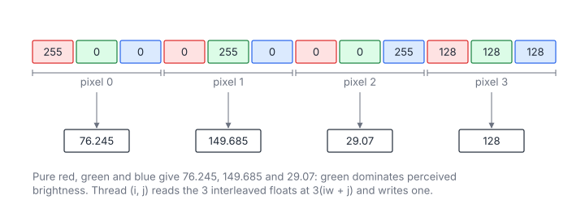

# Grayscale Conversion

**Platform:** Tensara · **Difficulty:** easy · [Problem statement](https://tensara.org/problems/grayscale)

## Problem

Convert an interleaved RGB float32 image (HWC layout, values in
$[0, 255]$) of height $h$ and width $w$ ($512^2$ … $3840\times2160$) to
grayscale with the ITU-R BT.601 luma weights. The check is
`rtol = atol = 1e-5`.

## Visual Overview

Pure red, green and blue pixels show how unequal the weights are: green
contributes the most to perceived brightness.

## Formulation

$$
Y[i, j] = 0.299\,R[i, j] + 0.587\,G[i, j] + 0.114\,B[i, j]
$$

$$
R[i, j] = x[\,3(iw + j)\,], \quad G[i, j] = x[\,3(iw + j) + 1\,], \quad B[i, j] = x[\,3(iw + j) + 2\,]
$$

| Symbol | Meaning |
|---|---|
| $x$ | Input buffer, $h\cdot w\cdot 3$ floats, channels interleaved |
| $R, G, B$ | Red, green and blue channels of pixel $(i, j)$ |
| $Y$ | Output luma image, $h\times w$ |
| $0.299, 0.587, 0.114$ | BT.601 weights (sum to 1); green dominates perceived brightness |

## Approach

One thread per pixel (grid-stride). Thread $t$ reads the three floats at
$3t, 3t+1, 3t+2$. Per load instruction the warp's addresses are strided by
12 bytes, so a single instruction touches 3 cache lines instead of 1, but
the three instructions together read exactly the 384 contiguous bytes of
the warp's 32 pixels. The first instruction brings them into L1, so the
other two hit, and DRAM traffic stays at the minimum. The output store is
fully coalesced.

The `channels` argument is used as the pixel stride, so the kernel also
works for an RGBA (4-channel) layout.

## Cost Analysis

$$
Q = 12hw + 4hw = 16hw\ \text{bytes}, \qquad W = 5hw\ \text{flops}, \qquad T_{\min} = \frac{Q}{\beta}
$$

| Symbol | Meaning |
|---|---|
| $Q$ | DRAM bytes: three input floats and one output float per pixel |
| $W$ | Two FMAs and one multiply per pixel |
| $\beta$ | DRAM bandwidth |

At $3840\times2160$: $Q = 133$ MB, about 66 µs at 2 TB/s. A fully
vectorized version would load 3 `float4`s (4 pixels) per thread; it saves
instructions, not bytes.

## Pitfalls

- **Rounding order**: the reference computes $0.299R + 0.587G + 0.114B$
  with separate multiply and add in fp32, while `fmaf` contraction rounds
  once. With values up to 255 the difference is $\sim 10^{-5}$ absolute,
  right at the tolerance; it passes, but this is where to look if it
  ever does not.
- **Layout**: HWC (interleaved), not CHW (planar).

## Verification

All test cases (scaled-down variants of the official sizes) pass on
[cuemu](../../tools/cuemu/README.md) against the PyTorch reference.

## Related

- [Threshold](../threshold/), [Edge Detect](../edge-detect/),
  LeetGPU [RGB to Grayscale](../../leetgpu/066-rgb-to-grayscale/).
