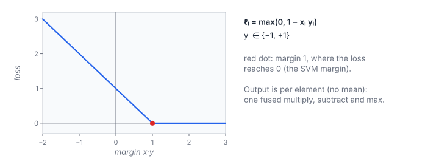

# Hinge Loss

**Platform:** Tensara · **Difficulty:** easy · [Problem statement](https://tensara.org/problems/hinge-loss)

## Problem

Element-wise hinge loss for $N$ real predictions and targets in
$\{-1, +1\}$ (1 M … 67 M elements). The output is the per-element loss,
before any averaging. The check is `rtol = atol = 1e-4`.

## Visual Overview

The loss depends only on the margin x·y. It is 0 from margin 1 on (red dot)
and grows linearly below it.

## Formulation

$$
\ell_i = \max\bigl(0,\ 1 - x_i\,y_i\bigr), \qquad \mathcal{L} = \frac{1}{N}\sum_{i=0}^{N-1} \ell_i\ \ (\text{not required here})
$$

| Symbol | Meaning |
|---|---|
| $x_i$ | Prediction (a raw score, not a probability) |
| $y_i$ | Target label, $-1$ or $+1$ |
| $x_i y_i$ | The margin: positive when the sign is right |
| $\ell_i$ | per-element hinge loss, the output |
| $\mathcal{L}$ | Mean loss, as used for SVM training |

The loss is 0 when the prediction is on the correct side with margin at
least 1, and grows linearly otherwise.

## Approach

A grid-stride map over two inputs: each thread loads $x_i$ and $y_i$
(coalesced), computes `fmaxf(0, 1 - x*y)`, and stores $\ell_i$.

## Cost Analysis

$$
Q = 12N\ \text{bytes}, \qquad T_{\min} = \frac{12N}{\beta}
$$

| Symbol | Meaning |
|---|---|
| $Q$ | DRAM bytes: two inputs and one output per element |
| $\beta$ | DRAM bandwidth |

At $N = 2^{26}$: 805 MB, about 0.4 ms at 2 TB/s. `float4` loads would
reduce the instruction count, not the bytes.

## Pitfalls

- **Per-element output**: the statement shows the mean, but the expected
  output is the vector $\ell$.
- `fmaf(-x, y, 1)` and `1 - x*y` round differently by at most 1 ulp.

## Verification

All test cases (scaled-down variants of the official sizes) pass on
[cuemu](../../tools/cuemu/README.md) against the PyTorch reference.

## Related

- [Huber Loss](../huber-loss/), [MSE Loss](../mse-loss/),
  [Triplet Margin Loss](../triplet-margin/).
