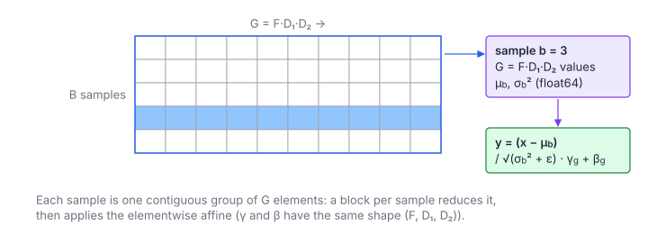

# Layer Normalization

**Platform:** Tensara · **Difficulty:** medium · [Problem statement](https://tensara.org/problems/layer-norm)

## Problem

Layer normalization of a float32 tensor of shape $(B, F, D_1, D_2)$ over
its last three axes, with elementwise affine parameters $\gamma, \beta$ of
shape $(F, D_1, D_2)$ and $\epsilon = 10^{-5}$, matching
`F.layer_norm(x, x.shape[1:], gamma, beta, eps)`. The check is
`rtol = 2e-4`, `atol = 1e-4`.

## Visual Overview

Each row is one whole sample of F·D₁·D₂ values. Its statistics normalise the
row, and γ, β have the same shape as the sample.

## Formulation

$$
G = F D_1 D_2, \qquad
\mu_b = \frac{1}{G}\sum_{g=0}^{G-1} x_{b,g}, \qquad
\sigma_b^2 = \frac{1}{G}\sum_{g=0}^{G-1}\bigl(x_{b,g} - \mu_b\bigr)^2
$$

$$
y_{b,g} = \frac{x_{b,g} - \mu_b}{\sqrt{\sigma_b^2 + \epsilon}}\,\gamma_g + \beta_g
$$

| Symbol | Meaning |
|---|---|
| $B$ | Batch size: one normalization group per sample |
| $G$ | Group size, the product of the normalized axes |
| $x_{b,g}$ | Element $g$ (flattened over $F, D_1, D_2$) of sample $b$; offset $bG + g$ |
| $\mu_b, \sigma_b^2$ | Mean and biased variance of sample $b$ |
| $\gamma_g, \beta_g$ | Scale and shift for position $g$ (shared across the batch) |
| $\epsilon$ | $10^{-5}$ |
| $y_{b,g}$ | Output |

Contrast with [Batch Norm](../batch-norm/): there the statistics are per
channel across the batch; here they are per sample across the features.

## Approach

1. **One block of 1024 threads per sample.** Each group is a contiguous
   range of $G$ floats, so thread strides are fully coalesced.
2. **Pass 1**: sum in `double`, block-reduce, $\mu_b$.
3. **Pass 2**: centered sum of squares in `double`, block-reduce,
   $r_b = 1/\sqrt{\sigma_b^2 + \epsilon}$. Centering first avoids the
   catastrophic cancellation of $\mathbb{E}[x^2] - \mu^2$.
4. **Pass 3**: $y = (x - \mu_b)\,r_b\,\gamma_g + \beta_g$ (with $\gamma, \beta$
   read coalesced and shared by all blocks through L2).

## Cost Analysis

$$
Q \approx 3\cdot 4BG + 2\cdot 4G + 4BG = 16BG + 8G\ \text{bytes}, \qquad T_{\min} = \frac{Q}{\beta_{\text{mem}}}
$$

| Symbol | Meaning |
|---|---|
| $Q$ | DRAM bytes: three reads of $x$ (unless it fits in L2), one read of $\gamma, \beta$, one write |
| $\beta_{\text{mem}}$ | DRAM bandwidth (named apart from the shift $\beta$) |

With few samples ($B$ small) and large groups, only $B$ blocks run; each
group could be split across several blocks (partial sums, then a second
kernel) to use all SMs, or a single-pass Welford update could replace
passes 1 and 2.

## Pitfalls

- **Biased variance** ($1/G$).
- **Affine parameters are per position**, not per channel: $\gamma$ has
  $G$ elements.
- **fp64 accumulation**: groups can have millions of elements.

## Verification

All test cases (scaled-down variants of the official sizes) pass on
[cuemu](../../tools/cuemu/README.md) against the PyTorch reference.

## Related

- [Batch Norm](../batch-norm/), [RMS Norm](../rms-norm/),
  LeetGPU [Layer Normalization](../../leetgpu/113-layer-normalization/).
