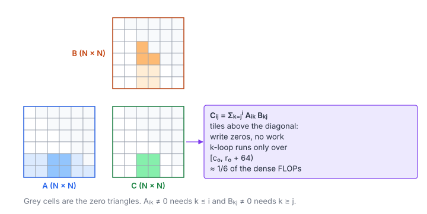

# Lower Triangular Matrix Multiplication

**Platform:** Tensara · **Difficulty:** medium · [Problem statement](https://tensara.org/problems/lower-trig-matmul)

## Problem

Multiply two lower-triangular $N\times N$ FP32 matrices ($N$ = 2048 …
8192). The reference applies `torch.tril` to both inputs and then does a
dense matmul. The check is `rtol = 8e-4`, `atol = 2e-2`.

## Visual Overview

Grey cells are the zero upper triangles of A, B and C. Tiles above the
diagonal are written as zeros without any work, and for the others the k-loop
only covers the range where both factors can be non-zero.

## Formulation

$$
L_{ij} = 0 \ \text{for } i < j, \qquad
C_{ij} = \sum_{k=0}^{N-1} L^{A}_{ik} L^{B}_{kj} = \begin{cases} \displaystyle\sum_{k=j}^{i} A_{ik}B_{kj}, & i \ge j \\ 0, & i < j \end{cases}
$$

| Symbol | Meaning |
|---|---|
| $L^{A} = \operatorname{tril}(A)$, $L^{B} = \operatorname{tril}(B)$ | The inputs with their strict upper triangles zeroed |
| $C$ | Product, again lower triangular |
| $k \in [j, i]$ | The only reduction indices where both factors can be non-zero: $A_{ik} \ne 0$ needs $k \le i$, $B_{kj} \ne 0$ needs $k \ge j$ |

For a whole output tile with rows $[r_0, r_0 + 64)$ and columns
$[c_0, c_0 + 64)$, the union of those ranges is

$$
k \in \bigl[\,c_0,\ \min(N,\ r_0 + 64)\,\bigr)
$$

| Symbol | Meaning |
|---|---|
| $r_0, c_0$ | First row and first column of the tile |

## Approach

A specialised copy of the shared SGEMM (`triMatmul`):

1. **Tiles strictly above the diagonal** ($c_0 \ge r_0 + 64$) are written
   as zeros without touching $A$ or $B$.
2. **Other tiles** loop $k$ only over $[\lfloor c_0/16\rfloor\cdot16,\ \min(N, r_0 + 64))$.
3. **Loads mask the opposite triangle** ($A_{ik}$ with $k > i$, $B_{kj}$ with
   $k < j$ are loaded as 0), exactly as `tril` does in the reference, so
   garbage in the upper triangle of the inputs cannot leak in.

Everything else (64 × 64 tile, 16-wide K slices, 4 × 4 per thread) is the
shared kernel described below.

### The Shared SGEMM Kernel

All matmul pages on Tensara use the same register-blocked FP32 kernel
(`gemmKernel<kTransB, Epi>`):

1. **Block tile $64\times64$**, 256 threads; each thread owns a $4\times4$
   patch of outputs at rows `ty + 16i`, columns `tx + 16j`. The stride-16
   layout makes every store instruction of a warp hit 16 consecutive
   columns (coalesced), and makes shared-memory reads conflict-free.
2. **K-slices of 16.** Per slice the block copies a $64\times16$ panel of
   $A$ (stored transposed as `a_tile[k][m]`) and a $16\times64$ panel of
   $B$ into shared memory (rows padded by 4 floats), then synchronizes.
3. **Inner product in registers.** For each of the 16 values of $k$, a
   thread loads 4 values of $A$ and 4 of $B$ from shared memory and does
   $4\times4 = 16$ FMAs (an outer product).
4. **Epilogue functor.** The accumulator goes through `epi(v, row, col)`
   before the single store. This is where bias, activations, scaling or
   elementwise multiplies are fused, so the product never makes a round
   trip through DRAM.
5. `kTransB = true` reads $B$ as $N\times K$ ("NT", the `nn.Linear`
   weight layout) and transposes it while staging.

#### Data Reuse

Data reuse at each level of the hierarchy:

$$
I_{\text{L2}} = \frac{2\,T_M T_N T_K}{4\,T_K\,(T_M + T_N)} = \frac{T_M T_N}{2\,(T_M + T_N)} = 16\ \tfrac{\text{flop}}{\text{byte}}, \qquad
I_{\text{smem}} = \frac{2 \cdot r_M r_N}{4\,(r_M + r_N)} = 1\ \tfrac{\text{flop}}{\text{byte}}
$$

| Symbol | Meaning |
|---|---|
| $T_M, T_N, T_K$ | Block tile: 64, 64, 16 |
| $r_M, r_N$ | per-thread register tile: 4 × 4 |
| $I_{\text{L2}}$ | Flops per byte loaded from L2/DRAM into shared memory |
| $I_{\text{smem}}$ | Flops per byte read from shared memory (16 FMAs per 8 loads) |

#### How Far It Gets

This reaches roughly 40–60 % of FP32 peak. The next steps are the ones
covered in the [SGEMM tutorial](../../tutorials/04-tiled-matmul.md):
$128\times128$ tiles with $8\times8$ per thread, `float4` shared loads,
double-buffered `cp.async` staging, and finally tensor cores (TF32) where
the tolerance allows.

## Cost Analysis

$$
W_{\text{dense}} = 2N^3, \qquad
W_{\text{tri}} = 2\sum_{d=0}^{N-1} (N - d)(d + 1) \approx \frac{N^3}{3}, \qquad
\frac{W_{\text{tri}}}{W_{\text{dense}}} \approx \frac{1}{6}
$$

| Symbol | Meaning |
|---|---|
| $W_{\text{dense}}$ | Flops of a dense $N\times N$ product |
| $W_{\text{tri}}$ | Flops actually needed: output $(i, j)$ in the triangle with $d = \lvert i - j\rvert$ needs $d + 1$ FMAs, and there are $N - d$ such outputs |
| $d$ | Distance from the diagonal |

With 64-wide tiles the kernel does a little more (whole tiles and
16-aligned $k$ ranges), close to the $1/6$ bound for $N \ge 2048$. At
$N = 8192$ that is ~0.18 TFLOP instead of 1.1.

## Pitfalls

- **Masking inputs**: skipping the $k$ range is not enough on its own;
  inside a tile row $i$ and column $j$ still differ, so elements outside
  each triangle must be zeroed at load.
- **Loose tolerance** (`atol = 2e-2`) because the reference sums $N$ terms,
  most of them zeros, in a different order.

## Verification

All test cases (scaled-down variants of the official sizes) pass on
[cuemu](../../tools/cuemu/README.md) against the PyTorch reference.

## Related

- [Upper Triangular Matmul](../upper-trig-matmul/), [Square Matmul](../square-matmul/),
  [Diagonal Matmul](../diagonal-matmul/).
