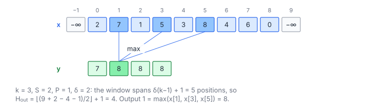

# 1D Max Pooling

**Platform:** Tensara · **Difficulty:** easy · [Problem statement](https://tensara.org/problems/max-pool-1d)

## Problem

1-D max pooling of a float32 tensor with a window of side $k$, stride
$S$, padding $P$ and **dilation** $\delta$, matching
`F.max_pool1d(x, k, S, P, dilation=δ)`. Padded positions act as
$-\infty$ (they never win). Inputs are long 1-D signals, $H$ = 2 M … 33 M, with parameters such as $(k, S, P, \delta) = (7, 4, 3, 1)$ and $(4, 2, 1, 2)$. The check is `rtol = 1e-4`, `atol = 7e-5`.

## Visual Overview

With dilation 2 the window reads every other input: output 1 is the maximum of
x₁, x₃ and x₅. The padded ends act as −∞.

## Formulation

The dilated window spans $\delta(k-1) + 1$ input positions per axis, so

$$
X_{\text{out}} = \left\lfloor \frac{X + 2P - \delta(k - 1) - 1}{S} \right\rfloor + 1
$$

| Symbol | Meaning |
|---|---|
| $X$ | Input extent along one axis ($H$) |
| $X_{\text{out}}$ | Output extent along that axis |
| $k$ | Window side (`kernel_size`) |
| $S$ | Stride |
| $P$ | Padding on each side |
| $\delta$ | Dilation: distance between neighbouring window taps |

$$
\text{out}[t] = \max_{0 \le m < k,\ 0 \le q < H} x[q], \qquad q = tS - P + m\delta
$$

| Symbol | Meaning |
|---|---|
| $x$ | Input signal, length $H$ |
| $t$ | Output index |
| $m$ | Tap index inside the window |
| $q$ | Input position of tap $m$ (taps with $q$ outside $[0, H)$ are padding) |

## Approach

1. **One thread per output** (grid-stride loop over the flat output
   index); consecutive threads produce consecutive outputs along the
   innermost axis, so their windows overlap and the loads are served from
   L1/L2.
2. **Padding is a bounds test**: taps outside the input are skipped, which
   is the same as treating them as $-\infty$.
3. **Accumulator** starts at $-\text{FLT\_MAX}$ and folds with `fmaxf`.
   `max` is exact, so the result is bit-identical to PyTorch.

## Cost Analysis

$$
W_{\text{ops}} = k^{1}\,H_{\text{out}}, \qquad Q \approx 4\,(\text{input size} + H_{\text{out}})\ \text{bytes}, \qquad T_{\min} = \frac{Q}{\beta}
$$

| Symbol | Meaning |
|---|---|
| $W_{\text{ops}}$ | Comparisons |
| $Q$ | Compulsory DRAM bytes, assuming overlapping windows hit in cache |
| $\beta$ | DRAM bandwidth |

With $S < k$ windows overlap and the kernel is bandwidth-bound; with
large strides each input is read once anyway.

## Pitfalls

- **Dilation in the output size**: the effective window is
  $\delta(k-1)+1$, not $k$.
- **Padding is $-\infty$, not 0**: a window that sees only negatives
  plus padding must return the largest negative, not 0.
- PyTorch requires $P \le k/2$, so every window contains at least one
  real element and the result is never $-\text{FLT\_MAX}$.

## Verification

All test cases (scaled-down variants of the official sizes) pass on
[cuemu](../../tools/cuemu/README.md) against the PyTorch reference.

## Related

- [Max Pool 2D](../max-pool-2d/), [Max Pool 3D](../max-pool-3d/), [Avg Pool 1D](../avg-pool-1d/).
