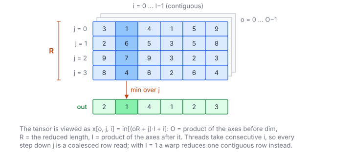

# Min Over Dimension

**Platform:** Tensara · **Difficulty:** easy · [Problem statement](https://tensara.org/problems/min-dim)

## Problem

`torch.min(x, dim, keepdim=True).values`: the minimum along dimension `dim` of a float32 tensor of arbitrary rank, keeping
the reduced dimension (`keepdim=True`). The tests reduce shapes from $(16, 128, 256)$ to $(64, 128, 128, 128)$
along different axes (0, 1, 2 or 3). The check is `rtol = atol = 1e-3`.

## Visual Overview

One outer slice x[o, :, :] is shown: j runs down the reduced axis and i along
the contiguous inner axis. Every column (fixed o and i) is reduced to one
output value.

## Formulation

View the tensor as three axes (everything before `dim`, the reduced axis,
everything after it):

$$
O = \prod_{k<d} S_k, \qquad R = S_d, \qquad I = \prod_{k>d} S_k, \qquad
x[o, j, i] = \text{in}\bigl[(oR + j)I + i\bigr]
$$

| Symbol | Meaning |
|---|---|
| $S_k$ | Size of axis $k$; $d$ is `dim` |
| $O$ | Outer size (product of the axes before $d$) |
| $R$ | Length of the reduced axis |
| $I$ | Inner size (product of the axes after $d$); also the memory stride of the reduced axis |
| $x[o, j, i]$ | The element at outer index $o$, reduced index $j$, inner index $i$ |

$$
\text{out}[oI + i] = \min_{0 \le j < R} x[o, j, i]
$$

| Symbol | Meaning |
|---|---|
| out | $O\cdot I$ results, index $oI + i$ |

## Approach

The reduction is a small accumulator struct `Acc` (identity, make,
combine, shuffle, finish) plugged into two generic kernels, shared by all
`*-dim` problems and by [Argmax](../argmax/)/[Argmin](../argmin/):

- **$I = 1$** (reducing the contiguous last axis): **one warp per output**.
  Lanes stride the row of $R$ contiguous floats (each warp load is one
  coalesced 128-byte line), fold with `combine`, then five
  `__shfl_down_sync` steps; lane 0 applies `finish` and stores.
- **$I > 1$**: **one thread per output** $(o, i)$ loops over $j$ with stride
  $I$. Threads with neighbouring $i$ read neighbouring addresses, so each
  step is coalesced *across* the warp even though each thread strides.

`shape` may be a host or a device pointer depending on the harness, so it
is copied with `cudaMemcpyDefault` and $O, R, I$ are computed on the host.
The output keeps the reduced axis with size 1 (`keepdim=True`), which
changes nothing in memory: it has $O\cdot I$ elements in the same order.

For this problem the accumulator is `{identity: +FLT_MAX, combine: fminf}`; exact, order-independent.

## Cost Analysis

$$
Q = 4\,ORI + 4\,OI\ \text{bytes}, \qquad T_{\min} = \frac{4\,ORI}{\beta}
$$

| Symbol | Meaning |
|---|---|
| $Q$ | DRAM bytes: read the tensor once, write one value per output |
| $\beta$ | DRAM bandwidth |

The largest test, $(64, 128, 128, 128)$, is 537 MB: about 0.27 ms at
2 TB/s. Weak spots: when $I = 1$ and $R$ is small (e.g. $R = 64$ for
$(128, 64, 64, 64)$ along dim 3) half the lanes of a warp-per-row idle, and
when $I > 1$ but $O\cdot I$ is small (e.g. $(32, 512, 512)$ along dim 0 gives
262 K threads, each looping 32 times) there is little parallelism per
output; splitting $R$ across threads would fix both.

## Pitfalls

- **Identity** $+\text{FLT\_MAX}$.
- **Values only**, not the indices (that is [Argmin](../argmin/)).

## Verification

All test cases (scaled-down variants of the official sizes) pass on
[cuemu](../../tools/cuemu/README.md) against the PyTorch reference.

## Related

- [Max Dim](../max-dim/), [Argmin](../argmin/), [Mean Dim](../mean-dim/).
