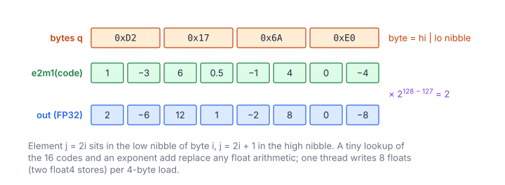

# MXFP4 Dequantization

**Platform:** Tensara · **Difficulty:** easy · [Problem statement](https://tensara.org/problems/mxfp4-dequantize)

## Problem

Expand an MXFP4 matrix (packed E2M1 codes plus row-major E8M0 scales
per 32 elements) back to an $M\times K$ FP32 matrix, with TorchAO
`MXTensor.to_dtype` semantics. Sizes up to $8192\times4096$; the check is
`rtol = atol = 1e-3`.

## Visual Overview

Each byte holds two 4-bit codes (low nibble first). The codes decode to small
values, and the whole block is multiplied by its shared scale 2^(u − 127).

## Formulation

$$
\text{out}_{ij} = \operatorname{e2m1}\bigl(c_{ij}\bigr)\cdot \operatorname{e8m0}\bigl(u_{i,\lfloor j/32\rfloor}\bigr), \qquad
c_{ij} = \begin{cases} q_{i,j/2} \mathbin{\&} \text{0xF}, & j \text{ even} \\ q_{i,(j-1)/2} \gg 4, & j \text{ odd}\end{cases}
$$

| Symbol | Meaning |
|---|---|
| $q$ | Packed payload, $M\times K/2$ bytes |
| $c_{ij}$ | 4-bit code of element $(i, j)$ |
| $u$ | Scale bytes, $M\times K/32$, row-major |
| out | FP32 result, $M\times K$ |

### The E2M1 (FP4) Element Format

**E2M1 (FP4)** has 1 sign, 2 exponent and 1 mantissa bit (bias 1). Its
eight magnitudes and the decode rule are

$$
\operatorname{e2m1}(c) = (-1)^{c_3}\cdot\begin{cases} \tfrac{1}{2}\,m, & m < 4 \\ (2 + (m \bmod 2))\cdot 2^{\lfloor m/2 \rfloor - 2}, & m \ge 4 \end{cases}
\in \pm\{0,\ 0.5,\ 1,\ 1.5,\ 2,\ 3,\ 4,\ 6\}, \qquad m = c \mathbin{\&} 7
$$

| Symbol | Meaning |
|---|---|
| $c$ | 4-bit code; two codes per byte, element $2i$ in the **low** nibble |
| $c_3$ | Sign bit (bit 3) |
| $m$ | 3-bit magnitude code, 0 … 7 |

### The E8M0 Block Scale

**E8M0** (the MX block scale) is a bare power of two:

$$
\operatorname{e8m0}(u) = 2^{\,u - 127}, \qquad u \in [0, 254], \quad u = 255 \Rightarrow \text{NaN}
$$

| Symbol | Meaning |
|---|---|
| $u$ | The scale byte (a biased exponent) |

## Approach

**One thread per byte** (two elements): decode both nibbles, multiply by
the block scale $2^{u - 127}$ (`ldexpf(1, u - 127)`, which also produces the
subnormal $2^{-127}$ correctly), and
write a `float2` (8-byte store, coalesced). The 16 threads that share a
block read the same scale byte, a cache hit. Every E2M1 value times a
power of two is exact in FP32, so the result matches the reference bit for
bit.

## Cost Analysis

$$
Q = 0.5\,MK + \frac{MK}{32}\ (\text{read}) + 4MK\ (\text{write})\ \text{bytes}, \qquad T_{\min} = \frac{Q}{\beta}
$$

| Symbol | Meaning |
|---|---|
| $Q$ | DRAM bytes, dominated by the FP32 output |
| $\beta$ | DRAM bandwidth |

At $8192\times4096$: ~153 MB, ~77 µs at 2 TB/s. Dequantization expands
the data 8×; in a real model it should be fused into the consumer (see
[MXFP4 GEMM](../mxfp4-gemm/)).

## Pitfalls

- **Nibble order**: low nibble = even column.
- **E8M0 = 0** means $2^{-127}$, a subnormal float; building the scale as
  float bits (`u << 23`) would give 0 instead, so use `ldexpf`.
- **Scale 255** is NaN.

## Verification

All test cases (scaled-down variants of the official sizes) pass on
[cuemu](../../tools/cuemu/README.md) against the PyTorch reference.

## Related

- [MXFP4 Quantize](../mxfp4-quantize/), [MXFP8 Dequantize](../mxfp8-dequantize/),
  [NVFP4 Dequantize](../nvfp4-dequantize/).
