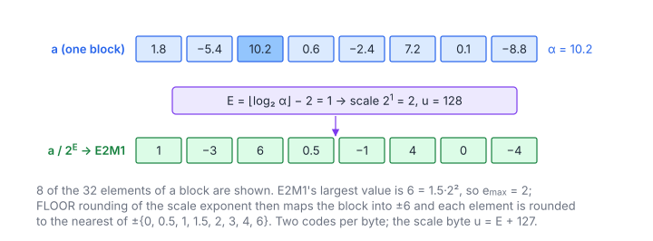

# MXFP4 Quantization

**Platform:** Tensara · **Difficulty:** medium · [Problem statement](https://tensara.org/problems/mxfp4-quantize)

## Problem

Quantize an $M\times K$ FP32 matrix to **MXFP4**: 4-bit E2M1 elements
(two per byte) with one E8M0 scale per 32 elements along $K$, matching
TorchAO's `MXTensor` reference path. The scale output is row-major
($M\times K/32$, no swizzle). Sizes go up to $8192\times4096$. The
checker dequantizes both outputs and compares with `rtol = atol = 1e-3`,
so the codes must match exactly in practice.

## Visual Overview

The block maximum 10.2 sets the exponent E = 1, so the scale is 2. Dividing by
2 and rounding to the nearest E2M1 value gives the codes in the bottom row.

## Formulation

An **MX** (OCP Microscaling) tensor splits every row into blocks of 32
consecutive elements along $K$; each block shares one power-of-two scale.
Following TorchAO's `to_mx` with the default FLOOR scale rounding:

$$
\alpha_b = \max_{t \in b} \lvert a_t \rvert, \qquad
E_b = \operatorname{clamp}\Bigl(\bigl\lfloor \log_2 \alpha_b \bigr\rfloor - e_{\max},\ -127,\ 128\Bigr), \qquad
u_b = E_b + 127
$$

$$
q_t = \operatorname{round}_{\text{fmt}\Bigl(\frac{a_t}{2^{E_b}\Bigr), \qquad \hat{a}_t = \operatorname{fmt}(q_t)\cdot 2^{E_b}
$$

| Symbol | Meaning |
|---|---|
| $b$ | A block of 32 elements of one row |
| $a_t$ | Input element |
| $\alpha_b$ | Block absolute maximum |
| $\lfloor\log_2\alpha_b\rfloor$ | The float's unbiased exponent, read from bits 23–30 |
| $e_{\max}$ | Exponent of the element format's largest power of two (2 for E2M1, whose largest value is $6 = 1.5\cdot 2^2$) |
| $E_b$ | Shared block exponent |
| $u_b$ | Stored E8M0 scale byte |
| $q_t$ | Element code, rounded to nearest (ties to even) in the element format, saturating |
| $\hat{a}_t$ | The value the code represents (what the checker compares after dequantizing) |

**E2M1 (FP4)** has 1 sign, 2 exponent and 1 mantissa bit (bias 1). Its
eight magnitudes and the decode rule are

$$
\operatorname{e2m1}(c) = (-1)^{c_3}\cdot\begin{cases} \tfrac{1}{2}\,m, & m < 4 \\ (2 + (m \bmod 2))\cdot 2^{\lfloor m/2 \rfloor - 2}, & m \ge 4 \end{cases}
\in \pm\{0,\ 0.5,\ 1,\ 1.5,\ 2,\ 3,\ 4,\ 6\}, \qquad m = c \mathbin{\&} 7
$$

| Symbol | Meaning |
|---|---|
| $c$ | 4-bit code; two codes per byte, element $2i$ in the **low** nibble |
| $c_3$ | Sign bit (bit 3) |
| $m$ | 3-bit magnitude code, 0 … 7 |

Because the largest E2M1 power of two is $2^2$, the scaled block maximum
$\alpha_b / 2^{E_b}$ lies in $[4, 8)$; values above 6 saturate to 6.

## Approach

1. **One warp per 32-element block** (grid-stride over blocks): lane $l$
   loads element $l$ (coalesced 128 bytes), and a 5-step
   `__shfl_xor_sync` max gives $\alpha_b$ to every lane.
2. **Exponent from the bits**: `(__float_as_uint(amax) >> 23) & 0xFF` is
   the biased exponent, so $\lfloor\log_2\alpha_b\rfloor$ costs no `log2f`
   (subnormal $\alpha_b$ are clamped like TorchAO).
3. **Encode**: $v = a_t / 2^{E_b}$ (exact, a power-of-two division), then
   `floatToE2M1` compares $\lvert v\rvert$ with the midpoints
   $0.25, 0.75, 1.25, 1.75, 2.5, 3.5, 5$; the strict or non-strict
   comparisons implement round-half-to-even (for example 0.25 → 0, 0.75 → 1).
4. **Pack**: `__shfl_down_sync(code, 1)` brings the odd neighbour's code;
   even lanes write `code | (odd << 4)`. Lane 0 writes the scale byte (255
   if the block contains NaN).

The format-specific parts (E2M1, E4M3, E8M0 codecs, swizzle) are written
with integer bit manipulation, so they do not depend on `cuda_fp4.h` or a
specific architecture.

## Cost Analysis

$$
Q = 4MK\ (\text{read}) + \frac{MK}{2} + \frac{MK}{32}\ (\text{write})\ \text{bytes} \approx 4.53\,MK, \qquad T_{\min} = \frac{Q}{\beta}
$$

| Symbol | Meaning |
|---|---|
| $Q$ | DRAM bytes |
| $\beta$ | DRAM bandwidth |

At $8192\times4096$: 152 MB, ~76 µs at 2 TB/s. Writes are half-warp byte
stores (16 bytes per warp); packing to 32-bit words per 8 lanes would make
them wider.

## Pitfalls

- **Scale rounding mode**: FLOOR (TorchAO's default) vs the OCP spec's
  suggested rounding give different exponents for some blocks.
- **Ties**: 2.5 must round to 2 (even code), not 3.
- **Nibble order**: element $2i$ in the low 4 bits.
- **Zero block**: $\alpha_b = 0$ has exponent field 0, which clamps to
  $E_b = -127$; all codes are 0.

## Verification

All test cases (scaled-down variants of the official sizes) pass on
[cuemu](../../tools/cuemu/README.md) against the PyTorch reference.

## Related

- [MXFP4 Dequantize](../mxfp4-dequantize/), [MXFP4 GEMM](../mxfp4-gemm/),
  [MXFP8 Quantize](../mxfp8-quantize/), [NVFP4 Quantize](../nvfp4-quantize/),
  LeetGPU [Weight Dequantization](../../leetgpu/064-weight-dequantization/).
