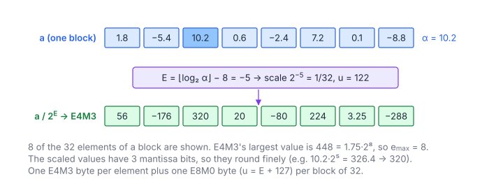

# MXFP8 Quantization

**Platform:** Tensara · **Difficulty:** medium · [Problem statement](https://tensara.org/problems/mxfp8-quantize)

## Problem

Quantize an $M\times K$ FP32 matrix to **MXFP8**: one E4M3 byte per
element and one E8M0 scale per 32 elements along $K$ (row-major scales),
matching TorchAO `to_mx`. Sizes go up to $8192\times4096$. The checker
dequantizes both outputs and compares with `rtol = atol = 1e-3`.

## Visual Overview

The block maximum 10.2 gives E = −5, a scale of 1/32. The scaled values have
three mantissa bits, so they are rounded finely (for example 326.4 becomes
320).

## Formulation

An **MX** (OCP Microscaling) tensor splits every row into blocks of 32
consecutive elements along $K$; each block shares one power-of-two scale.
Following TorchAO's `to_mx` with the default FLOOR scale rounding:

$$
\alpha_b = \max_{t \in b} \lvert a_t \rvert, \qquad
E_b = \operatorname{clamp}\Bigl(\bigl\lfloor \log_2 \alpha_b \bigr\rfloor - e_{\max},\ -127,\ 128\Bigr), \qquad
u_b = E_b + 127
$$

$$
q_t = \operatorname{round}_{\text{fmt}\Bigl(\frac{a_t}{2^{E_b}\Bigr), \qquad \hat{a}_t = \operatorname{fmt}(q_t)\cdot 2^{E_b}
$$

| Symbol | Meaning |
|---|---|
| $b$ | A block of 32 elements of one row |
| $a_t$ | Input element |
| $\alpha_b$ | Block absolute maximum |
| $\lfloor\log_2\alpha_b\rfloor$ | The float's unbiased exponent, read from bits 23–30 |
| $e_{\max}$ | Exponent of the element format's largest power of two (8 for E4M3, whose largest value is $448 = 1.75\cdot 2^8$) |
| $E_b$ | Shared block exponent |
| $u_b$ | Stored E8M0 scale byte |
| $q_t$ | Element code, rounded to nearest (ties to even) in the element format, saturating |
| $\hat{a}_t$ | The value the code represents (what the checker compares after dequantizing) |

**E4M3 (FP8)** has 1 sign, 4 exponent and 3 mantissa bits, bias 7,
no infinities, and codes `0x7F`/`0xFF` are NaN:

$$
\operatorname{e4m3}(b) = (-1)^{s}\cdot\begin{cases} \dfrac{f}{8}\cdot 2^{-6}, & e = 0 \ (\text{subnormal}) \\ \Bigl(1 + \dfrac{f}{8}\Bigr) 2^{e - 7}, & 1 \le e \le 15 \end{cases}, \qquad \lvert\operatorname{e4m3}\rvert \le 448
$$

| Symbol | Meaning |
|---|---|
| $b$ | The byte |
| $s, e, f$ | Sign bit, 4-bit exponent field, 3-bit mantissa field |
| 448 | Largest finite value ($e = 15$, $f = 6$) |

The scaled block maximum $\alpha_b/2^{E_b}$ lies in $[256, 512)$, so values
above 448 are clamped to $\pm448$ before rounding.

## Approach

The same warp-per-block structure as [MXFP4 Quantize](../mxfp4-quantize/):
warp-shuffle max, exponent read from the float bits, clamp to
$[-127, 128]$, divide by $2^{E_b}$. The E4M3 encoder clamps to $\pm448$ and
rounds to nearest-even, handling subnormals ($\lvert v\rvert < 2^{-6}$, step
$2^{-9}$). Each lane writes its own byte (a coalesced 32-byte store per
warp) and lane 0 writes the scale.

## Cost Analysis

$$
Q = 4MK + MK + \frac{MK}{32}\ \text{bytes} \approx 5.03\,MK, \qquad T_{\min} = \frac{Q}{\beta}
$$

| Symbol | Meaning |
|---|---|
| $Q$ | DRAM bytes: FP32 in, one byte per element plus scales out |
| $\beta$ | DRAM bandwidth |

At $8192\times4096$: 169 MB, ~85 µs at 2 TB/s.

## Pitfalls

- **$e_{\max} = 8$**, not 7: E4M3's largest normal power of two is $2^8$.
- **Saturate** before rounding (values in $(448, 512)$ appear after
  scaling).
- **NaN codes**: `0x7F` is NaN in E4M3, so the largest finite code is
  `0x7E` (448).

## Verification

All test cases (scaled-down variants of the official sizes) pass on
[cuemu](../../tools/cuemu/README.md) against the PyTorch reference.

## Related

- [MXFP8 Dequantize](../mxfp8-dequantize/), [MXFP8 GEMM](../mxfp8-gemm/),
  [MXFP4 Quantize](../mxfp4-quantize/).
