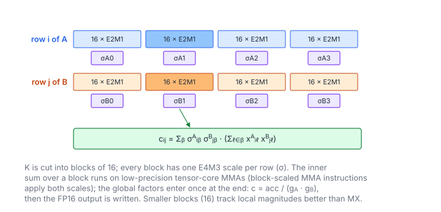

# NVFP4 GEMM

**Platform:** Tensara · **Difficulty:** hard · [Problem statement](https://tensara.org/problems/nvfp4-gemm)

## Problem

Compute $C = \hat{A}\hat{B}^{\mathsf T}$ with FP16 output, where $A$
($M\times K$) and $B$ ($N\times K$) are NVFP4: packed E2M1 elements, E4M3
scales per 16 elements (swizzled) and one global encode factor per operand
($g_A$, $g_B$). The reference is `torch._scaled_mm`. The check is
`rtol = 2e-2`, `atol = 5e-2`.

## Visual Overview

Blocks are only 16 elements long, so the scales follow local magnitudes
closely. The two global factors are applied once, at the end of the
accumulation.

## Formulation

**NVFP4** uses 16-element blocks along $K$ with a two-level scale: an
FP8 (E4M3) scale per block plus one FP32 global factor per tensor, which
moves the whole tensor into the range E4M3 × E2M1 can represent
($448\times6 = 2688$). The dequantized value of element $\ell$ of row $i$ is

$$
\hat{a}_{i\ell} = \frac{\operatorname{e2m1}(c_{i\ell})\cdot\operatorname{e4m3}\bigl(s_{i,\lfloor\ell/16\rfloor}\bigr)}{g}
$$

| Symbol | Meaning |
|---|---|
| $c_{i\ell}$ | 4-bit E2M1 code (two per byte, low nibble first) |
| $s_{i\beta}$ | E4M3 scale byte of block $\beta$, stored in the swizzled layout |
| $g$ | Global encode factor `sf_g` (FP32); $1/g$ is the global decode scale |
| $\hat{a}_{i\ell}$ | The value the encoding represents |

$$
c_{ij} = \sum_{\ell=0}^{K-1} \hat{A}_{i\ell}\,\hat{B}_{j\ell}, \qquad
\hat{A}_{i\ell} = \operatorname{e2m1}(c^A_{i\ell})\operatorname{e4m3}(s^A_{i,\lfloor\ell/16\rfloor})/g_A, \qquad \hat{B}_{j\ell} = \operatorname{e2m1}(c^B_{j\ell})\operatorname{e4m3}(s^B_{j,\lfloor\ell/16\rfloor})/g_B
$$

| Symbol | Meaning |
|---|---|
| $\hat{A}$ | Dequantized $A$, $M\times K$ |
| $\hat{B}$ | Dequantized $B$, stored $N\times K$ (so the product is $\hat{A}\hat{B}^{\mathsf T}$, an "NT" GEMM) |
| $c$ | Output, $M\times N$ (FP16) |
| $g_A, g_B$ | Global encode factors (`sf_g_a`, `sf_g_b`) |

### Regrouping the Sum by Blocks

Because every block of 16 elements shares one scale, the sum can be
regrouped by blocks, which is what tensor-core block-scaled MMAs do:

$$
c_{ij} = \frac{1}{g_A g_B}\sum_{\beta=0}^{K/16 - 1} \sigma^{A}_{i\beta}\,\sigma^{B}_{j\beta} \sum_{\ell \in \beta} x^{A}_{i\ell}\,x^{B}_{j\ell}
$$

| Symbol | Meaning |
|---|---|
| $\beta$ | Block index along $K$ |
| $\sigma^A_{i\beta}, \sigma^B_{j\beta}$ | The two block scales |
| $x^A, x^B$ | The decoded element values (before scaling) |

### The Swizzled Scale Layout

Block-scaled tensor-core MMAs (cuBLAS /
CUTLASS, TorchAO `is_swizzled_scales=True`, FlashInfer) store the scale
matrix of $R$ rows and $C$ scale columns in $128\times4$ atoms of 512 bytes:

$$
\operatorname{idx}(r, c) = \Bigl(\bigl\lfloor \tfrac{r}{128} \bigr\rfloor \Bigl\lceil \tfrac{C}{4} \Bigr\rceil + \bigl\lfloor \tfrac{c}{4} \bigr\rfloor\Bigr)\cdot 512 +
(r \bmod 32)\cdot 16 + \Bigl\lfloor \tfrac{r \bmod 128}{32} \Bigr\rfloor\cdot 4 + (c \bmod 4)
$$

| Symbol | Meaning |
|---|---|
| $r$ | Matrix row |
| $c$ | Scale column (block index along $K$) |
| $C$ | Number of scale columns, $K/\text{block}$ |
| idx | Byte offset of scale $(r, c)$ (`swizzledScaleIndex`) |

Inside an atom, rows $r, r+32, r+64, r+96$ are interleaved so that one
16-byte load gives a thread the 4 scales of 4 rows it needs.

## Approach

A block-scaled version of the register-blocked SGEMM used across the
Tensara matmul pages (`blockScaledGemm`):

1. **$64\times64$ output tile**, 256 threads, $4\times4$ outputs per thread.
2. **K-slices of 32 (two NVFP4 blocks)**: while staging the $A$ and $B$ panels into shared
   memory, each thread decodes the element code (nibble → `e2m1ToFloat` times the decoded E4M3 block scale) and multiplies by
   its block scale, looked up through the swizzled index. The tiles hold
   FP32, so the inner loop is the plain FMA outer product.
3. **Epilogue**: multiply by $1/(g_Ag_B)$ once and convert to FP16 (`__float2half_rn`).

The dequantized matrices are never written to global memory; the only
extra cost compared with an FP32 GEMM is the decode work while staging.
On Blackwell (sm_100) the same data would feed `tcgen05.mma` block-scaled
instructions directly, which read these swizzled scale layouts in
hardware; this portable kernel uses CUDA cores instead.

## Cost Analysis

$$
W = 2MNK, \qquad Q_{\min} = 0.5\,(MK + NK) + \frac{MK + NK}{16} + 2\,MN\ \text{bytes}
$$

| Symbol | Meaning |
|---|---|
| $W$ | Flops |
| $Q_{\min}$ | Compulsory DRAM bytes: packed operands, scales, output |

Applying the global factors once in the epilogue instead of per element
saves $2MNK/32$ multiplies and one rounding per staged value.

## Pitfalls

- **Output is FP16** (`float16*`): accumulate in FP32, convert once.
- **Two global factors**, both *encode* factors: divide by their product.
- **Block of 16**, not 32 as in MX.

## Verification

All test cases (scaled-down variants of the official sizes) pass on
[cuemu](../../tools/cuemu/README.md) against the PyTorch reference.

## Related

- [NVFP4 GEMV](../nvfp4-gemv/), [MXFP4 GEMM](../mxfp4-gemm/), [NVFP4 Quantize](../nvfp4-quantize/).
