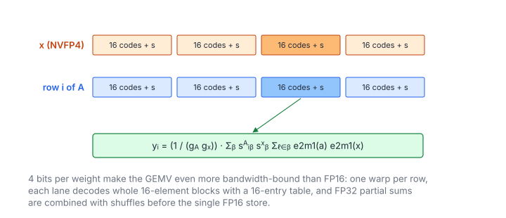

# NVFP4 GEMV

**Platform:** Tensara · **Difficulty:** hard · [Problem statement](https://tensara.org/problems/nvfp4-gemv)

## Problem

Compute $\mathbf{y} = \hat{A}\hat{\mathbf{x}}$ with FP16 output, where the
matrix $A$ ($M\times K$) and the vector $\mathbf{x}$ (length $K$) are both
NVFP4 (packed E2M1, swizzled E4M3 block scales per 16 elements, global
factors $g_A$, $g_x$). The reference dequantizes with FlashInfer and runs an
FP32 matmul. The check is `rtol = 2e-2`, `atol = 5e-2`.

## Visual Overview

Both the row of A and the vector x are NVFP4. Matching blocks (dark) are
decoded and multiplied, scaled by their two block scales, and the partial sums
are combined across the warp.

## Formulation

**NVFP4** uses 16-element blocks along $K$ with a two-level scale: an
FP8 (E4M3) scale per block plus one FP32 global factor per tensor, which
moves the whole tensor into the range E4M3 × E2M1 can represent
($448\times6 = 2688$). The dequantized value of element $\ell$ of row $i$ is

$$
\hat{a}_{i\ell} = \frac{\operatorname{e2m1}(c_{i\ell})\cdot\operatorname{e4m3}\bigl(s_{i,\lfloor\ell/16\rfloor}\bigr)}{g}
$$

| Symbol | Meaning |
|---|---|
| $c_{i\ell}$ | 4-bit E2M1 code (two per byte, low nibble first) |
| $s_{i\beta}$ | E4M3 scale byte of block $\beta$, stored in the swizzled layout |
| $g$ | Global encode factor `sf_g` (FP32); $1/g$ is the global decode scale |
| $\hat{a}_{i\ell}$ | The value the encoding represents |

$$
y_i = \frac{1}{g_A g_x}\sum_{\beta=0}^{K/16 - 1} \operatorname{e4m3}(s^A_{i\beta})\operatorname{e4m3}(s^x_{\beta})\sum_{\ell\in\beta} \operatorname{e2m1}(c^A_{i\ell})\operatorname{e2m1}(c^x_{\ell})
$$

| Symbol | Meaning |
|---|---|
| $y_i$ | Output element (FP16) |
| $\beta$ | 16-element block along $K$ |
| $s^A_{i\beta}, s^x_\beta$ | Block scales of the matrix row and of the vector |
| $c^A, c^x$ | Element codes |
| $g_A, g_x$ | Global encode factors |

A matrix row costs $K/2$ bytes of codes plus $K/16$ scale bytes:

$$
\text{bytes per weight} = \frac{1}{2} + \frac{1}{16} = 0.5625
$$

| Symbol | Meaning |
|---|---|
| 0.5625 | NVFP4 storage per element, versus 4 for FP32 (7.1× less) |

**Swizzled scale layout.** Block-scaled tensor-core MMAs (cuBLAS /
CUTLASS, TorchAO `is_swizzled_scales=True`, FlashInfer) store the scale
matrix of $R$ rows and $C$ scale columns in $128\times4$ atoms of 512 bytes:

$$
\operatorname{idx}(r, c) = \Bigl(\bigl\lfloor \tfrac{r}{128} \bigr\rfloor \Bigl\lceil \tfrac{C}{4} \Bigr\rceil + \bigl\lfloor \tfrac{c}{4} \bigr\rfloor\Bigr)\cdot 512 +
(r \bmod 32)\cdot 16 + \Bigl\lfloor \tfrac{r \bmod 128}{32} \Bigr\rfloor\cdot 4 + (c \bmod 4)
$$

| Symbol | Meaning |
|---|---|
| $r$ | Matrix row |
| $c$ | Scale column (block index along $K$) |
| $C$ | Number of scale columns, $K/\text{block}$ |
| idx | Byte offset of scale $(r, c)$ (`swizzledScaleIndex`) |

Inside an atom, rows $r, r+32, r+64, r+96$ are interleaved so that one
16-byte load gives a thread the 4 scales of 4 rows it needs.

## Approach

1. **One warp per row.** Lane $l$ handles blocks $l, l + 32, \dots$ of
   the row: it reads the block's 8 code bytes and scale byte, and the
   matching 8 bytes and scale of the vector (cached, since every warp
   reads the same vector), decodes both, and accumulates 16 products.
2. The per-block partial is scaled by
   $\operatorname{e4m3}(s^A)\operatorname{e4m3}(s^x)$ and accumulated in
   FP32.
3. A 5-step shuffle reduction, then lane 0 multiplies by $1/(g_Ag_x)$ and
   stores FP16.

The vector (≈ $0.56K$ bytes) stays in L1/L2; the matrix is streamed once.

## Cost Analysis

$$
Q \approx 0.5625\,MK + 0.5625\,K + 2M\ \text{bytes}, \qquad W = 2MK, \qquad T_{\min} = \frac{Q}{\beta_{\text{mem}}}
$$

| Symbol | Meaning |
|---|---|
| $Q$ | DRAM bytes, dominated by the packed matrix |
| $W$ | Flops (plus decode work) |
| $\beta_{\text{mem}}$ | DRAM bandwidth |

This is why FP4 weights matter for LLM decoding: GEMV is bandwidth-bound,
so the 7× smaller matrix is up to 7× faster than FP32 (3.6× faster than
FP16), provided the decode keeps up. At 16 decoded values per 9 bytes the
decode is roughly 2–3 integer instructions per value, which current GPUs
can sustain at full bandwidth.

## Pitfalls

- **Swizzled scales** for both $A$ and $\mathbf{x}$ (the vector is a
  $1\times K$ matrix, padded to a 128-row atom).
- **FP16 output**, FP32 accumulation.
- **Global scales once**, at the end.

## Verification

All test cases (scaled-down variants of the official sizes) pass on
[cuemu](../../tools/cuemu/README.md) against the PyTorch reference.

## Related

- [Matrix-Vector](../matrix-vector/), [NVFP4 GEMM](../nvfp4-gemm/), [NVFP4 Dequantize](../nvfp4-dequantize/).
